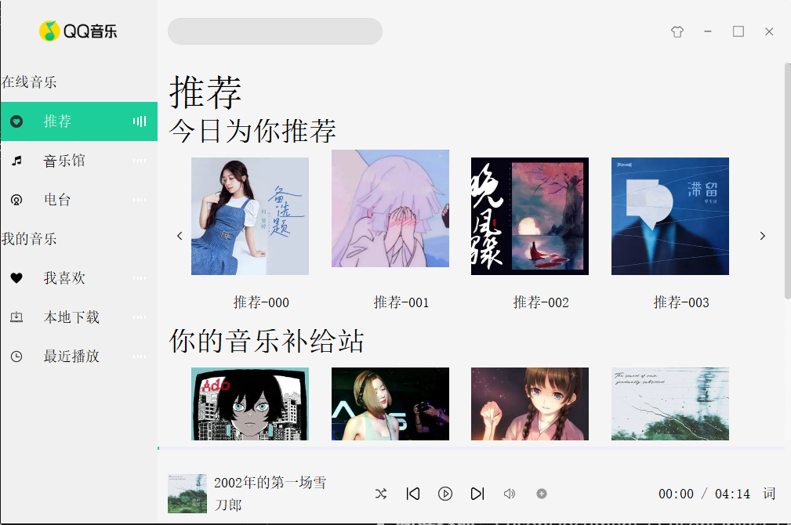
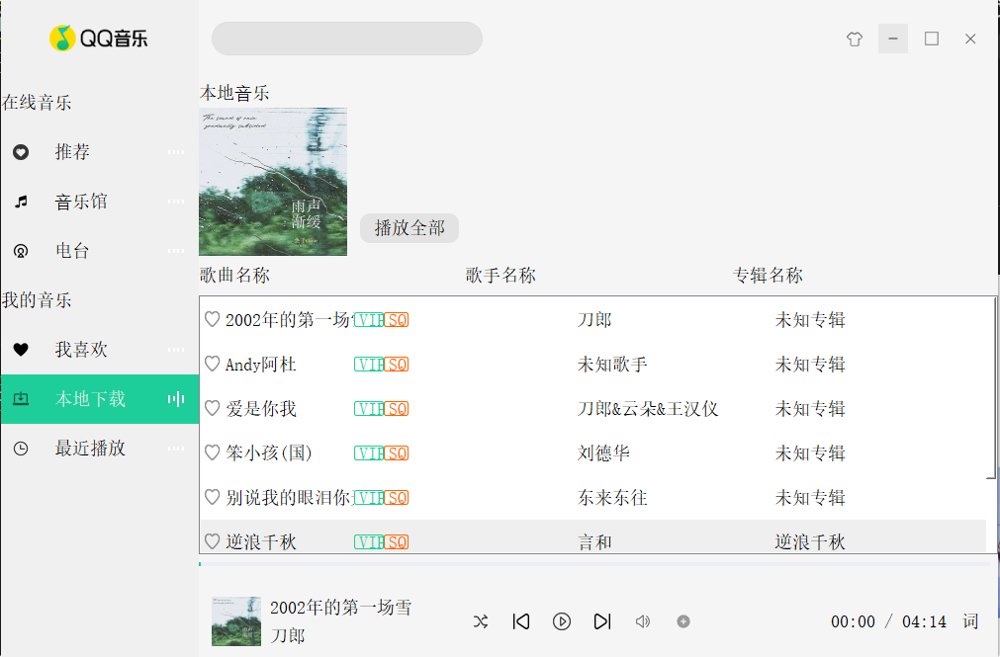
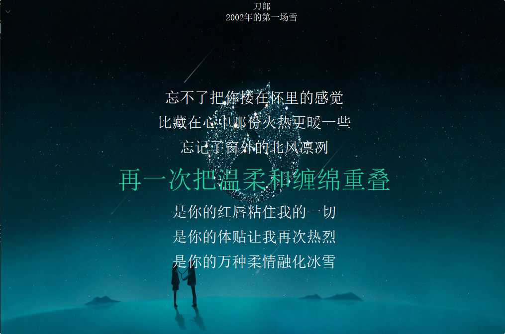

# Qt 仿 QQ 音乐播放器 (Qt QQMusic Clone)

这是一个基于 C++ 和 Qt 5 开发的桌面端高仿 QQ 音乐播放器。项目从零开始设计，抛弃了原生丑陋的边框，通过大量的自定义控件和 QSS 样式重绘，实现了极具现代感的 UI 交互。同时，底层深度融合了 Qt Multimedia 模块，实现了完整的本地音乐解析、播放控制以及精密的 LRC 歌词同步功能。

## ✨ 核心特性 (Features)

* **🎨 现代感无边框 UI**：
    * 采用纯代码 + QSS 重绘界面，去除了系统原生边框，并使用 `QGraphicsDropShadowEffect` 实现了高级窗口阴影。
    * 重写鼠标事件，支持主界面的平滑拖拽。
* **🧩 深度定制的组件化开发**：
    * **BtForm 选项卡**：使用 `QTimer` 替代传统的属性动画，还原了真实音乐频谱跳动时的“抽帧感”。
    * **MusicSlider & VolumeTool**：纯手工绘制的进度条与悬浮式音量控制盘（包含自定义绘制的指示三角）。
    * **动态推荐页**：支持卡片悬停的平滑升降动画，基于 JSON 数据动态渲染推荐列表。
* **🎵 强大的媒体播放引擎**：
    * 基于 `QMediaPlayer` 和 `QMediaPlaylist`，支持顺序播放、单曲循环、列表循环、随机播放等多种模式。
    * 使用 `QMimeDatabase` 智能解析本地音频元数据（如封面、歌手、专辑等），并支持异步加载。
* **🎤 LRC 歌词精准同步**：
    * 实现外挂 `.lrc` 文件的自动检索与解析。
    * 独立的歌词悬浮界面，基于播放器的时间戳信号（`positionChanged`）实现歌词的平滑上移与当前句的高亮显示。
* **⚙️ 工程化与系统级交互**：
    * **单例运行**：利用操作系统共享内存机制，防止程序多开导致资源冲突。
    * **系统托盘**：集成 `QSystemTrayIcon`，支持后台静默运行与托盘菜单交互。
    * **性能优化**：在 Release 模式下显式屏蔽 `qDebug` 输出，降低高频事件（如进度条刷新）带来的 CPU 损耗。

## 📸 界面预览 (Screenshots)

- **推荐页面**：


- **本地下载**：


- **LRC 歌词界面**：


## 🛠️ 技术栈 (Tech Stack)

* **开发语言**：C++
* **GUI 框架**：Qt 5 (5.14.2)
* **多媒体框架**：Qt Multimedia
* **编译器**：MinGW 64-bit
* **数据交换**：QJsonDocument / QJsonObject / QJsonArray

## 🚀 编译与运行 (How to run)

1.  克隆本项目到本地：
    ```bash
    git clone https://github.com/yrz-hahaha/qt-qqmusic-clone.git
    ```
2.  使用 Qt Creator 打开 `QMusic.pro` 工程文件。
3.  确保你的开发环境已配置好 **Desktop Qt 5.14.2 MinGW 64-bit** 构建套件。
4.  直接编译运行即可。

### 📦 关于打包 (Deployment)
本项目已完整测试通过 `windeployqt` 的打包流程。若需生成独立可运行的 `.exe` 发布包，请在 Release 模式下编译，并使用 `windeployqt` 提取依赖。详见项目文档。

## 📖 项目文档 (Documentation)

为了记录开发过程中的思考与踩坑经验，我编写了详细的系列文档，涵盖了从 UI 架构到核心算法的方方面面，欢迎查阅：
* [01. 界面规划](./项目文档//1.%20界面规划.md)
* [02. 界面布局设计](./项目文档/2.%20界面布局设计.md)
* [03. 界面美化](./项目文档/3.%20界面美化.md)
* [04. 自定义控件1 --- BtForm](./项目文档/4.%20自定义控件1%20---%20BtForm.md)
* [05. 自定义控件2 --- 推荐页面](./项目文档/5.%20自定义控件2%20---%20推荐页面.md)
* [06. 自定义控件3 --- CommonPage 页面](./项目文档/6.%20自定义控件3%20---%20CommonPage%20页面.md)
* [07. 自定义控件4 --- MusicSlider 和 VolumeTool](./项目文档/7.%20自定义控件4%20---%20MusicSlider%20和%20VolumeTool.md)
* [08. 音乐管理](./项目文档/8.%20音乐管理.md)
* [09. 音乐播放控制](./项目文档/9.%20音乐播放控制.md)
* [10. 音量控制与播放同步处理](./项目文档/10.%20音量控制与播放同步处理.md)
* [11. lrc 歌词同步](./项目文档/11.%20lrc%20歌词同步.md)
* [12. 项目完善](./项目文档/12.%20项目完善.md)