## 1.1 head 和 body
我们将整个界面主要分为两部分：==head 区和 body 区==。
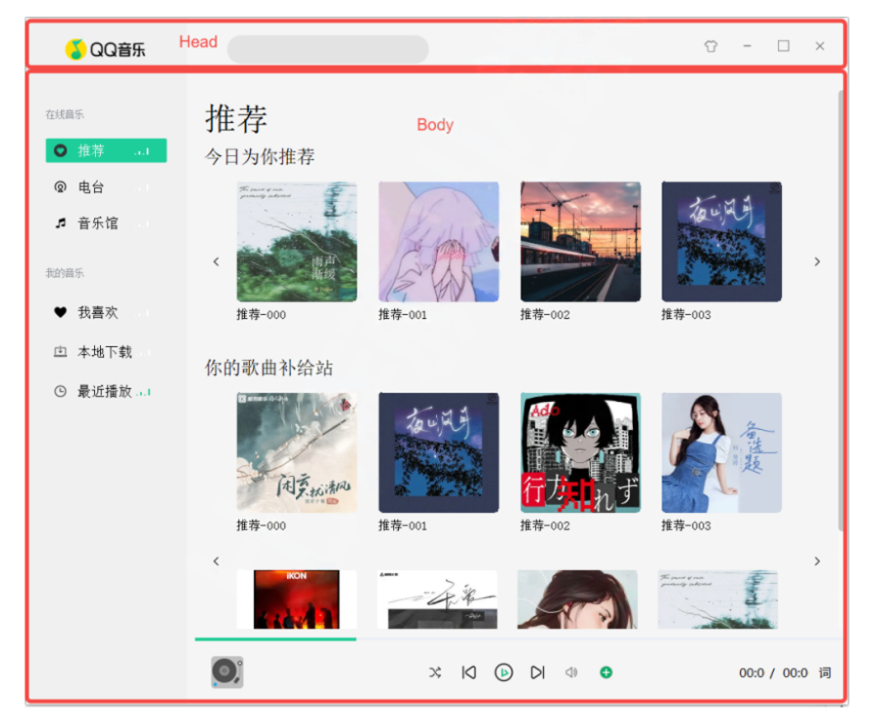

### 1.1.1 head区
**head 区域**从左往右依次为：图标、搜索框、更换皮肤按钮 & 最小化 & 最大化 & 退出按钮。
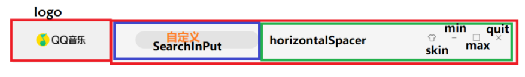
### 1.1.2 body 区
**body 区域**分为左侧种类选择区域和右侧Page展示区。
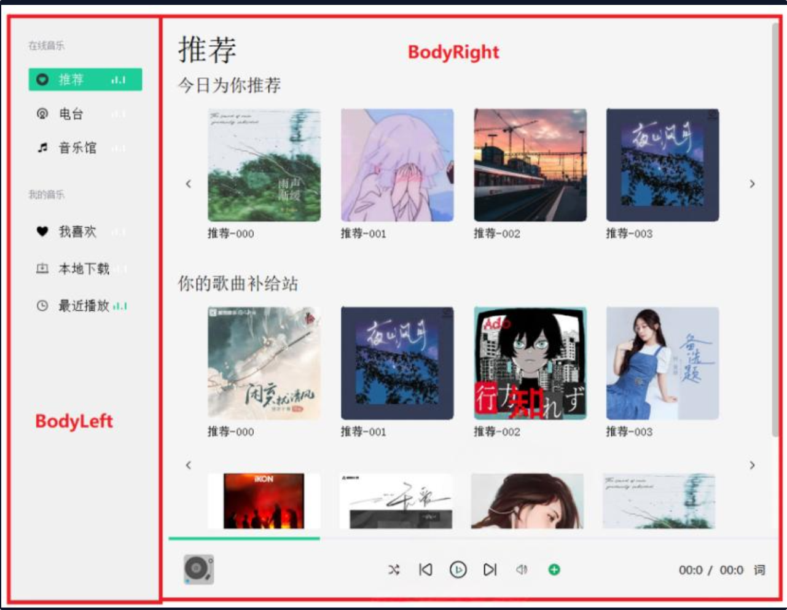

**Body左侧区域**有两部分组成：在线音乐 和 我的音乐，两部分内部的控件种类是相同的。
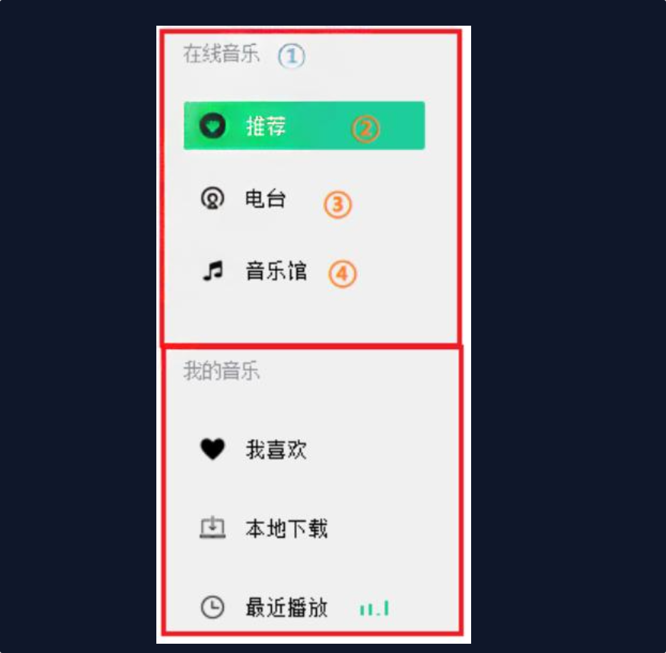
① 说明区域，实际为QLabel 
② 自定义控件(按钮的扩展)：图片+文本+动画 
③ 同②，自定义控件(按钮的扩展)：图片+文本+动画 
④ 同②，自定义控件(按钮的扩展)：图片+文本+动画

**Body右侧区域**由：Page区、播放进度、播放控制区三部分构成。
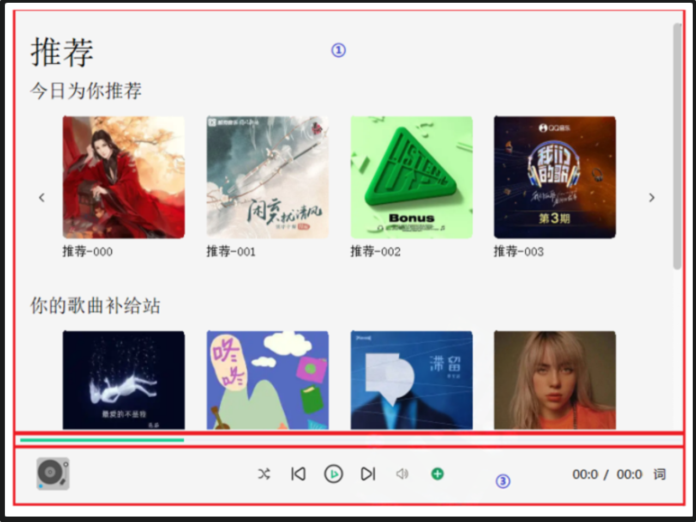
① Page区：歌曲信息页面，点击 < 或 > 具有轮播图效果 
② 播放进度：当前歌曲播放进度说明，支持seek功能，与播放控制区时间、以及LRC歌词是同步的 
③ 播放控制区域：显示歌曲图片&名称&歌手、 播放模式 & 下一曲 & 播放暂停 & 上一曲 & 音量调节和静音 & 添加本地音乐 当前播放时间 / 歌曲总时长 & 弹出歌词窗口按钮
#### 1.1.2.1 Page区说明
当点击body左侧不同按钮时，Page区域会显示不同的页面。

| Body左侧按钮 | Body右上侧Page显示                    |
| -------- | -------------------------------- |
| 推荐按钮     | 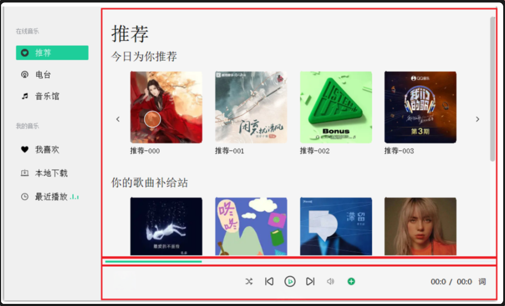 |
| 电台       | 暂未支持                             |
| 音乐馆      | 暂未支持                             |
| 我喜欢      | 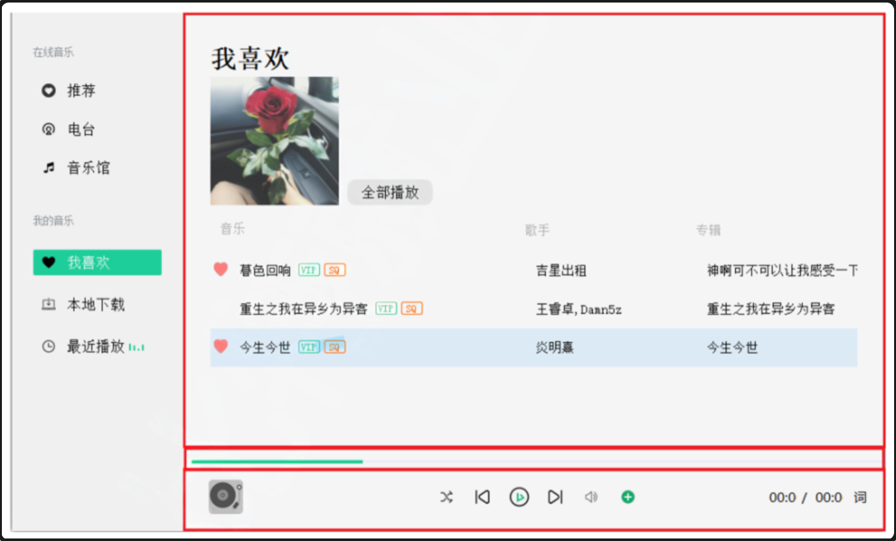 |
| 本地下载     | 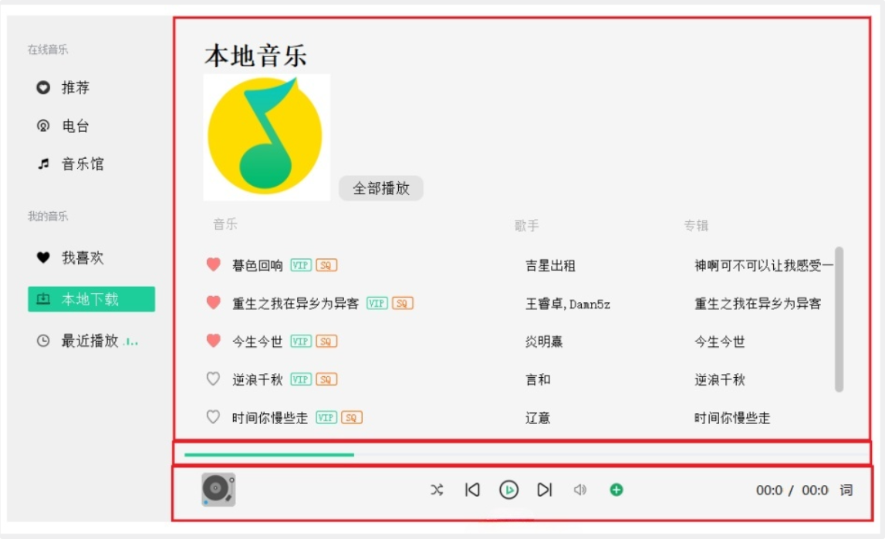 |
| 最近播放     | 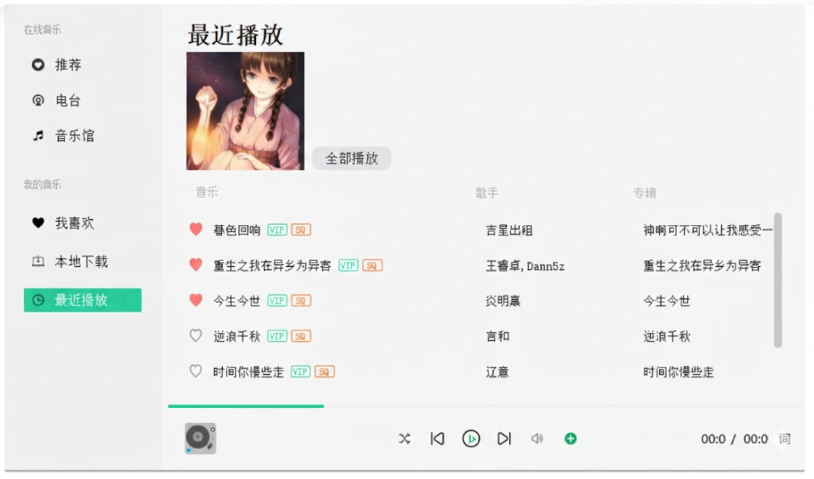 |
Body右侧目前支持的4个页面结构，整体的布局是相同的，唯独Page区域显示的内容稍有区别。 推荐页面具有类似轮播图的动态效果：
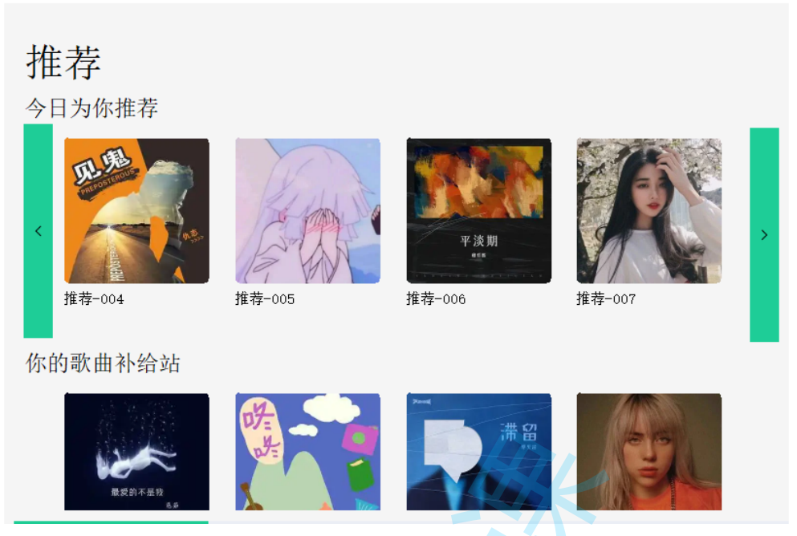
整个页面内容可以分为上下两组：今日为你推荐、你的歌曲补给站。两组的布局实际是相同的，元素说明：

- 上方显示1行，内部有4个推荐元素；下方显示2行，每行有4个推荐元素 
- 左右两侧一个按钮，点击后推荐内容会更换下一批，不停点击会循环推荐 
- 当鼠标悬停在推荐元素上时，推荐元素会向上移动，当鼠标离开时，又回到原位置 
- 当鼠标悬停在推荐元素上时，同时会出现小手图标，说明该推荐元素具有点击功能

我喜欢、本地下载、最近播放类似下图：
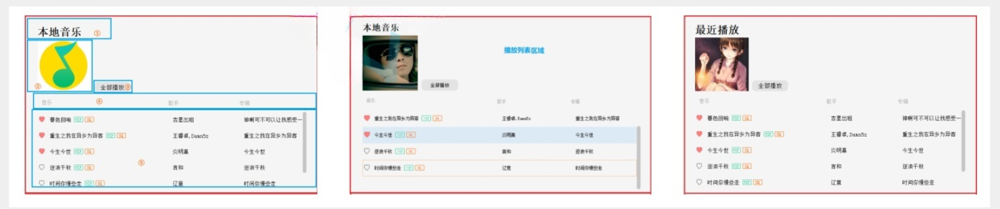
这三个Page中布局、控件都是相同的，只是填充的数据不一样。每个Page中包含了多个控件，大致如下：
① QLabel：类型说明 
② QLabel：图片显示 
③ QButton：播放全部按钮 
④ 一组QLabel说明：音乐、歌手、专辑
⑤ QListWidget：播放列表
可以通过自定义控件的方式，将①~⑤的控件集成到一起形成一个新的控件，方便复用，因此这三个 Page属于同一个自定义类型的Page。

这六个页面，将来由QStackedWidget控件组织起来，就可以实现点击不同按钮，显示不同页面效果。

#### 1.1.2.2 歌词页面
解析当前正在播放音乐的歌词，同步显示在界面上。
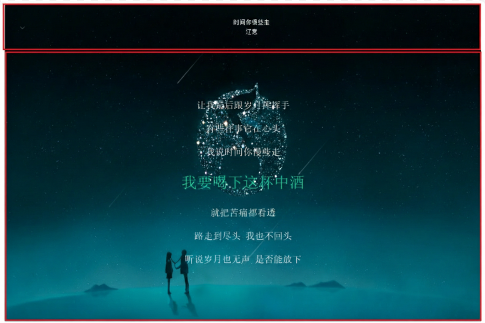
显示内容分为：歌曲信息、歌词部分、左上方收起隐藏按钮。

- 歌曲信息由歌曲名称(QLabel)和歌手名称(QLabel)构成 
- 歌词部分展示当前在唱歌词(QLabel)和在唱部分前三行和后三行歌词(QLabel)展示，当前播放 歌词突出显示 
- 点击收起按钮后，该页面会以动画的方式收起

当歌曲有LRC歌词时，播放时歌词会随播放时间自动调整；歌曲没有LRC歌词时，歌词部分显示空字符。