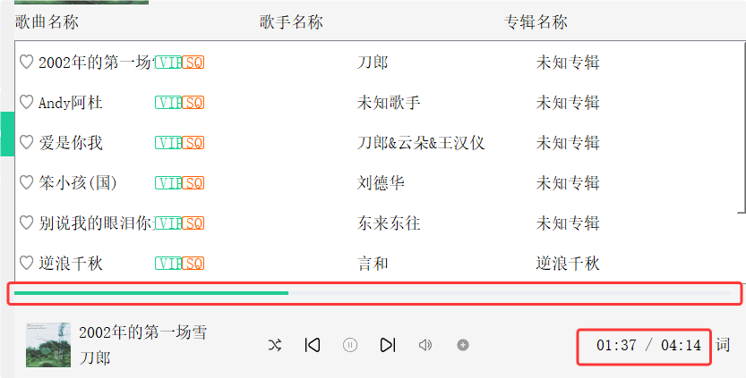

## 10.1 音量控制
### 10.1.1 功能分析

当点击静音按钮时，音量应该在静音和非静音之间进行切换，并且按钮上图标需要同步切换。鼠标在滑竿上点击或拖动滑竿时，应该根据滑竿的比率，设置音量大小，同时修改界面音量文本。

### 10.1.2 静音和非静音切换

VolumeTool 类中需要添加两个成员变量，用于记录当前是否静音和标记当前音量大小，并在构造函数中完成默认值的设置。 

给静音按钮参加槽函数 onSilenceBtnClicked，并在构造函数中 connect 按钮的 clicked 信号，当按钮点击时候，触发信号并调用槽函数，由槽函数完成静音和非静音的设置。

由于 VolumeTool 不具备媒体播放控制，因此当静音按钮被点击时，槽函数会先修改图标，再发射设置静音信号，让 QQMusic 来完成静音和非静音的切换。
```cpp
/////////////////////////////////////////////////////////////////   
// volumetool.h 中新增
public:
	void onSilenceBtnClicked(); // 静⾳按钮槽函数
signals:
    void setSilence(bool);

private:
    bool isMuted; // 记录静⾳或⾮静⾳，当点击静⾳按钮时，在true和false之间切换
    int volumeRatio; // 标记⾳量⼤⼩
    
/////////////////////////////////////////////////////////////////    
// volumetool.cpp 中新增
// 在构造函数中添加
VolumeTool::VolumeTool(QWidget *parent)
    : QWidget(parent)
    , ui(new Ui::VolumeTool)
    , isMuted(false) // 默认静⾳
    , volumeRatio(20) // 默认⾳量为20%
{
	...

	// 关联静⾳按钮的信号槽
    connect(ui->silenceBtn, &QPushButton::clicked, this, &VolumeTool::onSilenceBtnClicked);
}

void VolumeTool::onSilenceBtnClicked()
{
    // 1. 状态翻转：在静音与非静音之间切换
    isMuted = !isMuted;

    // 2. UI 图标切换：根据状态显示不同的喇叭图标
    if (isMuted)
    {
        ui->silenceBtn->setIcon(QIcon(":/images/silent.png"));
    }
    else
    {
        ui->silenceBtn->setIcon(QIcon(":/images/volumn.png"));
    }

    // 3. 发射信号：通知主窗口或其他监听者更新播放器状态
    emit setSilence(isMuted);
}

/////////////////////////////////////////////////////////////////   
// qqmusic.h 中新增
void setMusicSilence(bool isMuted);

/////////////////////////////////////////////////////////////////   
// qqmusic.cpp 中新增
void QQMusic::setMusicSilence(bool isMuted)
{
    // 调用底层 QMediaPlayer 接口实现静音或恢复音量
    player->setMuted(isMuted);
}

// 在 QQMusic::connectSignalAndSlot() 函数中添加
void QQMusic::connectSignalAndSlot()
{
	...

	// 设置静⾳
    connect(volumeTool, &VolumeTool::setSilence, this, &QMusic::setMusicSilence);
}
```
### 10.1.3 鼠标按下、滚动以及释放事件处理

我们期望音量的调节能够通过鼠标点击或鼠标拖动完成。鼠标点击又包含了两个动作，一是鼠标按下，二是鼠标释放，鼠标按下时我们希望只更新 UI 而不调节音量，鼠标释放时我们才希望进行音量调节；而鼠标拖动会包含三个动作，分别是鼠标按下、鼠标移动和鼠标释放，鼠标按下和释放的处理逻辑在鼠标点击时已经处理过了，这里还需要处理鼠标移动的逻辑，在鼠标移动时我们希望同时更新 UI 和完成对音量的调节。

这里 UI 的更新直接在当前类中就可以完成，而音量的调节要在 QQMusic 类中才能完成。
```cpp
/////////////////////////////////////////////////////////////////     
// volumetool.h 中新增
public:
    // 事件过滤器
    bool eventFilter(QObject* object, QEvent* event);
    
    // 根据⿏标在滑竿上滑动更新滑动界⾯，并按照⽐例计算⾳量⼤⼩
    void setVolume();
signals:
    // 发射修改⾳量⼤⼩槽函数
    void setMusicVolume(int);

/////////////////////////////////////////////////////////////////     
// volumetool.cpp 中新增
// 在构造函数中添加
VolumeTool::VolumeTool(QWidget *parent)
    : QWidget(parent)
    , ui(new Ui::VolumeTool)
    , isMuted(false) // 默认静⾳
    , volumeRatio(20) // 默认⾳量为20%
{
	...
	
	// 安装事件过滤器
    ui->sliderBox->installEventFilter(this);
}

bool VolumeTool::eventFilter(QObject *object, QEvent *event)
{
    // 1. 目标判定：仅处理针对 volumeBox（音量容器）的事件
    if (object == ui->sliderBox)
    {
        // 获取事件类型进行分支处理
        if (event->type() == QEvent::MouseButtonPress)
        {
            // A. 鼠标按下事件：实现“点哪跳哪”
            // 立即修改滑块按钮 (sliderBtn) 和外轮廓 (outLine) 的位置
            // 重新计算音量比例 (volumeRatio) 并调用 setVolume() 更新 UI 显示
            setVolume();
        }
        else if (event->type() == QEvent::MouseMove)
        {
            // B. 鼠标移动事件：实现滑动调节
            // 在拖拽过程中实时修改位置、计算比例并更新界面
            setVolume();

            // 关键点：实时向外部发射信号，确保播放器音量能够跟随手指即时变化
            emit setMusicVolume(volumeRatio);
        }
        else if (event->type() == QEvent::MouseButtonRelease)
        {
            // C. 鼠标释放事件：交互结束
            // 确保在松开鼠标时，最后一次确定的音量值被准确同步到播放器
            emit setMusicVolume(volumeRatio);
        }

        // 表示事件已被处理，不再向下传递
        return true;
    }

    // 2. 非目标对象：交给父类处理默认逻辑
    return QObject::eventFilter(object, event);
}

void VolumeTool::setVolume()
{
    // 1. 坐标转换：将鼠标在全局（屏幕）的位置转换为在 sliderBox 上的相对 y 坐标
    int height = ui->sliderBox->mapFromGlobal(QCursor::pos()).y();

    // 2. 边界限制：鼠标在 sliderBox 中可移动的有效 y 范围在 [25, 205] 之间
    // 这种“硬编码”限制确保了滑块不会飞出预设的槽位
    height = (height < 25) ? 25 : height;
    height = (height > 205) ? 205 : height;

    // 3. 调整滑块按钮位置：保持 x 轴不变，更新 y 轴，并做居中补偿处理
    ui->sliderBtn->move(ui->sliderBtn->x(), height - ui->sliderBtn->height() / 2);

    // 4. 更新进度条 (outLine) 的位置和大小
    // 随着滑块上移，进度条的高度会增加（205 - height）
    ui->outSlider->setGeometry(ui->outSlider->x(), height, ui->outSlider->width(), 205 - height);

    // 5. 计算音量比率
    // 180 是你定义的有效滑动总长度（205 - 25 = 180）
    // 通过当前进度条高度占总长度的比例计算出 0-100 的整数值
    volumeRatio = (int)((float)ui->outSlider->height() / 180 * 100);

    // 6. UI 反馈：将计算出的音量百分比显示在 Label 上
    ui->volumeRatio->setText(QString::number(volumeRatio) + "%");
}

/////////////////////////////////////////////////////////////////   
// qqmusic.h 中新增
void setPlayerVolume(int volume); // 设置⾳量⼤⼩

/////////////////////////////////////////////////////////////////   
// qqmusic.cpp 中新增
void QMusic::setPlayerVolume(int volume)
{
    player->setVolume(volume);
}

// 在 QQMusic::connectSignalAndSlot() 函数中添加
void QQMusic::connectSignalAndSlot()
{
	...
	
	// 设置⾳量⼤⼩
    connect(volumeTool, &VolumeTool::setMusicVolume, this, &QMusic::setPlayerVolume);
}
```
## 10.2 播放同步处理
### 10.2.1 界面歌曲总时间更新

我们期望当歌曲发生切换时，能获取到正在播放歌曲的总时长，并同步到 UI 界面上进行显示。

歌曲总时间在 Music 对象中可以获取，也可以让 player 调用自己的 duration() 方法获取。但是这两种获取歌曲总时间的调用时机不太好确定。

当播放源的持续时长发生改变时，QMediaPlayer 会触发 durationChanged 信号，该信号中提供了将要播放媒体的总时长。所以我们这里使用信号的方式获取歌曲总时长。
```cpp
/////////////////////////////////////////////////////////////////   
// qqmusic.h 中新增
public:
	// 歌曲持续时⻓改变时[歌曲切换]
    void onDurationChanged(qint64 duration);
    
private:
	qint64 totalTime;         // 记录媒体源的总时间
	
/////////////////////////////////////////////////////////////////   
// qqmusic.cpp 中新增
// 在构造函数中添加
QMusic::QQMusic(QWidget *parent)
    : QWidget(parent)
    , ui(new Ui::QMusic)
    , totalTime(0)
{
	...
}

void QQMusic::onDurationChanged(qint64 duration)
{
    totalTime = duration;

    ui->totalTime->setText(QString("%1:%2").arg(duration/1000/60, 2, 10,QChar('0'))
                                           .arg(duration/1000%60, 2, 10,QChar('0')));
}

// 在 QQMusic::initPlayer() 函数中添加
void QQMusic::initPlayer()
{
	...

	// 媒体持续时⻓更新，即：⾳乐切换，界⾯上时间也要更新
    connect(player, &QMediaPlayer::durationChanged, this, &QMusic::onDurationChanged);
}
```
### 10.2.2 界面歌曲当前播放时间更新 

每首音乐有一个总时长，只需要在音乐刚切换时加载一次时即可，而歌曲的当前播放时长需要实时更新，并在 UI 显示。

媒体在持续播放过程中，QMediaPlayer 会发射 positionChanged，该信号带有⼀个 qint64 类型参数，表示媒体当前持续播放的时间。

因此，在 QQMusic 中捕获该信号，便可获取到正在播放媒体的持续时间。
```cpp
/////////////////////////////////////////////////////////////////   
// qqmusic.h 中新增
// 播放位置改变，即持续播放时间改变
void onPositionChanged(qint64 duration);

/////////////////////////////////////////////////////////////////   
// qqmusic.cpp 中新增
void QMusic::onPositionChanged(qint64 duration)
{
    ui->currentTime->setText(QString("%1:%2").arg(duration/1000/60, 2, 10, QChar('0'))
                                             .arg(duration/1000%60, 2, 10, QChar('0')));
}

// 在 QQMusic::initPlayer() 函数中添加 
void QQMusic::initPlayer() 
{
	...
	
	// 播放位置发⽣改变，即已经播放时间更新
    connect(player, &QMediaPlayer::positionChanged, this, &QMusic::onPositionChanged);
}
```

### 10.2.3 进度条处理（seek功能）

在持续播放时间改变的同时，界面上的进度条应该也要前进。
#### 10.2.3.1 seek 功能介绍

播放器的 seek 功能指，允许用户在播放过程中随时跳转到特定时间点，从而快速找到感兴趣的内容或重新开始播放。


在界面上的体现是，当在 MusicSlider 上点击或者拖拽的时候，会跳转到歌曲的指定位置进行播放，并且歌曲的当前持续播放时间要同步修改。

#### 10.2.3.2 进度条 seek 功能实现

进度条功能进度界面展示与音量控制类似，这里我们重写鼠标按下、鼠标移动、以及鼠标释放的事件处理函数。

与上面音量控制同理，我们期望进度条的调节能够通过鼠标点击或鼠标拖动完成，但这里的处理逻辑有些许不同。鼠标点击包含鼠标按下和鼠标释放动作，鼠标按下时我们希望只更新 UI ，鼠标释放时我们希望即更新 UI 又完成歌曲的指定位置播放；而鼠标拖动会包含三个动作，分别是鼠标按下、鼠标移动和鼠标释放，鼠标按下和释放的处理逻辑在鼠标点击时已经处理过了，这里还需要处理鼠标移动的逻辑，在鼠标移动时我们希望只更新 UI 。
```cpp
/////////////////////////////////////////////////////////////////   
// musicslider.h 中新增
public:
    void mousePressEvent(QMouseEvent *event); // 重写⿏标按下事件
    void mouseMoveEvent(QMouseEvent *event); // 重写⿏标滚动事件
    void mouseReleaseEvent(QMouseEvent *event); // 重写⿏标释放事件

    void moveSilder(); // 修改outLine的宽度为currentPos
    
signals:
    void setMusicSliderPosition(float);
    
private:
    int currentPos; // 滑动条当前位置
    int maxWidth; // 滑动条总宽度
    
/////////////////////////////////////////////////////////////////   
// musicslider.cpp 中新增
// 在构造函数中添加
MusicSlider::MusicSlider(QWidget *parent) :
    QWidget(parent),
    ui(new Ui::MusicSlider)
{
	...
	
	// 初始情况下，还没有开始播放，将当前播放进度设置为0
    currentPos = 0;
    maxWidth = width();
    moveSilder();
}

void MusicSlider::mousePressEvent(QMouseEvent *event)
{
    // 获取点击位置：QMouseEvent 中的 pos() 为鼠标相对于 widget 的本地坐标
    // 因此鼠标位置的 x 坐标可以直接作为进度条 (outLine) 的宽度
    currentPos = event->pos().x();

    // 执行 UI 更新
    moveSilder();
}

void MusicSlider::mouseMoveEvent(QMouseEvent *event)
{
    // 范围判定：定义当前控件的矩形区域，如果鼠标滑出范围，停止处理拖拽
    QRect rect = QRect(0, 0, width(), height());
    QPoint pos = event->pos();

    if (!rect.contains(pos))
    {
        return;
    }

    // 拖拽逻辑：仅当鼠标左键按下并移动时触发
    if (event->buttons() == Qt::LeftButton)
    {
        currentPos = event->pos().x();

        // 越界检查：确保进度位置不会小于 0 或超过最大宽度限制
        if (currentPos < 0)
        {
            currentPos = 0;
        }
        if (currentPos > maxWidth)
        {
            currentPos = maxWidth;
        }

        moveSilder();
    }
}

void MusicSlider::mouseReleaseEvent(QMouseEvent *event)
{
    // 释放确认：在鼠标松开时，最后一次更新进度位置
    currentPos = event->pos().x();
    moveSilder();

    emit setMusicSliderPosition((float)currentPos / (float)maxWidth);
}

void MusicSlider::moveSilder()
{
    // UI 渲染同步：根据计算出的 currentPos 动态调整进度条的宽度和几何布局
    ui->outLine->setMaximumWidth(currentPos);

    // 设置进度条的具体位置和尺寸 (y=8, height=4)
    ui->outLine->setGeometry(0, 8, currentPos, 4);
}

/////////////////////////////////////////////////////////////////   
// qqmusic.h 中新增
void onMusicSliderChanged(float value); // 进度条改变

/////////////////////////////////////////////////////////////////   
// qqmusic.cpp 中新增
void QQMusic::onMusicSliderChanged(float value)
{
    // 1. 计算当前seek位置的时⻓
    qint64 duration = (qint64)(totalTime * value);

    // 2. 转换为百分制，设置当前时间
    ui->currentTime->setText(QString("%1:%2").arg(duration/1000/60, 2, 10, QChar('0'))
                                             .arg(duration/1000%60, 2, 10, QChar('0')));

    // 3. 设置当前播放位置
    player->setPosition(duration);
}

// 在 QQMusic::connectSignalAndSlot() 函数中添加
void QQMusic::connectSignalAndSlot()
{
	...
	
	// 进度条拖拽
    connect(ui->processBar, &MusicSlider::setMusicSliderPosition, this, &QMusic::onMusicSliderChanged);
}
```
#### 10.2.3.3 持续时间同步进度条

当播放位置更新时，界面上持续播放时间一直在更新，因此进度条也需要持续向前进，MusicSlider 应该提供 setStep 函数，播放进度持续更新时，也将进度条通过 setStep 函数更新下。 
```cpp
/////////////////////////////////////////////////////////////////   
// musicslider.h 中新增
void setStep(float bf);

/////////////////////////////////////////////////////////////////   
// musicslider.cpp 中新增
void MusicSlider::setStep(float bf)
{
    currentPos = maxWidth * bf;
    moveSilder();
}

/////////////////////////////////////////////////////////////////   
// qqmusic.cpp 中新增
// 在 QQMusic::onPositionChanged() 函数中添加
void QQMusic::onPositionChanged(qint64 duration)
{
	...
	
	// 防御性拦截：确保分母不为 0
    if (totalTime > 0) 
    {
		ui->processBar->setStep((float)duration / (float)totalTime);
	}
}
```
#### 10.2.3.4 歌曲名称、歌手和封面图片同步

在进行歌曲切换时候，歌曲名称、歌手以及歌曲的封面图，也需要更新到界面。歌曲名称、歌手可以再 Music 对象中进行获取，歌曲的封面图可以通过 player 到歌曲的元数据中获取，获取时需要使用"ThumbnailImage"作为参数，注意有些歌曲可能没有封面图，如果没有则设置一张默认的封面图。

由于歌曲切换时，player 需要将新播放歌曲作为播放源，并解析歌曲文件，如果歌曲文件是有效的才能播放；因此 QQMusic 类可以给 QMediaPlayer 发射的 metaDataAvailableChanged(bool) 信号关联槽函数，当歌曲更换时，完成信息的更新。
```cpp
/////////////////////////////////////////////////////////////////    
// qqmusic.h 中新增
public:
	void onMetaDataAvailableChanged(bool available);
	
private:
	int currentIndex;         // 记录当前正在播放歌曲在媒体列表中的索引
/////////////////////////////////////////////////////////////////    
// qqmusic.cpp 中新增
// 在构造函数中添加
QMusic::QQMusic(QWidget *parent)
    : QWidget(parent)
    , ui(new Ui::QMusic)
    , currentIndex(-1)
{
	...
}

// 在 QQMusic::onCurrentIndexChanged() 函数中添加
void QQMusic::onCurrentIndexChanged(int index)
{
    currentIndex = index;
    
    ...
}

void QQMusic::onMetaDataAvailableChanged(bool available)
{
    (int)(available);
    // 歌曲名称、歌曲作者直接到Musci对象中获取
    // 此时需要知道媒体源在播放列表中的索引
    QString musicId = curPage->getMusicIdByIndex(currentIndex);
    auto it = musicList.findMusicById(musicId);

    QString musicName("未知歌曲");
    QString musicSinger("歌手未知");
    if(it != musicList.end())
    {
        musicName = it->getMusicName();
        musicSinger = it->getSingerName();
    }

    ui->musicName->setText(musicName);
    ui->musicSinger->setText(musicSinger);

    // 获取封面图，通过元数据来获取
    QVariant coverimage = player->metaData("ThumbnailImage");
    if(coverimage.isValid())
    {
        QImage image = coverimage.value<QImage>();
        ui->musicCover->setPixmap(QPixmap::fromImage(image));
        curPage->setMusicImage(QPixmap::fromImage(image));
    }
    else
    {
        qDebug()<<"歌曲没有封面图";
        // 可以设置默认图片
        QString path = ":/images/rec/001.png";
        ui->musicCover->setPixmap(path);
        curPage->setMusicImage(path);
    }
    ui->musicCover->setScaledContents(true);
}

void QMusic::initPlayer()
{
	...
	
	// 关联QMediaPlayer::metaDataAvailableChanged
    connect(player, &QMediaPlayer::metaDataAvailableChanged, this, &QMusic::onMetaDataAvailableChanged);
}

/////////////////////////////////////////////////////////////////    
// commonpage.h 中新增
void setMusicImage(QPixmap pixmap);

/////////////////////////////////////////////////////////////////    
// commonpage.cpp 中新增
void CommonPage::setMusicImage(QPixmap pixmap)
{
    ui->musicImageLabel->setPixmap(pixmap);
    ui->musicImageLabel->setScaledContents(true);
}
```

> **metaDataAvailableChanged 是什么**？
> `metaDataAvailableChanged(bool available)` 是 Qt 框架中 `QMediaPlayer`（或 `QMediaRecorder`）发出的**异步信号**，用于指示媒体文件的元数据（Metadata）是否已成功加载，或其可用状态是否发生了改变。当 `available` 参数为 `true` 时，意味着底层引擎已完成解析，此时开发者可以安全地读取媒体的详细信息（如歌名、时长等）。
> 
> **metaDataAvailableChanged 的触发时机是什么**？
> 1、手动加载新媒体时触发 （`setMedia`）：当程序执行 `player->setMedia(musicUrl)` 后，主线程会立即返回并继续执行，而系统底层的多媒体后端会在独立线程中开始异步读取文件流。当后台线程完成对文件 ID3 标签（如歌名、歌手、专辑封面）和媒体总时长的解析时，它会将 `available` 状态设为 `true` 并发射该信号。
> 
> 2、播放列表自动切歌时：当绑定的 `QMediaPlaylist` 按顺序或随机模式跳转到下一首歌曲时，播放器内部会自动加载新的 URL 并重启解析流程。一旦新歌曲的信息读取完毕，该信号会再次触发。
> 
> 3、媒体被清空或卸载时：当调用 `player->stop()`，或者底层引擎遇到无法识别的损坏文件、格式不支持等情况时。如果原本的元数据是可用的，由于状态实质性改变，播放器会发射 `metaDataAvailableChanged(false)`，提示程序当前媒体信息已失效。

> **QVariant 是什么**？
> QVariant 是 Qt 框架中的一种变体数据类型，本质上是一个封装了多种 C++ 和 Qt 数据类型（如 `int`、`QString`、`QColor` 等）的通用容器。
> 
> **QVariant 的核心特点和用途：**
> - **通用容器**：能够存储几乎所有类型的数据，包括 Qt 的基本类型（int, float, QString）、自定义结构体等。
> - **运行时类型识别**：在运行时确定所存储的数据类型，使用 `type()` 或 `typeId()` 检查。
> - **类型转换**：提供 `to...()` 系列方法将存储的数据转换为目标类型（如 `toInt()`, `toString()`），如果不匹配则返回默认值。
> 
> **基本用法示例：**
> ```cpp
> // 1. 隐式转换存取
> QVariant v(123);            // 存储整数
> int i = v.toInt();          // 转换回整数
> 
> QVariant s("Hello");        // 存储字符串
> QString str = s.toString(); // 转换回字符串
> 
> // 2. 泛型方法存取 (适用于更复杂的类型)
> QVariant v2;
> v2.setValue(4.56f);         // 存储 float
> float f = v2.value<float>();// 取出 float
> ```
