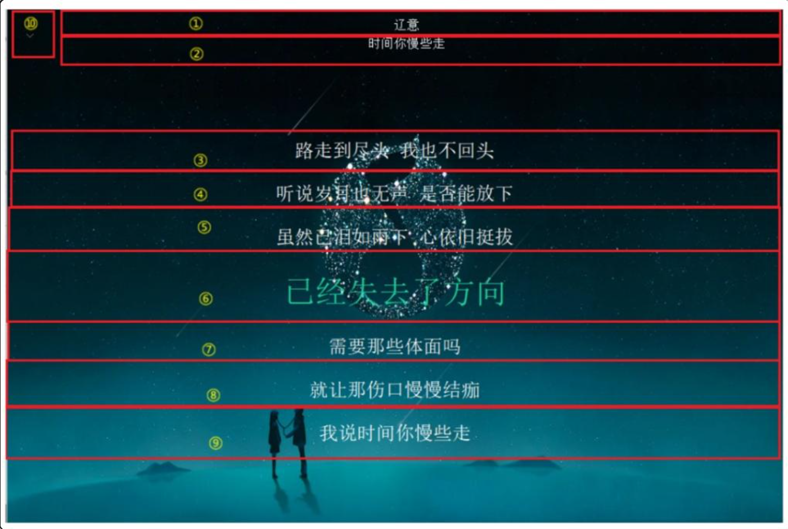
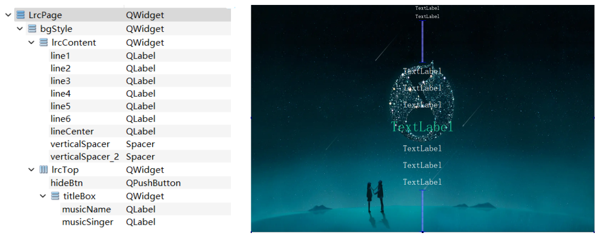
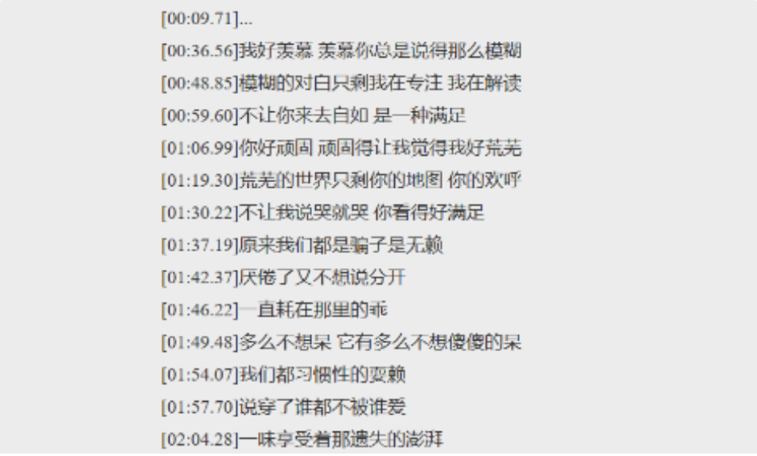

播放歌曲时，当点击"词"按钮后歌词窗口会慢慢弹出，当点击隐藏按钮后，歌词窗口又会慢慢隐藏，并且歌词窗口没有标题栏，内部显示当前播放歌曲的歌词，以及歌曲名称和作者。
## 11.1 lrc 歌词界面分析

lrcPage 中元素种类比较少，具体分析如下： 


① 和 ② 为 QLabel，分别显示作者和歌曲名称；

③ ~ ⑨ 均为 QLabel，用来显示歌词，⑥ 为当前正在播放歌词，③④⑤ 为当前播放歌词的前三句，⑦⑧⑨为当前播放歌词的后三句。歌词会随着播放时间持续，从下往上移动。

⑩ 为按钮，点击之后窗口隐藏。

## 11.2 lrc 歌词界面布局

1、新建一个“Qt 设计师界面类”，界面模板选择 Widget，类名为 LrcPage，创建。geometry 的宽高修改为：`1020*680`。

2、拖一个 Widget 到 LrcPage 中，objectName 修改为 bgStyle，选中 LrcPage，然后点击垂直布局，并将 LrcPage 的 margin 和 spacing 修改为0；

3、拖两个 Widget 到 bgStyle 中，objectName 从上往下分别修改为 lrcTop 和 lrcContent，lrcTop 的 minimumSize 和 maximumSize 的高修改为 50；然后选中 bgStyle 点击垂直布局，并将 bgStyle 的 margin 和 spacing 修改为 0；

4、拖一个按钮到 lrcTop 中，objectName 修改为 hideBtn，minimumSize 和 maximumSize 的宽和高修改为：`30*50`；

5、拖一个 Widget 到 lrcTop 中，objectName 修改为 titleBox；然后选中lrcTop，点击水平布局，并将 lrcTop 的 margin 和 spacing 修改为0；

6、拖两个 QLabel 到 titleBox 中，objectName 从上往下修改为 musicSinger 和 musicName，然后选中 titleBox，点击垂直布局，并将 titleBox 的 margin 和 spacing 修改为 0；

7、拖六个 QLabel 到l rcContent 中，从上往下将 objectName 依次修改为：line1、line2、line3、lineCenter、line4、line5、line6，将 line1 ~ line6 的 minimumSize 和 maximumSize 的高度修改为 50，font 大小修改为 15，将 lineCenter 的 minimumSize 和 maximumSize 的高度修改为 80，font 的大小修改为 25；

8、选中 lrcContent，然后点击垂直布局，将 lrcContent 的 margin 和 spacing 修改为 0。

9、将所有 QLabel 的 alignment 属性设置为水平垂直居中。

9、然后还需要对一些控件进行 QSS 样式设置：

控件：`bgStyle`
QSS 美化：
```css
#bgStyle
{
	border-image: url(:/images/bg.png);
}

*
{
	color : #FFFFFF;
}
```

控件：`lineCenter`
QSS 美化：
```css
#lineCenter
{
	color:#1ECE9A;
}
```

控件：`hideBtn`
QSS 美化：
```css
#hideBtn
{
	border:none;
}
```



## 11.3 LrcPage 显示

在 LrcPage 的构造函数中，将窗口的系统标题栏去除掉；并给 hideBtn 关联 clicked 信号，当按钮点击时将窗口隐藏。
```cpp
LrcPage::LrcPage(QWidget *parent) :
    QWidget(parent),
    ui(new Ui::LrcPage)
{
    ui->setupUi(this);

    setWindowFlag(Qt::FramelessWindowHint);
	connect(ui->hideBtn, &QPushButton::clicked, this, [=]{ 
		hide(); 
	});
    ui->hideBtn->setIcon(QIcon(":/images/xiala.png"));
}
```

在 QQMusic 中，创建 LrcPage 的指针，并在 initUi() 方法中创建窗口的对象，创建好之后将窗口隐藏起来；

在 QQMusic 中，给 lrcWord 按钮添加槽函数，在槽函数中将窗口显示出来。
```cpp
/////////////////////////////////////////////////////////////////    
// qqmusic.h 中新增
public:
	void onLrcWordClicked();
	
private:
	LrcPage* lrcPage;
	
/////////////////////////////////////////////////////////////////    
// qqmusic.cpp 中新增
// 在 QQMusic::initUI() 函数中添加
void QQMusic::initUI()
{
	...
	
	// 创建lrc歌词窗⼝
    lrcPage = new LrcPage(this);
    lrcPage->hide();
}

void QQMusic::onLrcWordClicked()
{
    lrcPage->show();
}

// 在 QQMusic::connectSignalAndSlot() 函数中添加
void QQMusic::connectSignalAndSlot()
{
	...

	// 显⽰歌词窗⼝
    connect(ui->lrcWord, &QPushButton::clicked, this, &QMusic::onLrcWordClicked);
}
```
## 11.4 为 LrcPage 添加动画效果

我们希望当点击 QQMusic中 "词"按钮时，lrcPage 窗口是以上移动画效果显示出来的，而不是瞬间加载歌词界面；同理，当点击 lrcPage 上"下拉"按钮时，窗口先以动画的方式下移，动画结束后窗口再隐藏。
### 11.4.1 窗口显示和上移动画

在 QQMusic 的 initUi 函数中，创建 lrcPage 对象并将窗口隐藏；给 lrcPage 窗口添加上移动画，动画暂不开启；然后给"词"按钮添加槽函数，当按钮点击时，显示窗口并开启动画。
```cpp
/////////////////////////////////////////////////////////////////    
// qqmusic.h 中新增
private:
	QPropertyAnimation* lrcPageAnimal;
	
	
/////////////////////////////////////////////////////////////////    
// qqmusic.cpp 中新增
// 在 QQMusic::initUI() 函数中添加
void QQMusic::initUI()
{
	...
	
	// lrcPage添加动画效果
    lrcPageAnimal = new QPropertyAnimation(lrcPage, "geometry", this);
    lrcPageAnimal->setDuration(250);
    lrcPageAnimal->setStartValue(QRect(10, 10+lrcPage->height(), lrcPage->width(), lrcPage->height()));
    lrcPageAnimal->setEndValue(QRect(10, 10, lrcPage->width(), lrcPage->height()));
}

// 在 QQMusic::onLrcWordClicked() 函数中添加
void QQMusic::onLrcWordClicked()
{
    ...
    
    lrcPageAnimal->start();
}
```
**==注意==**：这里还有一个小 bug ，就是我们之前在 `QQMusic::initUI()` 函数中为了给窗口设置阴影，调用了一个 `addShadow()` 函数，在这个函数中我们通过`shadowEffect->setBlurRadius(20);`为窗口设置了模糊半径，这里不能将这个模糊半径设太大了，否则就会导致歌词窗口重绘不完整，在界面上显示不完全，所以这里要将其改小一点，改为 10 就可以了。

### 11.4.2 窗口隐藏和下移动画

LrcPage 类中，在构造窗口时设置下移动画，给"下拉"按钮添加槽函数，当"下拉按钮"点击时，开启动画；当动画结束时，将窗口隐藏。
```cpp
/////////////////////////////////////////////////////////////////    
// lrcpage.h 中新增
private:
	QPropertyAnimation* lrcAnimation;
	
/////////////////////////////////////////////////////////////////    
// lrcpage.cpp 中新增
LrcPage::LrcPage(QWidget *parent) :
    QWidget(parent),
    ui(new Ui::LrcPage)
{
	...
	
	setWindowFlag(Qt::FramelessWindowHint);

    // 添加动画效果
    lrcAnimation = new QPropertyAnimation(this, "geometry", this);
    lrcAnimation->setDuration(250);
    lrcAnimation->setStartValue(QRect(10, 10, width(), height()));
    lrcAnimation->setEndValue(QRect(10, 10 + height(), width(), height()));

    // 点击设置下拉按钮时开启动画
    connect(ui->hideBtn, &QPushButton::clicked, this, [=]{
        lrcAnimation->start();
    });

    // 动画结束时，将窗⼝隐藏
    connect(lrcAnimation, &QPropertyAnimation::finished, this, [=]{
        hide();
    });

    ui->hideBtn->setIcon(QIcon(":/images/xiala.png"));
}
```
## 11.5 lrc 歌词解析和同步

### 11.5.1 什么是 LRC 歌词

LRC 歌词是一种包含时间标签的纯文本文件（扩展名为 `.lrc`），专门用于在音乐播放器中实现歌词与音乐的同步滚动显示。它通过 `[分:秒.毫秒]` 的格式标记每句歌词的出现时间，常用于 MP3 播放器、手机音乐 App，甚至外语语音教学。



由于每首歌的 lrc 歌词有多行文本，因此 lrc 歌词中的每行歌词可以采用结构体管理。
```cpp
/////////////////////////////////////////////////////////////////    
// lrcpage.h 中新增
// LRC行歌词结构
struct LyricLine
{
    qint64 time; // 时间
    QString text; // 歌词内容

    LyricLine(qint64 qtime, QString qtext)
        : time(qtime)
        , text(qtext)
    {}
};

// LrcPage 类中添加成员变量
private:
	QVector<LyricLine> lrcLines; // 按照时间的先后次序保存每⾏歌词
```
### 11.5.2 通过歌曲文件找 LRC 文件

一般情况下，播放器在设计之初就会设计好歌曲文件和歌词文件的存放位置，以及对应关系，通常歌曲文件和 lrc 歌词文件名字相同，后缀不同。在磁盘存放的时候，可以将歌曲文件和 lrc 文件分两个文件夹存储，也可以存储到一个文件夹下。

这里为了方便处理，将二者存储在一个文件夹下，因此可以通过 Music 对象快速找到 lrc 歌词文件。
```cpp
/////////////////////////////////////////////////////////////////    
// music.h 中新增
QString getLrcFilePath() const;

/////////////////////////////////////////////////////////////////    
// music.cpp 中新增
QString Music::getLrcFilePath() const
{
    // ⾳频⽂件和LRC⽂件在⼀个⽂件夹下
    // 直接将⾳频⽂件的后缀替换为.lrc
    QString path = musicUrl.toLocalFile();
    path.replace(".mp3", ".lrc");
    path.replace(".flac", ".lrc");
    path.replace(".mpga", ".lrc");
    return path;
}
```
### 11.5.3 LRC 歌词解析 

找到 lrc 歌词文件后，由 lrcPage 类完成对歌词的解析。解析的大概步骤如下：

1、打开歌词文件

2、以行为单位，读取歌词文件中的每一行 

3、按照lrc歌词⽂件格式，从每行文本中解析出时间和歌词 

4、用 <时间，行歌词> 构建一个 LyricLine 结构体对象存储到 lrcLines 中。

```cpp
/////////////////////////////////////////////////////////////////    
// lrcpage.h 中新增
bool parseLrc(const QString& lrcPath);

/////////////////////////////////////////////////////////////////    
// lrcpage.cpp 中新增
bool LrcPage::parseLrc(const QString& lrcPath)
{
    lrcLines.clear();

    // 1. 打开歌词文件
    QFile lrcFile(lrcPath);
    if (!lrcFile.open(QIODevice::ReadOnly | QIODevice::Text))
    {
        qDebug() << "无法打开文件:" << lrcPath;
        return false;
    }

    // 2. 逐行读取并解析
    while (!lrcFile.atEnd())
    {
        // 读取一行数据，转换成 QString 处理更方便
        QString lrcLineRaw = QString::fromUtf8(lrcFile.readLine());
        if (lrcLineRaw.trimmed().isEmpty()) continue;

        // 查找时间标签的边界 [00:17.94]
        int left  = lrcLineRaw.indexOf('[');
        int right = lrcLineRaw.indexOf(']');

        if (left == -1 || right == -1) continue; // 跳过不符合格式的行

        // 提取时间字符串内容 (例如 "00:17.94")
        QString timeStr = lrcLineRaw.mid(left + 1, right - left - 1);

        qint64 lineTime = 0;
        int start = 0;
        int end = 0;

        // --- 解析分钟 ---
        end = timeStr.indexOf(':');
        lineTime += timeStr.mid(start, end - start).toInt() * 60 * 1000;

        // --- 解析秒 ---
        start = end + 1;
        end = timeStr.indexOf('.', start);
        lineTime += timeStr.mid(start, end - start).toInt() * 1000;

        // --- 解析毫秒 ---
        start = end + 1;
        // 注意：有的歌词是 [00:12.34]，有的是 [00:12.345]
        lineTime += timeStr.mid(start).toInt();

        // 3. 解析歌词文本
        // 取 ']' 之后的所有内容并去除首尾空格
        QString wordText = lrcLineRaw.mid(right + 1).trimmed();

        // 存入容器
        lrcLines.push_back(LyricLine(lineTime, wordText));
    }

    // 4. 测试验证输出
    for (const auto& line : lrcLines)
    {
        qDebug() << "时间(ms):" << line.time << " 内容:" << line.text;
    }

    return true;
}
```
### 11.5.4 根据歌曲播放位置获取歌词并显示

当歌曲播放进度改变时候，QMediaPlayer的positionChanged 信号会触发，该信号同步播放时间的时候已经在 QQMusic 类中处理过了，在其槽函数中就能拿到当前歌曲的播放时间，通过播放时间，就能在 LrcPage 中找到对应行的歌词。

所以，我们先在 LrcPage 中添加相应 api 函数，方便 QQMusic 设置行歌词。
```cpp
/////////////////////////////////////////////////////////////////    
// lrcpage.h 中新增
public:
    int getLineLrcWordIndex(qint64 pos);
    QString getLineLrcWord(qint64 index);
    void showLrcWord(int time);

/////////////////////////////////////////////////////////////////    
// lrcpage.cpp 中新增
int LrcPage::getLineLrcWordIndex(qint64 pos)
{
    // 1. 如果歌词列表为空，直接返回 -1
    if (lrcLines.isEmpty())
    {
        return -1;
    }

    // 2. 特殊情况：如果当前时间还没到第一句歌词的时间
    if (lrcLines[0].time > pos)
    {
        return 0;
    }

    // 3. 核心逻辑：通过时间区间对比，获取当前在哪一行
    // 从第二行开始遍历，对比 [i-1].time 和 [i].time
    for (int i = 1; i < lrcLines.size(); ++i)
    {
        if (pos >= lrcLines[i - 1].time && pos < lrcLines[i].time)
        {
            return i - 1;
        }
    }

    // 4. 如果遍历结束仍未找到（说明进度超过了最后一句歌词的时间）
    // 返回最后一行下标
    return lrcLines.size() - 1;
}

QString LrcPage::getLineLrcWord(qint64 index)
{
    // 1. 边界检查：防止索引越界导致程序崩溃
    // 检查索引是否小于 0 或者超过了歌词列表的最大长度
    if (index < 0 || index >= lrcLines.size())
    {
        return ""; // 如果越界，返回空字符串
    }

    // 2. 返回对应索引的歌词文本
    return lrcLines[index].text;
}

void LrcPage::showLrcWord(int time)
{
    // 1. 根据当前播放时间获取对应的歌词索引
    int index = getLineLrcWordIndex(time);

    // 2. 如果返回 -1，说明歌词库为空或解析失败
    if (-1 == index)
    {
        ui->line1->setText("");
        ui->line2->setText("");
        ui->line3->setText("");
        ui->lineCenter->setText("当前歌曲无歌词");
        ui->line4->setText("");
        ui->line5->setText("");
        ui->line6->setText("");
    }
    else
    {
        // 3. 核心显示逻辑：以 index 为中心，向上取 3 行，向下取 3 行
        // 这里巧妙地利用了之前写的 getLineLrcWord(index) 函数
        // 因为该函数内部有边界检查（index < 0 会返回空串），所以这里不需要手动判断越界
        ui->line1->setText(getLineLrcWord(index - 3));
        ui->line2->setText(getLineLrcWord(index - 2));
        ui->line3->setText(getLineLrcWord(index - 1));

        ui->lineCenter->setText(getLineLrcWord(index)); // 当前正在唱的这一句

        ui->line4->setText(getLineLrcWord(index + 1));
        ui->line5->setText(getLineLrcWord(index + 2));
        ui->line6->setText(getLineLrcWord(index + 3));
    }
}
```
再在 QQMusic 中调用此 api 函数完成音乐播放时歌词的更新。
```cpp
/////////////////////////////////////////////////////////////////    
// qqmusic.cpp 中新增
// 在 QQMusic::onPositionChanged() 函数中添加
void QQMusic::onPositionChanged(qint64 duration)
{
	...
	
	// 同步lrc歌词
    if(playList->currentIndex() >= 0)
    {
        lrcPage->showLrcWord(duration);
    }
}
```
### 11.5.5 lrc 歌词同步播放进度

在完成歌词的显示更新前，应该要先加载歌曲的歌词信息。当歌曲发生切换时，会触发 metaDataAvailableChanged 信号，这个信号我们在 QQMusic 中也处理过了，所以这里我们还要在其槽函数中补充歌词加载的内容。
```cpp
/////////////////////////////////////////////////////////////////     
// lrcpage.h 中新增
public:
	// 设置歌词窗口上的歌曲名和歌手信息
	void setMusicName(const QString musicName) const;
    void setMusicSinger(const QString musicSinger) const;
    
/////////////////////////////////////////////////////////////////     
// lrcpage.cpp 中新增
void LrcPage::setMusicName(const QString musicName) const
{
    ui->musicName->setText(musicName);
}

void LrcPage::setMusicSinger(const QString musicSinger) const
{
    ui->musicSinger->setText(musicSinger);
}

/////////////////////////////////////////////////////////////////     
// qqmusic.cpp 中新增
// 在 QQMusic::onMetaDataAvailableChanged() 函数中添加
void QQMusic::onMetaDataAvailableChanged(bool available)
{
	...
	
	lrcPage->setMusicName(musicName);
    lrcPage->setMusicSinger(musicSinger);

    // 加载lrc歌词并解析
    if(it != musicList.end())
    {
        lrcPage->parseLrc(it->getLrcFilePath());
    }
}
```