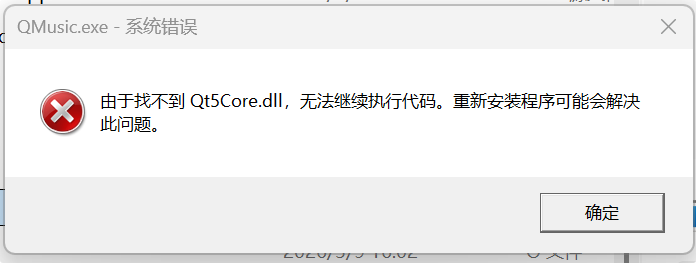
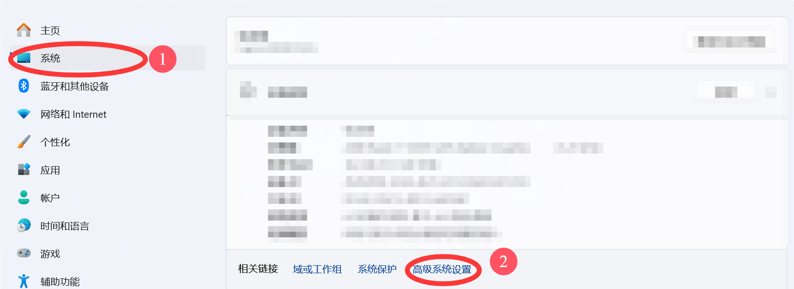
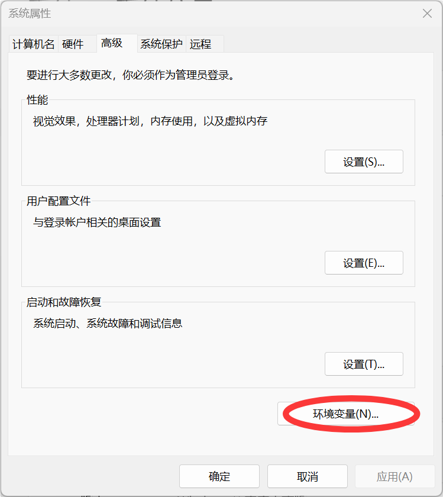
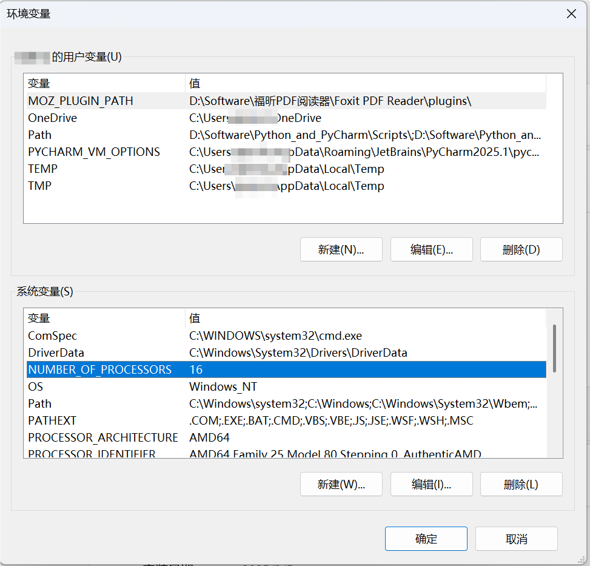
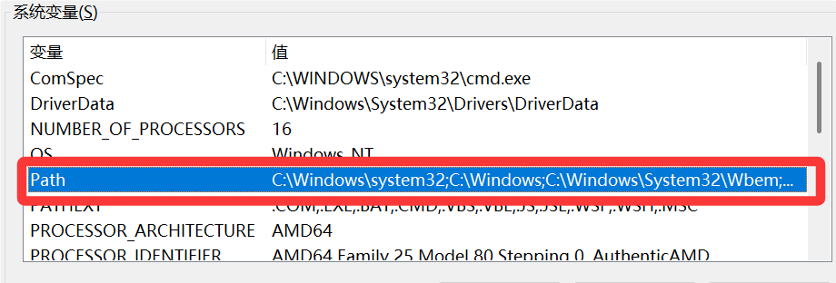
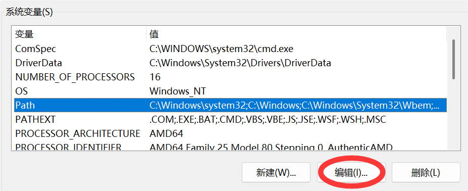
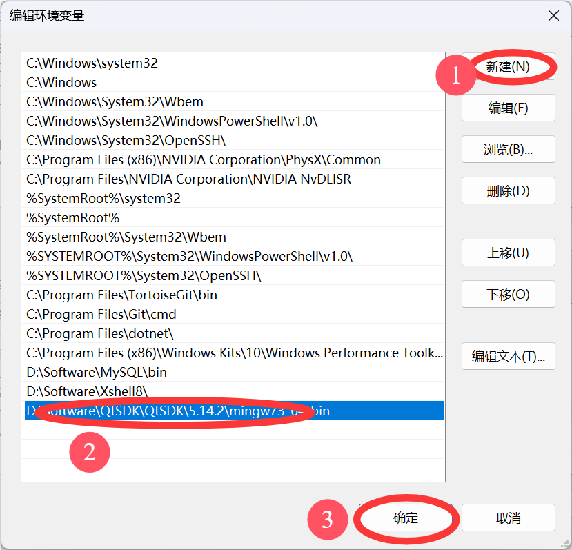
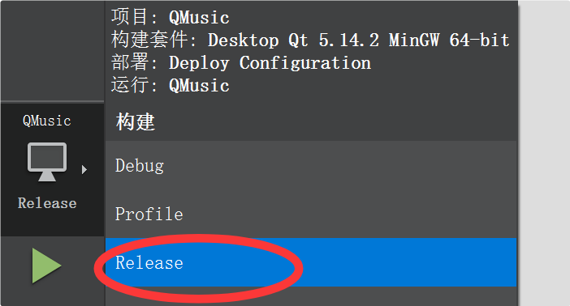
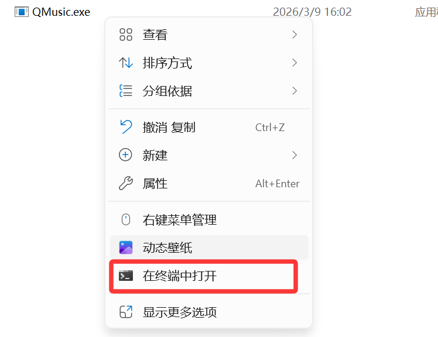
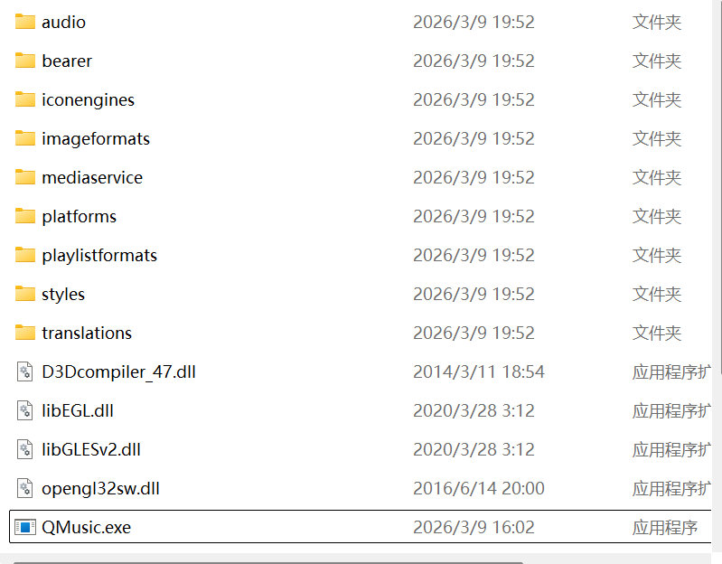

## 12.1 更换主窗口图标

在主界面显示时，我们希望标题栏显示我们自己设置的图标。
```cpp
/////////////////////////////////////////////////////////////////    
// qqmusic.cpp 中新增
// 在 QQMusic::initUI() 函数中添加
void QQMusic::initUI()
{
	// 设置窗口为无边框
    setWindowFlag(Qt::WindowType::FramelessWindowHint);
    
    setWindowIcon(QIcon(":/images/tubiao.png"));  // 设置主窗⼝图标
    
    ...
}
```
## 12.2 处理最大化、最小化、关闭等按钮

由于窗口中控件并非全部都设置了 Widget 布局，我们在做有些控件时位置是计算死的，所以在这种情况下进行窗口最大化有些控件可能无法适配尺寸，因此这里禁止窗口最大化。

并且我们希望当用户点击关闭按钮后，程序并不退出，而是隐藏起来了，用户可以在系统托盘中进行再次显示或退出程序的操作。
```cpp
/////////////////////////////////////////////////////////////////    
// qqmusic.cpp 中新增
// 在 QQMusic::initUI() 函数中添加
void QQMusic::initUI()
{
	// 设置窗口为无边框
    setWindowFlag(Qt::WindowType::FramelessWindowHint);

    setWindowIcon(QIcon(":/images/tubiao.png"));  // 设置主窗⼝图标
	
	// 禁止窗口最大化
	ui->max->setEnabled(false);
	
	...
}

void QQMusic::on_min_clicked()
{
    showMinimized();
}

void QQMusic::on_quit_clicked()
{
    this->hide();
}

void QQMusic::on_skin_clicked()
{
    QMessageBox::information(this, "温馨提⽰", "⼩哥哥正在加班紧急⽀持中...");
}
```
## 12.3 点击添加按钮歌曲重复加载问题

当我们点击加载按钮对同一个目录下歌曲重复加载时，仍能加载到程序中，正常情况下相同目录中的歌曲只能在播放器中加载一份才对。出现该问题的原因是加载时，未对已经存在的歌曲文件进行过滤导致，因此在 addMusicsByUrl() 函数中进行过滤，如果歌曲已经存在则无需解析，也无需加载。

如何知道歌曲是否已经被加载过了呢？最简单的方式是直接到 musicList 中查找，但是 musicList 为线性的 QVector，循环遍历效率太低，因此可以借助 QSet 容器（相当于C++标准库中的unordered_set），将歌曲的路径保存一份（同一个电脑上，文件路径不可能重复），在进行歌曲加载时，先检测歌曲文件是否存在，如果不存在则添加否则不添加。
```cpp
/////////////////////////////////////////////////////////////////    
// musiclist.h 中新增
private:
	QSet<QString> musicPaths;
	
/////////////////////////////////////////////////////////////////    
// musiclist.cpp 中新增
void MusicList::addMusicByUrl(const QList<QUrl> &urls)
{
	// 遍历传入的 URL 列表
    for (const auto &musicUrl : urls)
    {
        // 1. 获取文件的本地路径
        QString localFile = musicUrl.toLocalFile();

        // 2. 检测歌曲是否已经存在（去重逻辑）
        // 如果 musicPaths 集合中已经包含该路径，则跳过本次循环
        if (musicPaths.contains(localFile))
        {
            continue;
        }

        // 3. 歌曲还没有加载过，将其标记为已处理
        musicPaths.insert(localFile);

        // 4. 利用 Qt 的 MIME 数据库进行深度类型校验
        // 相比简单的后缀名判断，QMimeDatabase 能够识别文件真实的内容特征
        QMimeDatabase db;
        QMimeType mime = db.mimeTypeForFile(localFile);
        
        ...
	}
}
```
## 12.4 添加系统托盘

我们在前面说过当点击关闭按钮时，不让播放器直接退出，而是要将窗口隐藏掉，窗口的图标在系统托盘位置，当在播放器图标上右键单击时，弹出菜单让用户选择是显示窗口还是继续退出。


```cpp
/////////////////////////////////////////////////////////////////    
// qqmusic.cpp 中新增
// 在 QQMusic::initUI() 函数中添加
void QQMusic::initUI()
{
	...
	
	// 禁止窗口最大化
	ui->max->setEnabled(false);
	
	// 添加托盘
    // 创建托盘图标
    QSystemTrayIcon *trayIcon = new QSystemTrayIcon(this);
    trayIcon->setIcon(QIcon(":/images/tubiao.png"));

    // 创建托盘菜单
    QMenu *trayMenu = new QMenu(this);
    trayMenu->addAction("还原", this, &QWidget::showNormal);
    trayMenu->addSeparator();
    trayMenu->addAction("退出", this, &QWidget::close);

    // 将托盘菜单添加到托盘图标
    trayIcon->setContextMenu(trayMenu);

    // 显⽰托盘
    trayIcon->show();
	
	...
}
```

> **QSystemTrayIcon 是什么**？
> **QSystemTrayIcon** 是 Qt 框架中用于在**系统托盘**显示图标和管理交互的类。它主要用于那些需要长时间在后台运行、且不希望占用主任务栏空间的应用程序，如即时通讯工具、音乐播放器或系统监控软件。
> 
> **核心功能与特点**：
> - **显示图标**：允许程序在通知区域展示自定义的 QIcon 图标。
> - **交互菜单**：可以关联 `QMenu`，使用户右键点击图标时弹出操作选项。
> - **气泡通知**：支持通过 `showMessage()` 方法向用户发送临时的系统级通知消息。
> - **事件处理**：能够捕捉并响应用户对图标的点击、双击等交互动作。
> - **跨平台支持**：支持 Windows、macOS 以及实现相关规范（如 D-Bus StatusNotifierItem）的各种 Linux 桌面环境。

> **QMenu 是什么**？
> QMenu 是 Qt 框架中用于创建和管理菜单的类。它通常用于在 QMainWindow 的菜单栏中显示选项、作为上下文菜单（右键菜单）弹出或创建子菜单。QMenu 内部通过添加 QAction 对象来定义具体的菜单功能项，支持菜单、子菜单和分割线。
> 
> **核心功能与特性：**
> - **用途：** 用于定义菜单栏中的下拉菜单或鼠标右键弹出菜单。
> - **组成：** 由一系列 `QAction`（操作项）组成，支持 `addMenu()` 添加子菜单和 `addSeparator()` 添加分隔符。
> - **交互：** 支持信号槽机制，点击菜单项会触发信号。
> - **样式：** 支持通过 Qt Style Sheets (QSS) 自定义外观，包括边框、阴影和布局。

## 12.5 保证程序只运行一次 

我们现在如果通过点击 `QQMusic.exe` 文件运行程序，每点击一次都会创建一个 `QQMusic` 的实例，即同一个机器上可以同时运行多份程序实例，但多个实例同时运行有一些缺陷：

- 多个实例同时运行可能会导致资源浪费，如内存、CPU效率等 
- 如果应用程序涉及对共享数据的修改，多个程序同时运行可能会导致数据不一致问题
- 若多个实例尝试访问同一资源时，如文件、数据库等，可能会导致冲突或错误
- 另外，用户体验不是很好，多个实例操作时容易混淆

因此有时会禁止程序多开，即一个应用程序只能运行一个实例，也称为单实例应用程序或单例应用程序。

在Qt中，禁止程序多开的方式有好几种，此处采用共享内存实现。

共享内存是操作系统中的概念，是进程间通信的一种机制。由于相同 key 值的共享内存只能存在一份，因此在程序启动时可以检测共享内存是否已经被创建，如果已经创建则说明已有程序在运行，停止运行当前程序实例，否则程序还没有运行，创建共享内存并继续运行当前程序实例。
```cpp
/////////////////////////////////////////////////////////////////    
// main.cpp 中新增
int main(int argc, char *argv[])
{
    QApplication a(argc, argv);

    // 1. 为将要创建的共享内存定义一个唯一的标识符
    // 这个字符串（"QMusic"）在操作系统底层是全局唯一的
    QSharedMemory sharedMem("QMusic");

    // 2. 尝试将当前进程“挂载”到这个共享内存上
    // 如果 attach() 成功，说明已经有另一个 QMusic 进程创建并持有这块内存了
    if (sharedMem.attach())
    {
        // 弹出提示框告知用户
        QMessageBox::information(nullptr, "QQMusic", "QQMusic已经在运行...");

        // 直接退出当前进程，不进入主循环
        return 0;
    }

    // 3. 如果 attach() 失败，说明我是第一个运行的实例
    // 于是我正式“创建”这块共享内存，大小设为 1 字节即可（仅用于占位）
    sharedMem.create(1);

    // 4. 正常启动主界面
    QMusic w;
    w.show();

    return a.exec();
}
```
## 12.6 禁止 qDebug() 输出

在生产环境（Release 模式）中，显式禁用 `qDebug()` 输出是软件发布的标准实践。若不显示禁用则会为我们带来一些负面影响：

**1、隐性性能损耗 (Performance Overhead)**
虽然 Windows 下的 GUI 程序默认不显示控制台，但 `qDebug()` 依然会执行**字符串格式化**和**系统调用**。它会尝试将数据推送到系统的“调试输出管道”（Debug Output Pipeline）。这种后台操作在处理高频事件（如歌词滚动、进度条刷新）时，会产生不必要的 CPU 开销和线程锁竞争，导致程序运行产生微小却可感的卡顿。

**2、存储空间安全 (Storage Risk)**
如果程序中安装了日志重定向机制（将日志写入文件），持续产生的 `qDebug()` 信息会使日志文件迅速膨胀。在极端情况下，长达数天的持续运行可能生成数 GB 的垃圾数据，不仅**耗尽用户硬盘空间**，还可能因为频繁的磁盘写入缩短 SSD 的使用寿命。

**3、敏感数据泄露 (Security Privacy)**
`qDebug()` 往往包含开发时的敏感信息，如内部变量逻辑、文件路径、甚至 API 接口调试参数。这些信息即使在 Release 下也会残留在二进制文件中，通过调试工具（如 DbgView）即可轻松获取，增加了被**逆向工程**攻击的风险。

要逐个删除程序中 qDebug 的打印太麻烦，可以在 `.pro` 配置文件中通过添加以下语句，禁止 qDebug 输出：
```
# ban qDebug output
DEFINES += QT_NO_DEBUG_OUTPUT
```
## 12.7 项目打包

### 12.7.1 为什么要打包 
程序编译好之后，将 `exe` 可执行程序直接拷贝给其他人运行，可能会出现运行不了的情况，原因是什么呢？

答：Qt 可执行程序在运行的时候，需要依赖 Qt 框架中的一些库文件，如果对方之前未安装 Qt 环境，点击可执行程序运行时，会提示缺少 `xxx.dll` 动态库信息等。为了让开发好的 Qt 可执行程序在未安装 Qt 环境的机器上也可以运行，就需要对项目进行打包，打包的过程会将 `exe` 可执行程序运行时所需的依赖文件全部整合到一起，将打包好的包一起发给对端，双击 `exe` 可执行程序时就可以执行了。

注意：打包时 `exe` 需要用 release 版本，debug 是调试版本，release 版本编译器会去除调试信息，并会对工程进行优化等操作，使程序体积更小，运行效率更高。
### 12.7.2 windeployqt 打包工具

windeployqt 是Qt框架自带的命令行工具（位于Qt安装目录的bin文件夹中），专门用于Windows平台。它能自动分析并复制程序（`.exe`）所需的依赖文件（如Qt库、插件、插件文件夹、运行时库），从而快速生成可直接在其他 Windows 电脑上运行的完整发布包。

### 12.7.3 打包步骤

==1、检查电脑是否已配置过 Qt 环境变量==

配置 Qt 环境变量主要是在告诉操作系统（Windows/Linux）在哪里可以找到 Qt 的库文件（.dll/.so）、头文件以及编译器/工具（如qmake、mingw32-make）。这使得在命令行、IDE或其他工具中可以直接运行 Qt 工具，并在编译或运行程序时自动找到所需的库，实现全局访问。

如果我们之前没有配置过环境变量，运行 `.exe` 可执行程序时出现下面这种情况：


这就是因为系统找不到程序运行相关的动态库，此时需要配置系统的环境变量，让系统知道该去哪里找：

1. **先找到配置环境变量入口**




2. **配置环境变量**


进入环境变量配置框后能发现，这里有两个环境变量配置框，上面是用户变量框，意思是这里面配置的环境变量仅针对当前用户，如果系统中还有其他用户，这些环境变量不会对其他用户生效；下面一个就是系统环境变量框，意思是我在这里配置的环境变量针对当前电脑所有用户都生效。

我们一般电脑都只有一个用户，所以选哪一个都无所谓，这里我就选择配置系统环境变量了。



会发现这里面有很多环境变量项，这里选择系统变量中的 path 环境变量，path环境变量的变量值是很多个文件夹路径，意思是我想运行一个应用程序时，系统会自动在这些文件夹里查找。



点击编辑按钮。



然后新建一个路径，将对应的路径粘贴到新建路径位置，点击确定。

**补充**：如果之前已经配置过环境变量了就不用管了。

==2、选择以 release 方式编译程序。编译好之后，在工程目录上一层会生成包含 release 字段的文件夹，文件夹内部就有 release 模式的可执行程序。==



选择此模式，然后编译。


会生成一个带 release 的构建目录。


进入“构建目录->release 文件夹”就能看到`.exe`文件

==3、随便找一个位置，新建一个文件夹，命名为 QQMusic-release，将 release 模式可执行程序拷贝到 QQMusic-release 中。==

==4、进入 QQMusic-release，在该文件夹内部，选中 `.exe` 可执行程序，然后鼠标右键单击，弹出菜单中选择"在终端中打开"，再在弹出窗口中输入 `windeployqt .\QMusic.exe`，`windeployqt` 工具就会自动完成打包。==





当指令执行完后就会发现 QQMusic-release 文件夹下多出来了很多文件，这些就是程序要正常运行的依赖文件。

==5、配置好之后，将该目录压缩之后，发给对对方，对方收到之后直接解压，双击`exe`文件之后就可以运行。==
 
其实完成一个“完整打包”还需要将打包后的目录转换为安装包，这里就不做了，如果有需要可参考：[Qt入门（三）：项目打包_qt打包-CSDN博客](https://blog.csdn.net/a1547998353/article/details/140413232)
