## 2.1 创建项目
创建一个基于QWidget的项目，选中生成form选项，Kit（构建套件）选 Desktop Qt 5.14.2 MinGW 64-bit 。

> **QWidget、QMainWindow、QDialog 区别**：
> `QWidget`、`QMainWindow`和`QDialog`均为Qt中常用的窗口基类`QMainWindow` 和 `QDialog` 均继承自 `QWidget` 。
> 
> **QWidget**：
> **特点**：非常“干净”，没有任何预设的装饰（如菜单栏、状态栏）。通常用于**嵌入**到其他窗口中，或者作为自定义控件的基类。
> 
> **QMainWindow**：
> **特点：** 内置了菜单栏 (QMenuBar)、工具栏 (QToolBar)、状态栏 (QStatusBar) 和中心部件 (Central Widget)，具有完善的主窗口布局。
> 
> **QDialog**：
> **特点**：没有菜单栏和状态栏，专门用于**临时交互**，通常作为顶级窗口弹出，支持模态（modal）和非模态（non-modal）。

> **Generate form（生成表单）**：勾选此选项后，Qt 会自动为我们创建一个配套的 `.ui` 文件。这样我们就使用 **Qt Designer**（Qt 设计师）通过拖拽控件（按钮、文本框等）的方式来设计界面，而不需要纯靠手写 C++ 代码来布局，效率会更高。

> **Kit Selection（构建套件选择）**：要将我们 Qt 中的 C++ 代码变成电脑能运行的软件，需要三样东西：编译器（包含在 MinGW 里面）、Qt 库（这里是 Qt 5.14.2）以及调试器（包含在 MinGW 里面）。
> 
> **`Desktop Qt 5.14.2 MinGW 64-bit` 参数含义**：
> **Desktop**：表示你打算开发的是**桌面端**（Windows/Mac/Linux）软件，而不是安卓或嵌入式设备。
> **Qt 5.14.2**：这是你当前使用的 **Qt 版本号**。
> **MinGW 64-bit**：
> - **MinGW**：一个将著名的开源GNU工具链（如GCC、GDB、Make）移植到Windows平台的开发环境。
> - **64-bit** 表示编译出来的程序是 64 位的（只能在 64 位 Windows 上跑，现在的电脑基本都是了）。
> 
> **MinGW**：
> 
> **MinGW 是什么**？
> **MinGW** 的全称是 **Minimalist GNU for Windows**。**Minimalist（极简）** 表示它只提供在 Windows 上开发 C/C++ 程序最核心的工具，不附带臃肿的额外功能；**GNU** 是一个著名的自由软件工程，包含操作系统内核、编译器、工具链、应用程序等全套软件的项目体系；**for Windows** 就是把 Linux 上那套搬到了 Windows 系统中。
> 
> 所以，简单来说 MinGW 就是一个将 Linux 著名的开源 GNU 工具链（如GCC、GDB、Make）移植到Windows平台的 C/C++ 编译器工具链。它允许开发者在Windows上原生编译生成32位或64位（通常通过MinGW-w64分支）的C/C++程序，无需依赖第三方运行库。
> 
> **为什么需要 MinGW** ？
> 在 Windows 上开发中，通常有两大阵营：一个是微软自家的 **MSVC**（随 Visual Studio 安装），另一个就是 **MinGW**。**MSVC**（Microsoft Visual C++）由于是微软官方编译器，集成于 Visual Studio，所以对 Windows 原生支持最好；**MinGW**（Minimalist GNU for Windows）则是 GCC 在 Windows 的移植版，开源且轻量，适合跨平台开发。
> 
> 由于安装 MSVC 通常需要下载庞大的 Visual Studio IDE（几个 GB 起步），而 MinGW 可以作为一套独立的工具链（几百 MB）配合 Qt Creator、VS Code 甚至简单的命令行使用，非常轻量，非常适合追求极致效率的开发者。

## 2.2 主界面布局设计
Qt 中有4种布局管理器：QHBoxLayout（水平布局）、QVBoxLayout（垂直布局）、QGridLayout（栅格布局）、QFormLayout（表单布局）

由于一个 widget 中只能包含上述布局管理器中的一种，所以直接使用布局管理器来布局不是很灵活； 而一个 widget 中可以包含多个 widget ，在这些 widget 中的控件可以进行水平、垂直、栅格、表单等布局操作，非常灵活。所以本项目基于 Widget 来进行布局。
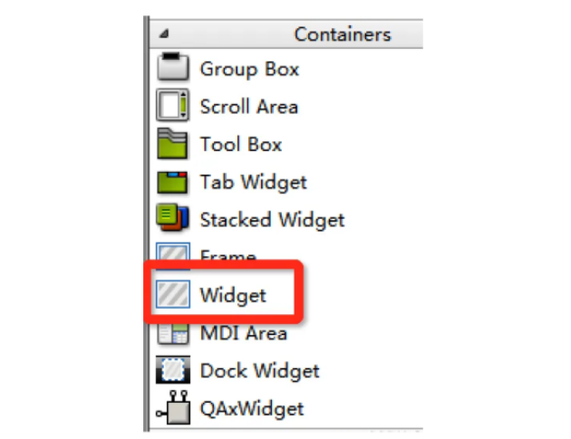

### 2.2.1 窗口主框架设计
① 选中 QQMusic ，在弹出的属性中找到 geometry 属性，将窗口宽度修改为：1040，高度修改为700
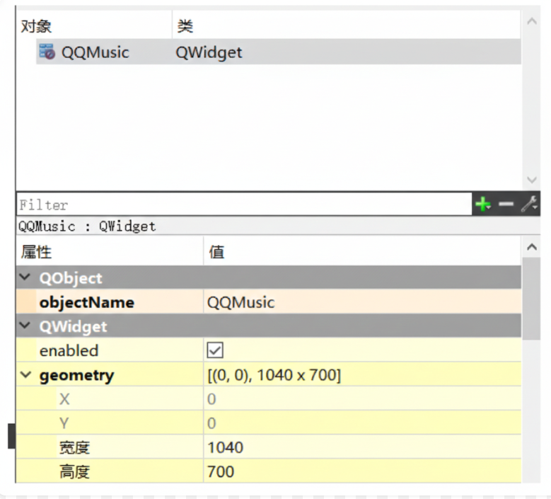

> `geometry` 决定了 **`Widget`（控件/窗口）在屏幕上或其父窗口中的位置和大小**。它由一个 **`QRect`** 对象表示，包含了四个核心数值：
> - **x**: 控件左上角的横坐标。
> - **y**: 控件左上角的纵坐标。
> - **width**: 控件的宽度。
> - **height**: 控件的高度。

② 从控件区拖拽一个Widget到窗口区域，objectName修改为：background，选中QQMusic，然后 点击垂直布局，background就填充满了整个窗口。
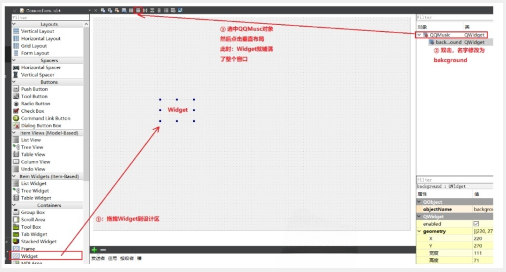
由于Widget显示不明显，选中backroound控件，然后右键单击，弹出菜单中选择改变样式表，内部添加 `background-color:gray;` 就能非常清晰的看到布局效果了。

整个窗口由head和body上下两部分组成。直接拖两个Widget放到设计区，双击将名字修改为head和body； 修改背景颜色方便查看效果,head背景色修改为`background-color:green;`，body背景色修改为`background-color:pink;`。head在上，body在下，然后选中background对象，点击垂直布局。
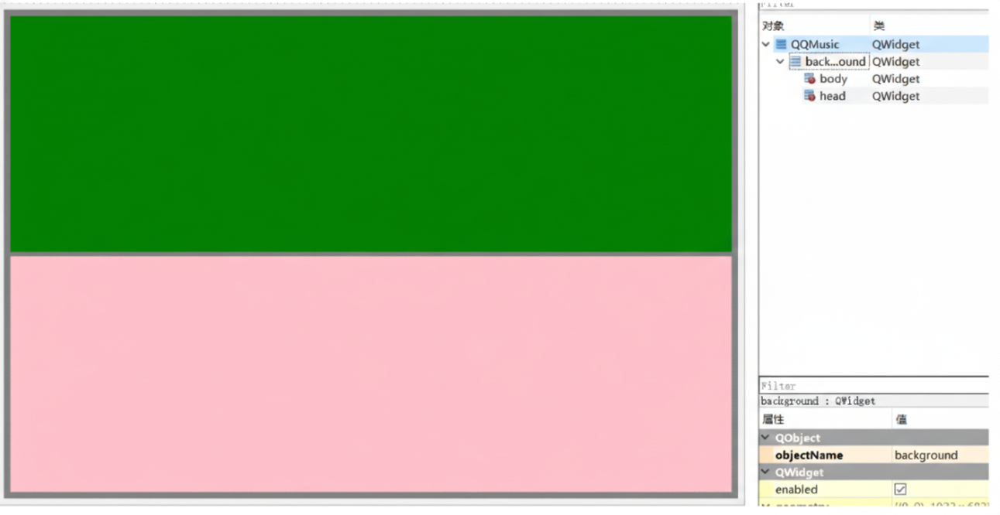

head和body平分了整个background，并且head和body的margin有间隔。再次选中background对象，右侧属性部分下滑找到Layout，将Margni和Space修改为0
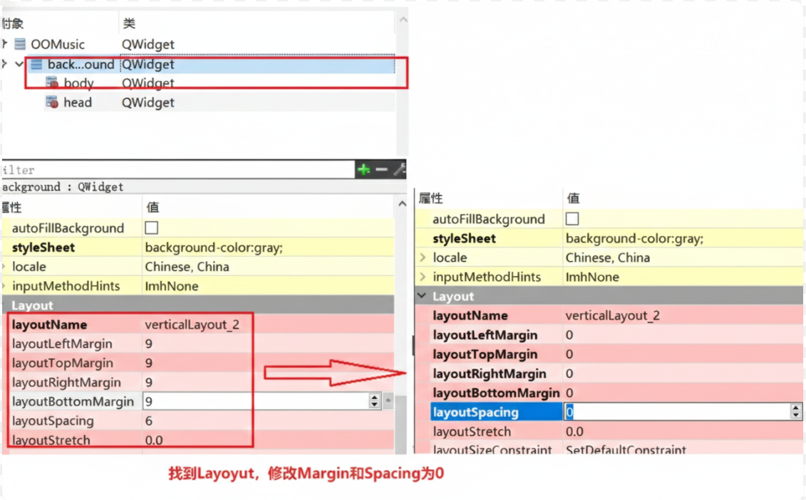

> **Layout（布局管理器）** 的一些核心参数：
> - layoutMargin（外边距）：**布局边界**与其**内部控件**之间的距离
> - layoutSpacing（间距）：**相邻两个控件之间**的距离
> - layoutStretch（伸缩因子）：当窗口拉大时，内部控件**分配剩余空间的比例**
> - **`layoutSizeConstraint`**（布局大小约束）：决定了布局控制窗口的大小的策略。
> 	- SetDefaultConstraint（默认约束）：窗口会根据内部控件的 **`sizeHint`**（建议大小）自动调整。
> 	- SetFixedSize（固定尺寸）：窗口的大小将完全由内部控件决定，且禁止用户拉伸。
> 	- SetMinimumSize（最小尺寸约束）： 窗口的大小不能小于内部控件所需的最小尺寸。
> 	- SetMaximumSize（最大尺寸约束）：窗口不能超过内部控件设定的最大尺寸。
> 	- SetNoConstraint（无约束）：布局不控制窗口的大小，完全放任自流。

修完完成后，head和body之间的间隔就没有了。

但是head占区域过大，选中head对象，将head的minimumSize和maxmumSize属性的高度都调整为 80，这样head的大小就固定了。
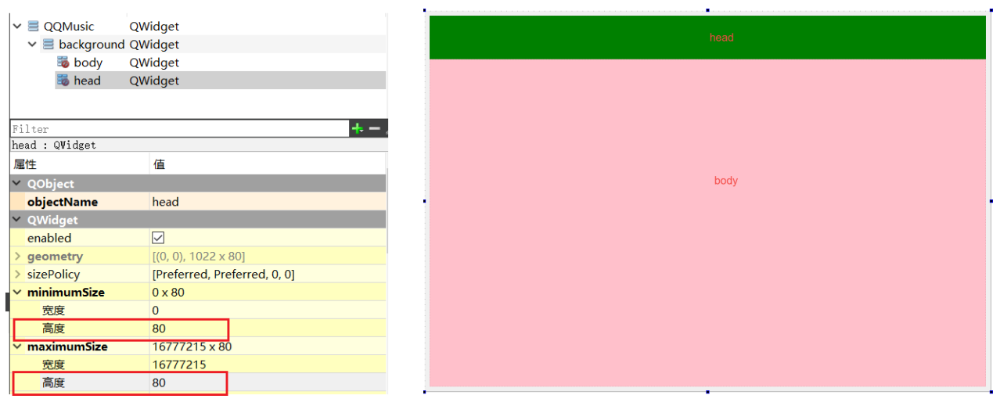

> minimumSize（最小尺寸）：规定了控件最小能缩到多大。
> maximumSize（最大尺寸）：规定了控件最大能扩展到多大。

### 2.2.2 head内部设计
head内部由两部分构成，headLeft区域显示图标，headRight区域为搜索框和功能按钮区域。

拖两个widget到head中，将objectName修改为headLeft和headRight，背景颜色修改为：headLeft：`background-color:yellow;`；headRight：`background-color:blue;`

然后选中head对象，点击水平布局，继续选中head对象，下滑找到Layout属性，将Margin和Spacing全部设置为0；

选中headLeft对象，将minimumSize和maximumSize的宽度修改为200，就能看到head的初步效 果。
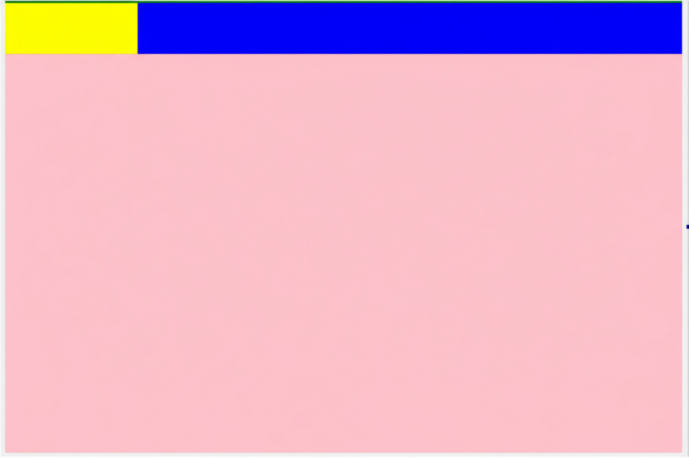

#### 2.2.2.1 headLeft
拖一个QLabel控件放置headLeft内，将QLabel的objectName修改为logo，text属性修改为空；然后 选中headLeft，点击水平布局，此时QLabel就会填充满headLeft。同样需要选中headLeft，下滑找到 Layout属性，将Margin和spacing全部设置为0.

#### 2.2.2.2 headRight
headRight内部也是由两部分构成：搜索框和按钮区域 

拖拽两个widget到headRight，修改objectName为SearchBox和SettingBox，将SearchBox的 minimumSize和maximumSize的宽度修改为300，背景颜色分别修改为：SearchBox：`background-color:red;`；SettingBox：`background-color:orange;`

选中headRight，然后点击水平布局，并将headRight的Margin和Spacing修改为0，就能看到下面的效果。
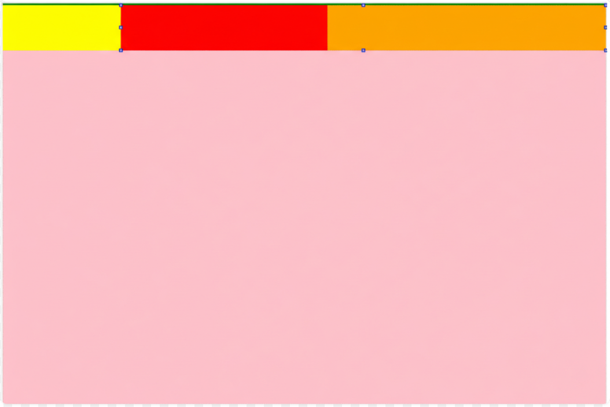

##### 2.2.2.2.1 searchBox
拖一个QLineEdit进去，然后选中searchBox点击水平布局。

##### 2.2.2.2.2 settingBox
拖拽一个按钮到SettingBox，按钮的minimumSize和maximumSize的宽度和高度都修改为30，然后鼠标选中，按着ctrl键+鼠标拖拽，复制3个出来摆放好，依次将四个按钮的objectName从左往右修改 为：skin、max、min、quit，并将按钮的text属性也修改为空，将来设置图片。

在控件区域找到Spacers，找到Horizontal Spacer控件，拖拽到SettingBox区域
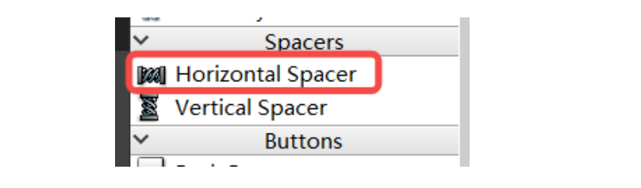
选中SettingBox，点击水平布局，并将SettingBox的Margin和Spacing修改为0

### 2.2.3 Body内部设计
整个body部分是由bodyLeft和bodyRight两部分组成。
① 拖两个Widget到Body中，将objectName修改为bodyLeft和bodyRight 

② 将bodyLeft颜色修改为：bodyLeft：`background-color:#f0f0f0`、bodyRight：`background-color:#f5f5f5`

③ 选中body，点击水平布局，将bodyLeft的minimumSize和maxmumSize的宽度修改为200 

④ 选中Body，将body的Margin和Spacing修改为0
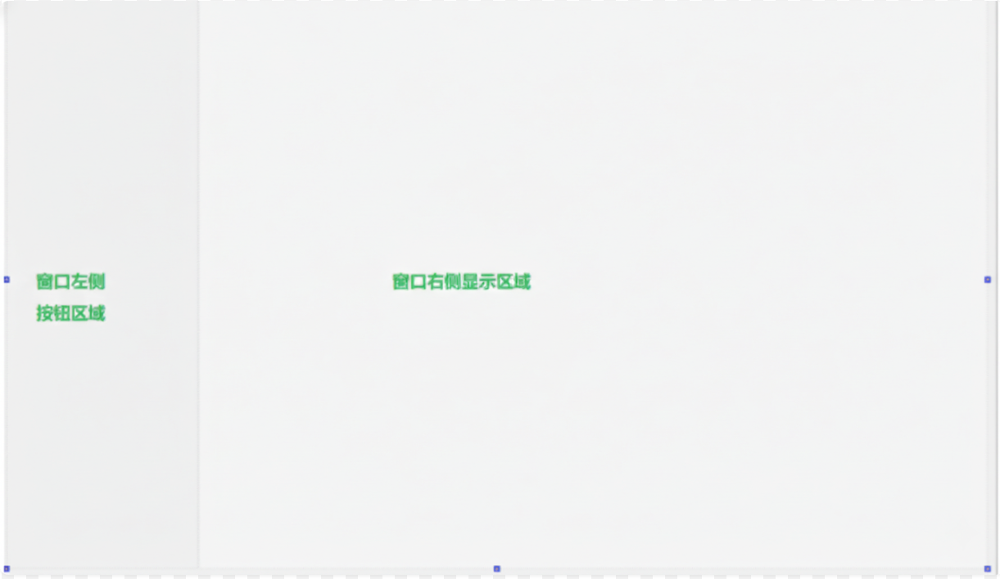

#### 2.2.3.1 bodyLeft
① 拖拽一个Widget到bodyLeft，将objectName修改为leftBox，背景颜色修改为：`backgroundcolor:pink;` 

② 拖拽Vertical Spacer到bodyLeft 

③ 选中leftBox，将minmumSize和maxmumSize的高度修改为400 

④ 选中bodyLeft，点击垂直布局，并将bodyLeft的Margin和Spacing修改为0
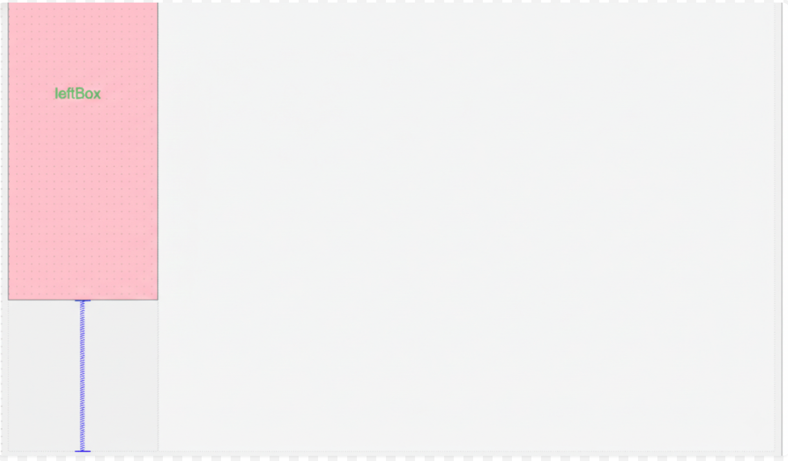

##### 2.2.3.1.1 leftBox
leftBox内部包含：在线音乐 和 我的音乐两部分。 

① 拖拽两个Widget到leftBox中，将objectName依次修改为：onlineMusic和myMusic 

② 颜色分别修改为：onlineMusic：`background-color:#f0f0f0`、myMusic：`background-color:#f5f5f5`

③ 选中leftBox，点击垂直布局，然后将Margin和Spacing设置为0 

④ onlineMusic 和 myMusic内部的元素都是相同的，由一个QLabel和三个Widget构成，后期Widget 会替换为自定义按钮，此处先用Widget占位。因此分别向onlineMusic和myMusic内部拖拽一个 QLabel和三个QWidget，并选中 onlineMusic 和 myMusic点击垂直布局，然后将Margin和Spacing设置为0

#### 2.2.3.2 bodyRight
bodyRight由层叠窗口、进度滑竿、播放控制区三部分组成。

① 拖拽层叠窗口控件Stacked Widget（就在Widget控件上方）到bodyRight中 

② 拖拽Widget到bodyRight，将objectName修改为processBar，将minimumSize和maximumSize 的高度修改为30，背景颜色修改为绿色 

③ 拖拽Widget到bodyRight，将objectName修改为controlBox，将minmumSize高度修改为60 

④ 选中bodyRight，点击垂直布局，然后将bodyRight的Margin和Spacing修改为0 

⑤ 为了能看到效果，将processBar颜色修改为：`background-color:pink;`
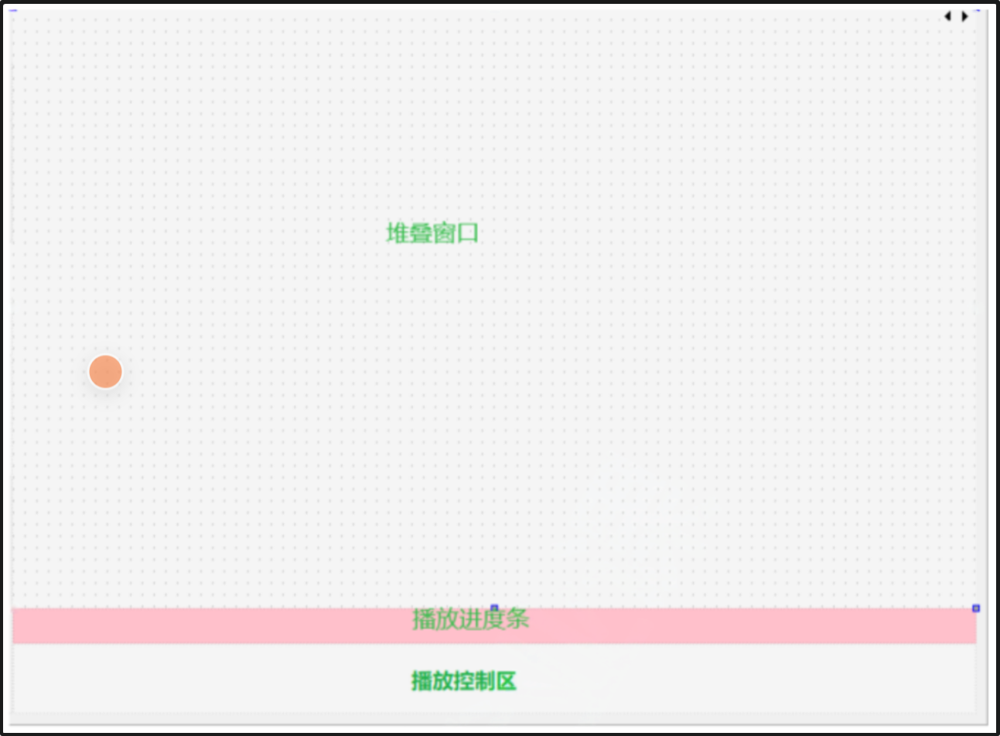

##### 2.2.3.2.1 stackedWidget
stackedWidget默认会提供两个页面，还需添加四个页面。

在对象区域选中stackedWidget控件，然后右键单击弹出菜单中选择添加页：
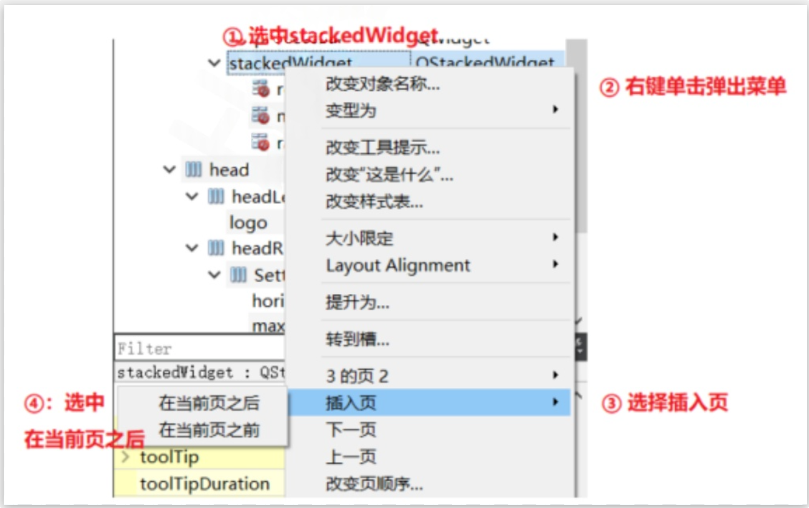
以类似的方式添加添加4个页面，并修改每个页面的objectName如下：
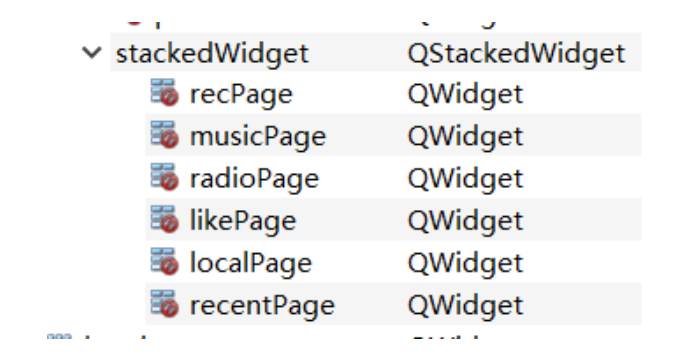
总共六个页面，每个页面都有自己的索引，索引是从0开始的，将来切换页面时就是通过索引来切换的。

选中stackedWidget，然后右键单击，弹出菜单中选择：改变页顺序，在弹出的窗口中就能看到每个页面的索引
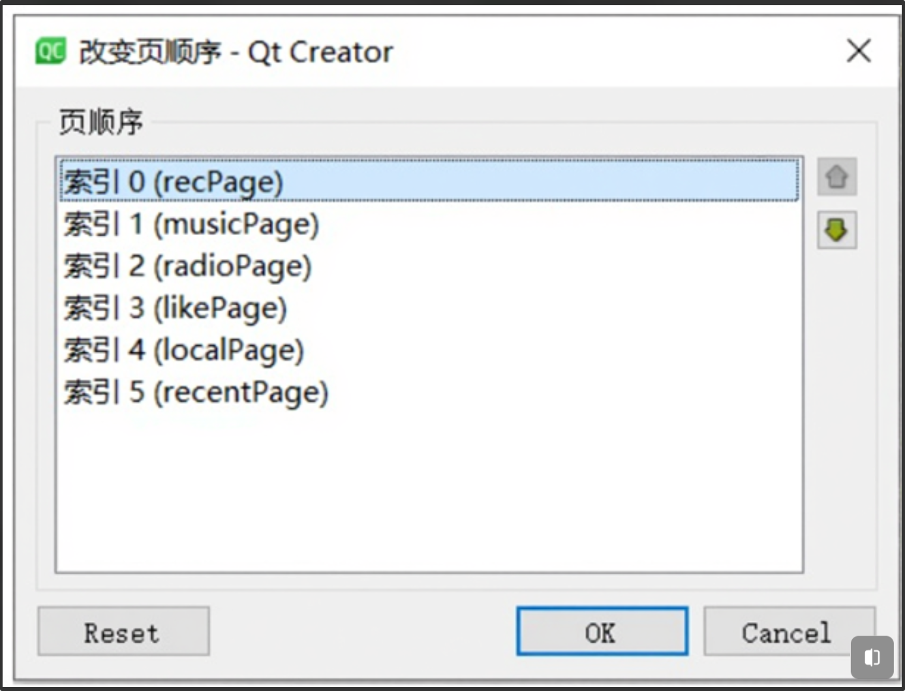

##### 2.2.3.2.2 ControlBox
该区域内部由三部分组成：歌曲信息部分、播放控制部分、时间显示 

① 拖拽三个Widget到ControlBox中，将ObjectName依次修改为play_1、play_2、play_3 颜色依次修改为：play1：`background-color:#FFFAFA;`、play2：`background-color:#F8F8FF;`、play3：`background-color:#FFFAF0;`

② 选中ControlBox，点击水平布局，将ControlBox的Margin和Spacing修改为0
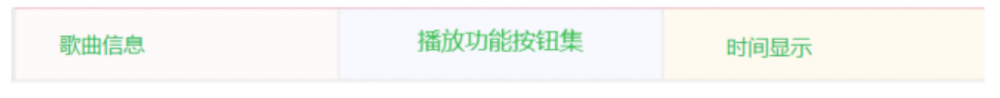

**play1内部**： 
拖拽3个QLabel，放置歌曲图片、歌手名和歌曲名字，调整好位置，将QLabel的objectName修改为： musicCover、musicName、musicSinger，然后选中play1，点击栅格布局

**play2内部**：
从左到右依次摆放6个按钮，按钮的minimumSize和maxmumSize均修改为`30*30`，将objectName从 左往右依次修改为：playMode、playUp、Play、playDown、volume、addLocal； 然后选中play2，点击水平布局，并将play_2的Margin和Spacing修改为0

**play3内部**：
拖四个QLabel和一个按钮，调整大小位置，从左往右QLabel的objectName依次修改为：labelNull、 currentTime、line、totalTime，按钮的objectName修改为lrcWord，按钮的maxmumSize的宽度和 高度修改为`30*30`；

选中play3，点击水平布局，并将play2的Margin和Spacing修改为0
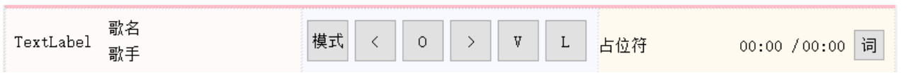
