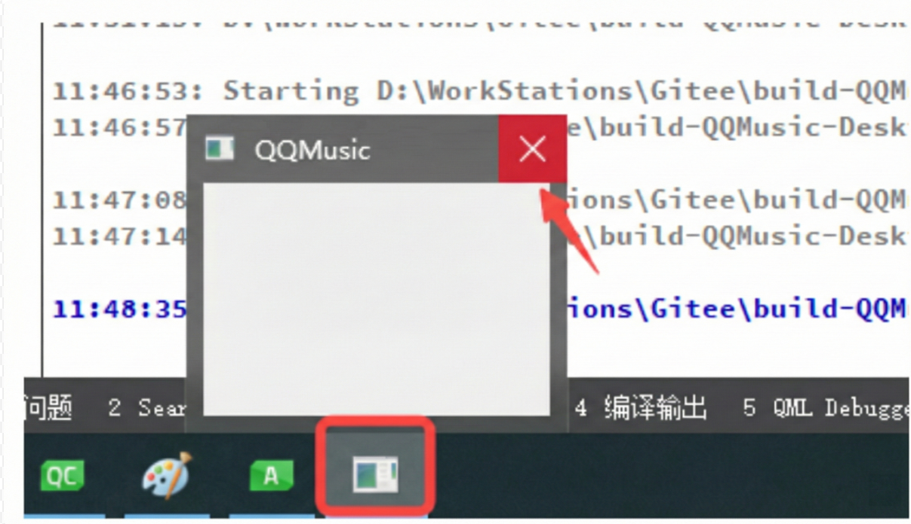
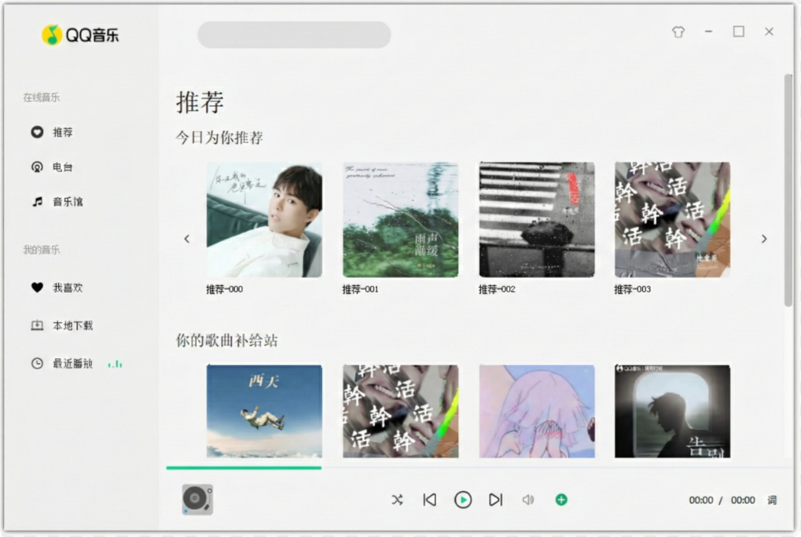
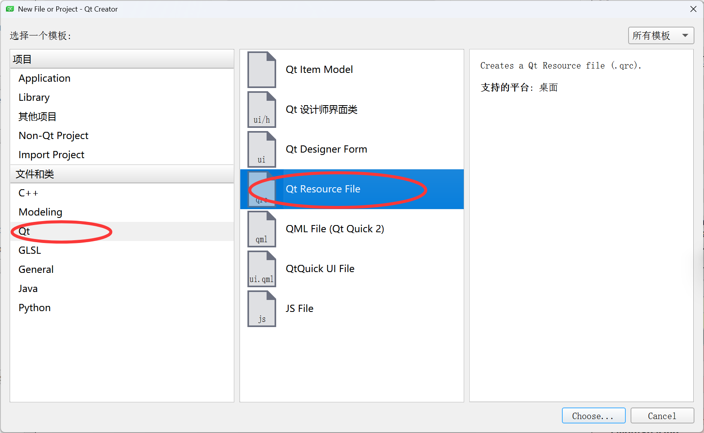
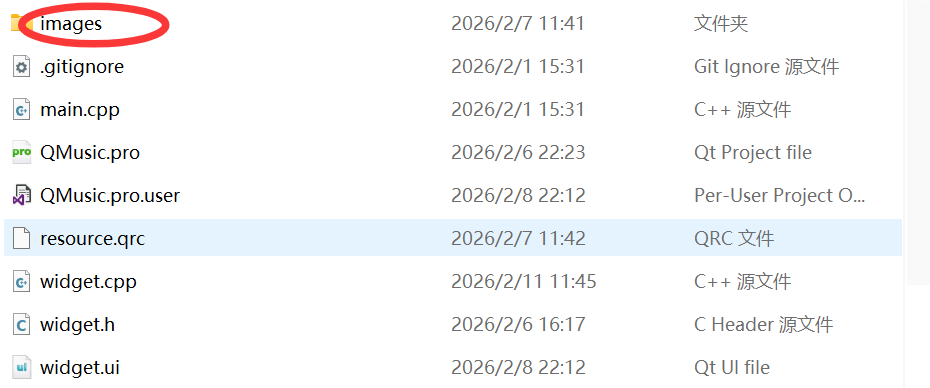
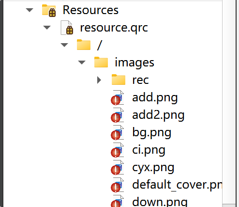

确定界面的总体布局后，就需要向合适的位置放入相应的内容进行界面优化，使总体界面看起来更符合我们的审美。

我们这里用 [QSS](QSS.md)（Qt样式表）来设计每个控件的基本样式。
## 3.1 主窗口设定
主窗口是没有标题栏，因此在窗口创建前，需要设置窗口的格式。我们这里用`QWidget::setWindowFlag()`函数将其设置为无标题栏的窗口

我们在`QQMusic`类中添加`initUI()`方法来完成界面初始化工作。
```cpp
// QQMusic.h ⽂件中添加：
void initUI();
// 添加完成后，光标放在函数名字上按 alt + Enter 组合键完成⽅法定义

// QQMusic.cpp 头⽂件中完成定义
void QQMusic::initUI() {
	// 设置⽆边框窗⼝，即窗⼝将来⽆标题栏
	setWindowFlag(Qt::WindowType::FramelessWindowHint); 
}
```
添加完成后在`QQMusic`的构造函数中调用`initUI()`函数，运行后，发现窗口的标题栏确实消失了，但又存在以下两个问题：
- 窗口无标题栏，找不到关闭按钮，导致窗口无法关闭
- 窗口无法拖拽

对于**关闭窗口**，可以先将光标放在任务栏中当前应用程序图标上，弹出的框中选择关闭，后序会实现关闭功能。


**主界面无法拖动**，此时只需要处理下鼠标单击（`mousePressEvent`）和鼠标移动（`mouseMoveEvent`）事件，重写事件处理函数即可。
```cpp
/////////////////////////////////////////////////////////////////
// QQMusic.h中添加
protected:
    // 重写 QWidget 类的鼠标按下和鼠标移动事件
    void mousePressEvent(QMouseEvent *event) override;
    void mouseMoveEvent(QMouseEvent *event) override;

private:
    // 记录鼠标按下时，光标相对于窗口左上角的偏移距离
    QPoint dragPosition;
    
/////////////////////////////////////////////////////////////////
// QQMusic.cpp中添加
// 鼠标按下事件：计算偏移量
void QQMusic::mousePressEvent(QMouseEvent *event) {
    // "==" 仅响应鼠标左键
    if (event->button() == Qt::LeftButton) {
        /*
         * event->globalPos(): 鼠标相对于屏幕左上角的位置
         * frameGeometry().topLeft(): 整个窗口（含边框）相对于屏幕左上角的位置
         * 两者相减，得到鼠标在窗口内部的相对坐标
         */
        dragPosition = event->globalPos() - frameGeometry().topLeft();
        
        // 接受事件，不再向下传递（也可以不写，但为了规范还是写上）
        event->accept();
        return;
    }
    
    // 其他情况交给基类处理
    QWidget::mousePressEvent(event);
}

// 鼠标移动事件：根据偏移量更新窗口位置
void QQMusic::mouseMoveEvent(QMouseEvent *event) {
    /*
     * event->buttons(): 返回鼠标按键状态
     * "&" 只要按下了左键，不管有没有同时按住其他键，条件都成立。
     */
    if (event->buttons() & Qt::LeftButton) {
        /*
         * 窗口新位置 = 当前鼠标的全局位置 - 之前记录的偏移量
         */
        move(event->globalPos() - dragPosition);
        
        event->accept();
        return;
    }
    
    QWidget::mouseMoveEvent(event);
}
```

---
补充：上面这种写法会出现一个 bug ，就是当我在后面实现了自定义控件后（比如 BtForm），点击这个自定义控件时，父窗口 `Widget` 的 `mousePressEvent` **可能比子控件更早地捕捉到了这个动作**（或者逻辑上没避开子控件），此时 `event->pos()` 的参考系有时会发生微小的混乱，导致 `dragPosition` 计算出了一个错误的值，错误的坐标传给了 Windows 的 `UpdateLayeredWindow` 函数，系统发现参数不对，于是报错，并强行把窗口“修正”到一个它认为对的位置，然后会表现出当我们快速点击这个自定义控件时窗口会发生**瞬移**的现象。

所以，我们要修改我们窗口拖动的代码逻辑。
```cpp
/////////////////////////////////////////////////////////////////
// QQMusic.h中添加
protected:
    // 重写QWidget类的⿏标单击和⿏标移动事件
    void mousePressEvent(QMouseEvent* event) override;
    void mouseMoveEvent(QMouseEvent* event) override;
    void mouseReleaseEvent(QMouseEvent* event) override;
    
private:
	...

    bool isDragging;		// 记录鼠标是否处于按下并准备拖拽的状态
    QPoint dragPosition;	// 记录鼠标按下时，鼠标指针相对于窗口左上角的坐标偏移

/////////////////////////////////////////////////////////////////
// QQMusic.cpp中添加
void QQMusic::mousePressEvent(QMouseEvent *event)
{
    QWidget *clickedWidget = childAt(event->pos());

    // 只要鼠标在顶部 80 个像素内，并且没有点到按钮 (max, min, quit, skin) 和 输入框 (search)，条件就达成
    // 注意：必须加上 clickedWidget == nullptr 的判断，防止鼠标刚好点击在了一个连背景 QWidget 都没有铺到的绝对空白边缘时
    // 对空指针解引用，此时程序会崩溃
    if (event->pos().y() < 80 &&
       (clickedWidget == nullptr ||
       (!clickedWidget->inherits("QPushButton") && !clickedWidget->inherits("QLineEdit"))))
    {

        // "==" 仅响应鼠标左键
        if (event->button() == Qt::LeftButton)
        {
            isDragging = true; // 鼠标左键已按下准备拖拽

            /*
            * event->globalPos(): 鼠标相对于屏幕左上角的位置
            * frameGeometry().topLeft(): 整个窗口（含边框）相对于屏幕左上角的位置
            * 两者相减，得到鼠标在窗口内部的相对坐标
            */
            dragPosition = event->globalPos() - frameGeometry().topLeft();

            // 接受事件，不再向下传递（也可以不写，但为了规范还是写上）
            event->accept();
            return;
        }
    }

    isDragging = false;
    // 交给基类处理
    QWidget::mousePressEvent(event);
}

void QQMusic::mouseMoveEvent(QMouseEvent *event)
{
    // event->buttons(): 返回鼠标按键状态
    // "&" 只要按下了左键，不管有没有同时按住其他键，条件都成立。
    // 只有在明确标记为“拖拽中”且按住左键时才移动
    if (isDragging && (event->buttons() & Qt::LeftButton))
    {
        // 窗口新位置 = 当前鼠标的全局位置 - 之前记录的偏移量
        move(event->globalPos() - dragPosition);

        event->accept();
        return;
    }

    QWidget::mouseMoveEvent(event);
}

void QQMusic::mouseReleaseEvent(QMouseEvent *event)
{
    isDragging = false;
    (void)event;
}
```

---
接着，我们可以**为窗口周围添加阴影效果**（窗口四周的黑色部分就是阴影）

给窗口添加阴影需要用到 `QGraphicsDropShadowEffect` 类，具体步骤如下：
1. 创建 `QGraphicsDropShadowEffect` 类对象
2. 设置阴影的属性。比如：设置阴影的偏移、颜色、圆角等
3. 将阴影设置到具体对象上

创建一个`addShadow()`添加阴影函数：
```cpp
/////////////////////////////////////////////////////////////////
// QQMusic.h中添加
protected:
    // 为窗⼝添加阴影
    void addShadow();
    
/////////////////////////////////////////////////////////////////
// QQMusic.cpp中添加
// 为窗⼝添加阴影
void QQMusic::addShadow() 
{
    // 1. 设置窗口背景透明（非常关键，否则阴影会被窗口的背景色遮挡）
    this->setAttribute(Qt::WA_TranslucentBackground);

    // 2. 创建阴影效果对象
    QGraphicsDropShadowEffect* shadowEffect = new QGraphicsDropShadowEffect(this);
    
    // 设置阴影偏移：(0,0) 表示阴影向四周均匀发散，没有特定方向的偏移
    shadowEffect->setOffset(0, 0);               
    
    // 设置阴影颜色：使用半透明黑色，视觉效果更柔和
    shadowEffect->setColor(QColor(0, 0, 0, 160)); 
    
    // 设置阴影的模糊半径：数值越大，阴影越弥散
    shadowEffect->setBlurRadius(20);             
    
    // 3. 将阴影效果应用到窗口上
    this->setGraphicsEffect(shadowEffect);
}
```
在`initUI()`中调用。

**注意**：在 Qt 中，如果直接给顶层窗口设置阴影，可能会出现阴影显示不出来的情况。因为阴影是在窗口的外边距（Margin）进行绘制的，如果你将窗口的外边距全部设置为 0 了就无法显示，所以应当给这个外边距预留合适的空间。
## 3.2 添加图片资源
### 3.2.1 Qt 的 qrc 机制

**为什么需要 qrc**？
在开发 QQMusic 项目时，如果使用相对路径（如 `./images/logo.png`）加载资源，程序会高度依赖本地的文件系统。一旦项目打包外发，只要对方电脑的文件夹层级稍有变动，或者漏传了某个文件夹，界面上的图标就会全部失效。

为了彻底解决这种“环境依赖”问题，Qt 引入了 qrc 机制。它不再是简单地去硬盘找文件，而是将资源直接“烧录”进可执行文件内部。这样一来，无论程序被移动到哪里，资源都会一起移动，永远不会丢失。

但这种 qrc 机制也有缺点，就是会导致程序内存占用变高，如果放几个 GB 的视频进去，程序启动会非常慢且吃内存。

**什么是 qrc 机制**？
qrc 是 Qt 提供的一个跨平台的资源管理方案。它本质上是一个 XML 格式的文本文件，记录了物理文件与虚拟文件系统之间的映射关系。

**qrc 机制的核心原理**：
- **编译期 (Compile-time)：** Qt 的资源编译器 (`rcc`) 会读取 qrc 中引用的磁盘文件（如图片、QSS），将其二进制内容转换为 C++ 代码中的静态字节数组 (`static const unsigned char[]`)。这使得资源数据成为了最终可执行文件 (`.exe`) 数据段的一部分。 
- **运行期 (Run-time)：** Qt 会构建一棵虚拟文件树，其结构与我们在 `.qrc` 中定义的完全一致。 当我们使用 `:/icons/play.png` 访问资源时，Qt 实际上是在查这棵树。找到对应的节点后，Qt 就能拿到一个内存指针——这个指针指向的正是编译阶段生成的那个 C++ 数组。通过这个指针，Qt 就能像读硬盘文件一样，从内存里把图片数据读出来，再将这些图片二进制数据还原成原始图片。

### 3.2.2 添加 qrc 文件

向项目中添加⼀个 qrc 文件。

再将我们要用到的图片资源放到与我们项目同级的目录下（建议新建一个 `images` 文件夹统一存放，确保资源与项目处于同一根目录下）。

再将这些图片资源全部添加到我们创建的 qrc 文件中。


## 3.3 通过 QSS 为控件设置样式

在通过 QSS 为控件设置相应的样式时，应注意要先将我们前面为方便界面布局设计而给控件设置的背景给去除掉，否则会出现明明控件已经应用了 QSS 但就是显示不出来的情况，这是因为你的 QSS 样式被父控件的背景样式覆盖了。
### 3.3.1 head 区处理

控件：`headLeft`
QSS 美化：
```css
#headLeft
{
	background-color:#F0F0F0;/*设置背景颜⾊为浅灰⾊*/
}
```

控件：`headRight`
QSS 美化：
```css
#headRight
{
	background-color:#F5F5F5; /*设置背景颜⾊为亮灰⾊*/
}
```

控件：`logo`
QSS 美化：
```css
#logo 
{
    /* 设置圆角半径为 0（保持直角状态） */
    border-radius: 0px;

    /* 从资源文件（qrc）中加载图片作为背景图 */
    background-image: url(:/images/Logo.png);

    /* 设置背景图不平铺（防止图片过小时出现重复填充） */
    background-repeat: no-repeat;

    /* 去掉控件的边框 */
    border: none;

    /* 将背景图在控件区域内居中对齐 */
    background-position: center center;
}
```

控件：`search`
QSS 美化：
```css
#search 
{
    background-color: #E3E3E3;
    border-radius: 17px; 
    padding-left: 17px;
	padding-right: 17px; /* 增加右侧间距，防止文字过长时顶到边框 */
	border: 1px solid #DCDCDC;
}

#search:focus
{
    border: 1px solid #1ECD97; /* 比如变成绿色，更像 QQ 音乐 */
    background-color: #FFFFFF; /* 点击时背景变白 */
}
```

控件：`settingBox`
QSS 美化：
```css
QPushButton
{
	border-radius:0px; /*设置按钮的边框圆⻆为 0 像素，实现直⻆边缘*/
	background-repeat:no-repeat; /* 背景图⽚不重复平铺*/
	border: none; /*⽆边框*/
	background-position:center center; /*背景图⽚放置在按钮的中⼼位置*/
}

/*悬停状态*/
/* 普通按钮悬停变灰 */
QPushButton:hover 
{ 
	background-color: rgba(200, 200, 200, 0.3); 
}

/* 关闭按钮悬停变红 */
#quit:hover 
{ 
	background-color: rgba(230, 0, 0, 0.5); 
}
```

控件：`skin`
QSS 美化：
```css
background-image: url(:/images/skin.png);
```

控件：`max`
QSS 美化：
```css
background-image: url(:/images/max.png);
```

控件：`min`
QSS 美化：
```css
background-image: url(:/images/min.png);
```

控件：`quit`
QSS 美化：
```css
background-image: url(:/images/quit.png);
```

### 3.3.2 body 区处理

控件：`bodyLeft`
QSS 美化：
```css
#bodyLeft
{
	background-color:#F0F0F0;/*设置背景颜⾊为浅灰⾊*/
}
```

控件：`bodyRight`
QSS 美化：
```css
#bodyRight
{
	background-color:#F5F5F5; /*设置背景颜⾊为亮灰⾊*/
}
```

控件：`play2`
QSS 美化：
```css
QPushButton
{
	background-repeat: no-repeat;
	background-position: center center;
	border: none; /* 去除边框 */
}

/*悬停状态*/
QPushButton:hover
{
	/*设置背景颜⾊为半透明的红⾊*/
	background-color: rgba(220,220,220,0.5);
}

/* 按下时的反馈，颜色稍微深一点 */
QPushButton:pressed 
{
    background-color: rgba(200, 200, 200, 0.7);
}
```

控件：`playMode`
QSS 美化：
```css
#playMode
{
	background-image: url(:/images/shuffle_2.png);
}
```

控件：`playUp`
QSS 美化：
```css
#playUp
{
	background-image: url(:/images/up.png);
}
```

控件：`play`
QSS 美化：
```css
#play
{
	background-image: url(:/images/play.png);
}
```

控件：`playDown`
QSS 美化：
```css
#playDown
{
	background-image: url(:/images/down.png);
}
```

控件：`volume`
QSS 美化：
```css
#volume
{
	background-image: url(:/images/volumn.png);
}
```

控件：`addLocal`
QSS 美化：
```css
#addLocal
{
	background-image: url(:/images/add2.png);
}
```

控件：`lrcWord`
QSS 美化：
```css
#lrcWord
{
	border: none; /* 去除边框 */
	background-repeat:no-repeat;
	background-position:center center;
}
QPushButton:hover
{
	/*设置背景颜⾊为半透明的浅灰色*/
	background-color: rgba(220,220,220,0.5);
}
```
