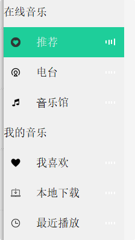
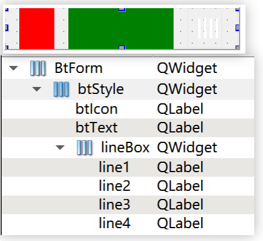

在进行基本的界面美化后，我们需要为 body 左侧的选项卡区域填充相应内容，例如：图标、文字、动画等，但 Qt 中没有这样现成的类，所以我们需要自定义一个这样的类。

应用后的最终效果：

## 4.1 BtForm 界面设计与使用
### 4.1.1 BtForm 界面设计

添加⼀个新设计界面，命名为 `BtForm`。

我们的这个自定义控件实际由：图片、文字、动画三部分组成。图片和文字分别用 QLabel 展示，动画部分内部实际为4个 QLabel。

1. 将 `BtForm` 的 `geometry` 的宽度和高度修改为`200*35`。
2. 拖⼀个 Widget 到 btForm 中，objectName 修改为 btStyle，并将 BtForm 设置为水平布局，再将 btForm 的 margin 和 Spacing 设置为 0。
3. 拖 2 个 QLable 和 1 个 Widget 到 btStyle 中，将 btStyle 设置为水平布局，并将 objectName 依次修改为 btIcon、btText、lineBox 
    - btIcon 的 minimumSize 和 maximumSize 的宽度设置为30（为了看到效果可将颜色设置为red）
	- btText 的 minimumSize 和 maximumSize 的宽度设置为90（为了看到效果可将颜色设置为green）
    - lineBox 的 minimumSize 和 maximumSize 的宽度设置为30 
4. 然后选中 btStyle，并将其 margin 和 Spacing 设置为0
5. 然后往 lineBox 内部拖4个 QLabel，objectName 依次修改为line1、line2、line3、line4。
	- minimumSize 和 maximumSize 的宽度均设置为2
6. 再为 btStyle 和 lineBox 设置相应的 QSS 样式
	- 控件：btStyle
	```css
	#btStyle:hover
	{
		background:#D8D8D8;
	}
	```
	- 控件：lineBox
	```css
	.QLabel
	{
		background-color:#FFFFFF;
	}
	```

效果如下：


### 4.1.2 使用 BtForm

回到，QQMusic.ui 中，将 bodyLeft 内部 onlineMusic 和 MyMusic 中的QWidget全部提升为BtForm。具体操作：

选中要提升的控件，比如：rec，右键，在弹出的菜单中选择提升为，会出现⼀个新窗口（如下右侧图），在提升的类名称中输入要提升为的类型 BtForm，然后点击添加，最后选中 btform.h 点击提升，便可以将 rec 由 QWidget 提升为自定义的 BtForm 类型。

再依次将 body 左侧的 6 个选项卡按照相同的方式全部提升为 BtForm。

## 4.2 设置选项卡基本信息

1. 在 BtForm 类中添加一个公共成员函数 seticon()，用于设置该控件按钮上的图片和文字信息，以及该按钮关联的page页面。
```cpp
/////////////////////////////////////////////////////////////////
// btform.h 新增
// 设置图标 ⽂字 id
void seticon(QString btIcon,QString content,int mid);

// 按钮id：该按钮对应的page⻚
int id = 0;

/////////////////////////////////////////////////////////////////
// btform.cpp新增
void BtFrom::seticon(QString btIcon,QString btText,int mid) 
{
	// 设置⾃定义按钮的图⽚、⽂字、以及id
	ui->btIcon->setPixmap(QPixmap(btIcon));
	ui->btText->setText(btText);
	this->id = mid;
}
```
2. 然后在 QQMusic 类中新增一个 setBtFormInfo() 函数，用于设置 6 个选项卡的图片和文字信息，并在 initUI() 函数中调用此函数。
```cpp
/////////////////////////////////////////////////////////////////
// qqmusic.h 中新增
// 设置BodyLeft中6个btForm的信息
void setBtFormInfo();

/////////////////////////////////////////////////////////////////
// qqmusic.cpp 中新增
void QQMusic::setBtFormInfo()
{
    ui->rec->seticon(":/images/rec.png", "推荐", 1);
    ui->music->seticon(":/images/music.png", "⾳乐馆", 2);
    ui->audio->seticon(":/images/radio.png", "电台", 3);
    ui->like->seticon(":/images/like.png", "我喜欢", 4);
    ui->local->seticon(":/images/local.png", "本地下载", 5);
    ui->recent->seticon(":/images/recent.png", "最近播放", 6);
}
```
## 4.3 处理 BtForm 控件的鼠标点击事件

我们希望当我们的选项卡被点击后**选项卡的颜色会变成绿色**，并且**右侧的 bodyRight 区域能加载正确的 page 页面**。

所以，在 BtForm 类中重写鼠标点击的事件处理函数 mousePressEvent 。
```cpp
/////////////////////////////////////////////////////////////////
// btform.h 新增
protected:
    // ⿏标点击事件
    virtual void mousePressEvent(QMouseEvent *event);

signals:
	// 自定义一个点击信号
    void click(int mid);
    
/////////////////////////////////////////////////////////////////
// btform.cpp 新增
void BtForm::mousePressEvent(QMouseEvent *event)
{
    // 告诉编译器不要触发警告
    (void)event;

    emit click(this->id); // 发送⿏标点击信号
    event->accept();
}
```

我们之所以不在 `BtForm` 类内部直接处理点击逻辑，是为了实现**组件解耦**。如果将样式切换逻辑强耦合在子类中，它将无法感知并操作其他同级选项卡的状态，导致难以实现‘单选互斥’的效果。因此，我们遵循**状态提升**的原则：由 `BtForm` 仅发射点击信号，交由父类 `QQMusic` 进行全局统一调度，从而优雅地实现选项卡的排他性切换。
```cpp
/////////////////////////////////////////////////////////////////
// qqmusic.h 新增
// btForm点击槽函数
void onBtFormClick(int id);

// 链接信号和槽
void connectSignalAndSlot();

/////////////////////////////////////////////////////////////////
// qqmusic.cpp 新增
void QQMusic::onBtFormClick(int id)
{
    // 1.获取当前⻚⾯所有btFrom按钮类型的对象
    // 因为 findChildren 是一个递归搜索操作，会递归地查找当前对象（this，即你的 Widget）对象树上的所有控件，
    // 只要控件的类型是 BtForm（或者是其派生类），它都会被抓取出来。
    // 所以，还是更推荐在 Widget.h 中定义 QList<BtForm*> m_btList;，
    // 并在在构造函数执行一次 m_btList = this->findChildren<BtForm*>();，这样性能会更好。
    QList<BtForm*> buttonList = this->findChildren<BtForm*>();

    // 2.遍历所有对象, 如果不是当前id的按钮,则把之前设置的背景颜⾊清除掉
    foreach (BtForm* btitem, buttonList)
    {
        if (id != btitem->getId())
        {
            btitem->clearBg();
        }
        else
        {
            btitem->setActive();
        }
    }
    // 3.设置当前栈空间显⽰⻚⾯
    ui->stackedWidget->setCurrentIndex(id - 1);
}

void QQMusic::connectSignalAndSlot()
{
    // ⾃定义的btFrom按钮点击信号，当btForm点击后，设置对应的堆叠窗⼝
    connect(ui->rec, &BtForm::click, this, &QQMusic::onBtFormClick);
    connect(ui->music, &BtForm::click, this, &QQMusic::onBtFormClick);
    connect(ui->audio, &BtForm::click, this, &QQMusic::onBtFormClick);
    connect(ui->like, &BtForm::click, this, &QQMusic::onBtFormClick);
    connect(ui->local, &BtForm::click, this, &QQMusic::onBtFormClick);
    connect(ui->recent, &BtForm::click, this, &QQMusic::onBtFormClick);
}
```

```cpp
/////////////////////////////////////////////////////////////////
// btform.h 新增
// 点亮当前按钮并发出超时信号使频谱跳动起来
void setActive();

// 清除上⼀次按钮点击留下的样式
void clearBg();

// 获取id
int getId();

/////////////////////////////////////////////////////////////////
// btform.cpp 新增
void BtForm::setActive()
{
    // 背景变为绿⾊，⽂字变为⽩⾊
    ui->btStyle->setStyleSheet("#btStyle{ background:rgb(30,206,154);}*{color:#F6F6F6;}");
}

void BtForm::clearBg()
{
    // 清除上⼀个按钮点击的背景效果,恢复之前的样式
    ui->btStyle->setStyleSheet("#btStyle:hover{ background:#D8D8D8;} ");
}

int BtForm::getId()
{
    return id;
}
```
添加完后，在 QQMusic 类中的 initUI() 函数中调用 connectSignalAndSlot() 函数，连接信号和槽。
## 4.4 添加动画效果

我们还希望当我们选中选项卡时，这个选项卡右侧能够出现类似于音符跳动的的场景，所以要为右侧的四个 QLabel 添加动画效果。

这里有两种实现思路，一种就是使用 QPropertyAnimation 类，另一种就是 QTimer 类。
- QPropertyAnimation 是 Qt 框架提供的一个专门用于制作属性动画的类。核心原理是 “插值计算（Interpolation）”。你只需要告诉它一个控件的某个属性（如大小、位置、透明度）、动画的持续时间，以及起始值和结束值，它就会利用 Qt 强大的元对象系统，自动在底层帮你计算出每一帧的中间状态。
	- 核心功能：它内置了丰富的缓动曲线（`QEasingCurve`）。你可以轻松实现诸如“弹性回弹”、“加速起步”、“减速刹车”等极具物理真实感的现代 UI 动效，是制作侧边栏滑出、按钮颜色渐变等平滑过渡效果的不二之选。
- QTimer 是 Qt 框架中用于处理周期性或单次定时任务的类。它是 Qt 框架中深度绑定“事件循环（Event Loop）”的时间调度工具。与 C++ 原生的 `sleep()` 阻塞主线程不同，`QTimer` 是非阻塞的异步操作。它的核心工作流非常纯粹：设定一个时间间隔（Interval），一旦时间到达，它就会在 Qt 的事件队列中抛出一个 `timeout()` 信号。
	- 核心功能：它赋予了开发者对代码执行频率的绝对掌控权。你可以用它做单次延时触发（`singleShot`），也可以做高频的周期性轮询。在自定义复杂逻辑的逐帧动画（如游戏逻辑刷新、波形图跳动）时，它是最可靠的节拍器。

**`QPropertyAnimation` 的强项是“平滑过渡”（补间动画）**。如果你用它来改变高度，它会在起始高度和目标高度之间计算出无数个中间值。表现出来的效果是竖条在“拉伸”和“收缩”，看起来像是**呼吸灯**或者**平滑的弹簧**。

而**真实音乐频谱的特征是“顿挫感”**。比如 QQ 音乐或者真实的 DJ 打碟机，频谱柱是因为瞬间的音频采样而突然拔高或降低的，它不需要（也不应该）有拉伸的过程。`QTimer` 瞬间改变高度的“抽帧感”，反而更符合真实数字频谱的视觉直觉。并且用 `QPropertyAnimation` 来实现**持续不断的随机跳动**，逻辑会变得非常复杂，而使用 `QTimer` 来实现动画核心代码只有几行，逻辑会非常简单，所以我们这里选择 `QTimer` 。
```cpp
/////////////////////////////////////////////////////////////////
// btform.h 新增
private slots:
    // 频谱跳动函数
    void updateSpectrum();
    
private:
    // 定时器指针
    QTimer *timer;
    
/////////////////////////////////////////////////////////////////
// btform.cpp 新增
void BtForm::updateSpectrum()
{
    // 生成 4 到 16 像素之间的随机高度 (你可以根据你 UI 的实际大小调整 16 这个最大值)
    int h1 = QRandomGenerator::global()->bounded(4, 17);
    int h2 = QRandomGenerator::global()->bounded(4, 17);
    int h3 = QRandomGenerator::global()->bounded(4, 17);
    int h4 = QRandomGenerator::global()->bounded(4, 17);

    // 瞬间改变四个小竖条的高度，制造顿挫的律动感
    ui->line1->setFixedHeight(h1);
    ui->line2->setFixedHeight(h2);
    ui->line3->setFixedHeight(h3);
    ui->line4->setFixedHeight(h4);
}

// 在构造函数中添加
BtForm::BtForm(QWidget *parent) :
    QWidget(parent),
    ui(new Ui::BtForm)
{
	...
	
    // 实例化定时器
    timer = new QTimer(this);

    // 连接定时器的“超时信号”与的“跳动函数”
    connect(timer, &QTimer::timeout, this, &BtForm::updateSpectrum);
}

// 在 BtForm::setActive() 函数中添加
void BtForm::setActive()
{
	...

    // 启动定时器，参数是毫秒
    timer->start(100);
}

// 在 BtForm::clearBg() 函数中添加
void BtForm::clearBg()
{
    ... 

    // 取消选中时：停止动画
    timer->stop();
    
    // 把 4 个竖条的高度打回原形（比如恢复成静止时的 4 像素高）
    ui->line1->setFixedHeight(4);
    ui->line2->setFixedHeight(4);
    ui->line3->setFixedHeight(4);
    ui->line4->setFixedHeight(4);
}
```

```cpp
/////////////////////////////////////////////////////////////////
// qqmusic.cpp 中的 QQMusic::initUI() 函数中添加
void QQMusic::initUI()
{
	...

	// 让窗口加载时默认选中推荐选项卡并加载动画
    // 这里直接调“onBtFormClick(1);”，可能会出现 Bug，就是“推荐”选项卡的频谱能跳动，但颜色并没有变化，还是初始的灰色。
    // 原因是当我们在 Widget 的构造函数里调用 onBtFormClick(1); 时，构造函数运行，
    // 此时，整个窗口其实还没有真正显示到屏幕上（处于隐身状态），在这个“隐身”阶段，Qt 的 QSS 样式引擎有时会比较“懒”，
    // 它接收到了你改变背景颜色的指令，但它觉得“反正还没显示，我先不画了”，结果等窗口真正弹出来时，样式就被忽略了。
    // 所以，我们可以用 Qt 中的下面这个函数解决上面的问题，这个函数的意思是：在指定的延时时间后，执行一次指定的槽函数回调函数。
    // （这里设置为 0 并不是真的 “立刻执行”，而是告诉 Qt：“当前代码执行完后，尽快执行这个操作”）
    QTimer::singleShot(0, this, [=](){
        onBtFormClick(1);
    });
}
```