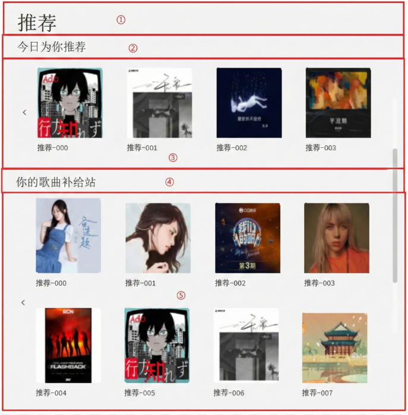
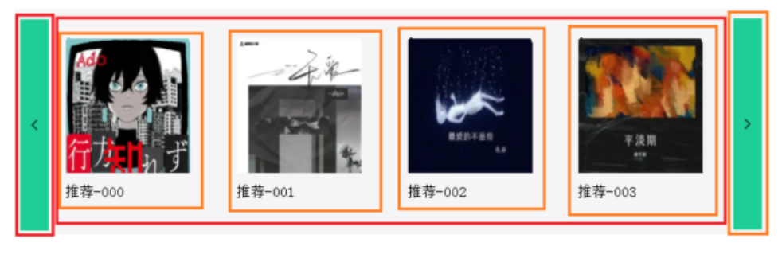
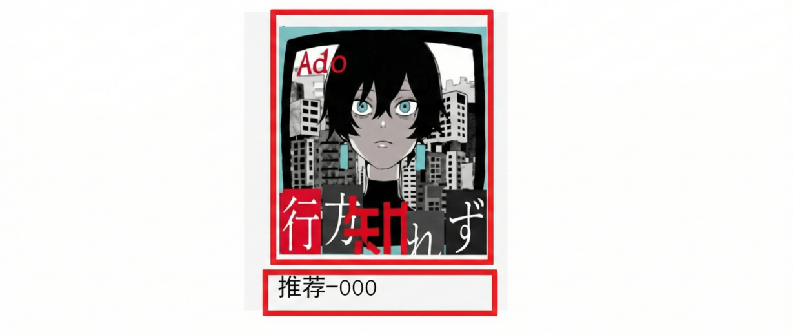
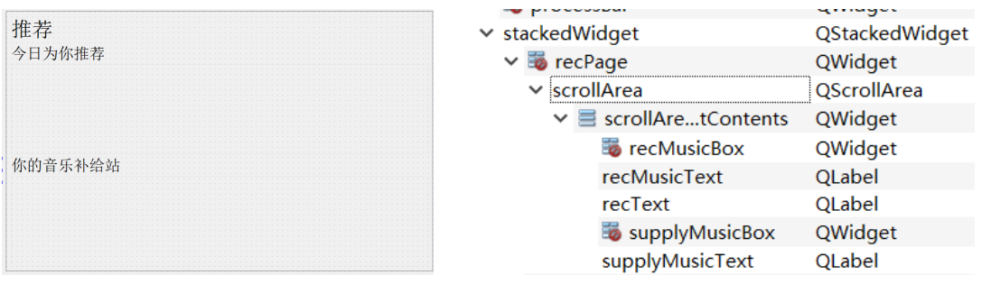
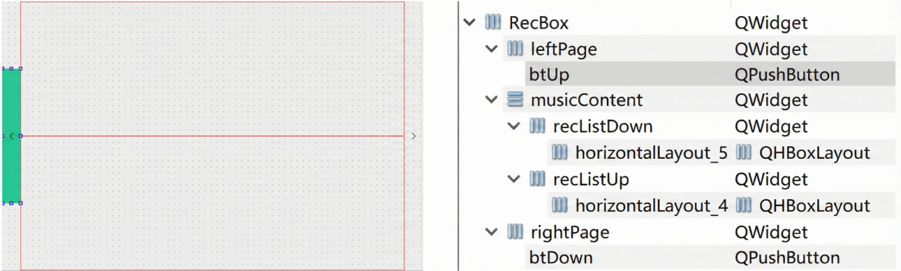
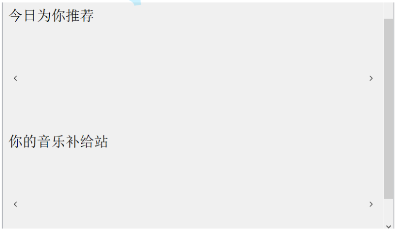
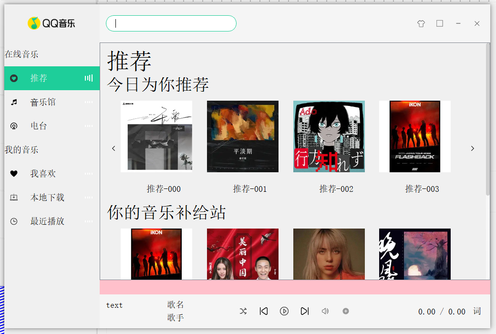
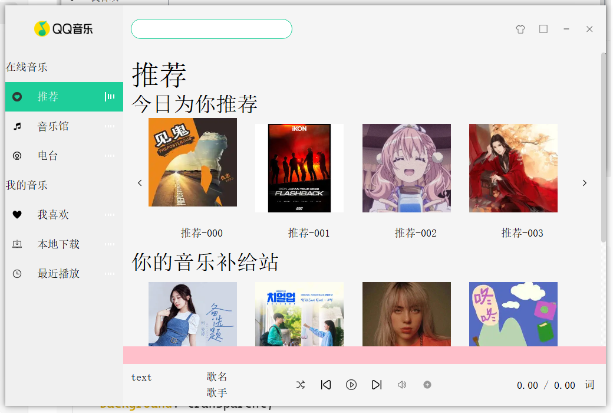

当我们在 `bodyLeft` 区域点击不同的选项卡时，`bodyRight` 区域应同步切换至相应的功能界面。例如，选中‘推荐’选项卡，右侧区域即刻呈现对应的推荐页面。

考虑到‘在线音乐’模块下的三个子页面布局高度相似，为了提高代码复用性并保持视觉统一，我们计划提取出一套通用页面模板。通过这种‘模板化’的设计，三个子页面仅需填充各自的差异化内容即可完成构建。

## 5.1 推荐页面分析

对推荐页面进行拆解发现，推荐页面由五部分构成：


① "推荐"文本提示，即 `QLabel` 
② "今日为你推荐"文本提示，即 `QLabel` 
③ 具体推荐的歌曲内容，点击左右两侧翻页按钮，具有轮番图效果，将光标放到图上，有图片上移动画 
④ "你的歌曲补给站"文本提示，即 `QLabel` 
⑤ 具体显示音乐，和③实际是⼀样的，不同的是③中音乐只有一行，⑤中的音乐有两行

因为页面中元素较多，直接摆到⼀个页面太拥挤，从右侧的滚动条可以看出，整个页面中的元素都放置在 QScrollArea 中。 

仔细分析③发现，里面包含了：


左右各两个按钮，点击之后中间的图片会左右移动，Qt 中未提供类似该种组合控件，因此③实际为自定义控件。

③中按钮之间的元素，由图片和底下的文字组成，当光标放在图片上会有上移的动画，因此该元素实际也为自定义控件。


## 5.2 推荐页面布局

1、在 stackedWidget 中选中推荐页面，即 objectName 为 recPage 的页面。拖拽一个 QScrollArea 到 recPage 中，选中 recPage 页面，再右键 stackedWidget 将其布局设置为垂直布局，并将其 margin 和 Spacing 设置为 0，这样 scrollArea 就充满了整个 recPage 页面。

2、拖拽一个 QLable，objectName 修改为 recText，显示内容修改为推荐， minimumSize 和 maximumSize 的高度均修改为 50，Font 属性中的点大小修改为24。

3、再拖拽一个 QLable 和 Widget，QLable 的 objectName 修改为 recMusictext，内容修改为"今日为你推荐"，minimumSize 和 maximumSize 的高度均修改为 30，Font 属性的点大小修改为18；Widget 的 objectName 修改为 recMusicBox 。

4、再拖拽一个 QLabel 和 Widget，QLabel 的 objectName 修改为 supplyMusicText，内容修改为"你的音乐补给站"，minimumSize 和 maximumSize 的高度均修改为30，Font 属性的点大小修改为 18；Widget的 objectName 修改为 supplyMusicBox。

5、最后选中 QScrollArea，点击垂直布局，整个 recPage 基本就布局完成。



> QScrollArea 是 Qt 框架中用于提供滚动视图区域的核心控件。当子控件（Child Widget）的内容超出当前可视窗口大小时，它会自动生成滚动条，允许用户通过滚动查看完整内容。
> 
> `QScrollArea` 原生的滚动条非常丑（Windows 风格的灰色方块），我们可以用 QSS 样式表将他优化一下：
> ```css
> QScrollBar:vertical {
>     border: none;
>     background: #f0f0f0;
>     width: 8px; /* 让滚动条变细，更现代 */
>     border-radius: 4px;
> }
> QScrollBar::handle:vertical {
>     background: #d0d0d0; /* 滚动滑块颜色 */
>     border-radius: 4px;
> }
> ```

## 5.3 自定义 recBox 

在“5.1 推荐页面分析”中，我们知道在推荐页面中是需要具体的歌曲内容的，比如上述的③区域和⑤区域。这个自定义控件 recBox 就是针对这两个区域的控件，只不过③区域只有一行，⑤区域有两行，这里我们在定义控件时就统一定义为两行，③区域如果用的话就隐藏一行即可。

### 5.3.1 RecBox 界面布局

1、新建一个“Qt 设计师界面类”，界面模板选择 Widget，类名为 RecBox，创建。geometry 的宽高修改为：`685*440`。

2、添加三个 Widget，objectName 依次修改为 upPage、musicContent、downPage； upPage 和 downPage 的 minimumSize 和 maximumSize 修改宽为30，然后选中RecBox点击水平布局。将 RecBox 的 margin 和 Spacing 修改为0 。

3、在 upPage 和 downPage 中各拖一个按钮，upPage 中按钮 objectName 修改为btUp，minimumSize 的高度修改为220；downPage 中按钮 objectName 修改为btDown，minimumSize 的高度修改为220；然后选中 upPage 和 downPage 点击水平布局。将 upPage 和 downPage 的 margin 和 Spacing 修改为0。

4、在 musicContent 中拖两个 Widget，objectName 依次修改为 recListUp 和 recListDown，然后选中 musicContent 点击垂直布局，将 musicContent 的 margin 和 Spacing 修改为0。

5、在 recListUp 和 recListDown 中分别拖两个水平布局器，依次命名为 recListUpHLayout 和 recListDownHLayout，选中 recListUp 和 recListDown 点击水平布局，将 margin 和 Spacing 修改为0 

6、再为按钮添加如下QSS美化：

控件：`btUp`
QSS 美化：
```css
QPushButton
{
	background-repeat:no-repeat;
	border:none;
	background-image : url(:/images/up_page.png);
	background-position:center center;
}

QPushButton:hover
{
	background-color: #1ECD97;
}
```

控件：`btDown`
QSS 美化：
```css
QPushButton
{
	background-repeat:no-repeat;
	border:none;
	background-image : url(:/images/down_page.png);
	background-position:center center;
}

QPushButton:hover
{
	background-color: #1ECD97;
}
```



再将 QQMusic 主界面中 recPage 页面中的 recMusicBox 和 supplyMusicBox 提升为 RecBox，就能看到如下效果。


## 5.4 自定义 recBoxItem 

在 recBox 中具体的歌曲内容是按行列排布的，有非常多的选项卡片，实际上这些选项卡片也是一个个自定义控件。

### 5.4.1 RecBoxItem 界面布局

1、新建一个“Qt 设计师界面类”，界面模板选择 Widget，类名为 RecBoxItem，创建。geometry 的宽高修改为：`150*200`。

2、拖拽一个 Widget 到 RecBoxItem 中，objectName 修改为 musicImageBox， minimumSize 和 maximumSize 的高度均修改为150；

3、拖拽一个 QLabel 到 RecBoxItem 中，objectName 修改为 recBoxItemText，文本设置为"推荐-001"，QLabel 的 alignment 属性设置为水平、垂直居中。

4、选中 RecBoxItem ，将其设置为垂直布局，再将 layoutTopMargin 和 layoutSpacing 均设置为10，其他的 margin 和 Spacing 均修改为0。 

4、拖拽一个 QLabel 到 musicImageBox 中，objectName 修改为 recMusicImage, geometry 设置为：`[(0, 0), 150*150]`

5、拖拽一个 QPushButton 到 musicImageBox 中，objectName 修改为 recMusicBtn，删除掉文本内容，自己按自己的感觉将按钮设置为合适的大小。在属性中找到 cursor，点击选择小手图标。

6、为 recMusicBtn 设置为无边框

控件：`recMusicBtn`
QSS 美化：
```css
#recMusicBtn
{
	border:none;
}
```

为更明显的观察，设置一下相应控件的背景颜色，效果如下：


### 5.4.2 RecBoxItem类中添加动画效果

我们希望在 RecBoxItem 类中拦截鼠标进入和离开事件，在进入时让图片上移，在离开时让图片下移回到原位。

```cpp
/////////////////////////////////////////////////////////////////
// recboxitem.h 新增
protected:
    // 声明事件过滤器，用于拦截子控件的鼠标进出事件
    bool eventFilter(QObject *watched, QEvent *event) override;
private:
    // 动画对象和初始Y坐标
    QPropertyAnimation *animation;
    int originY;
    
/////////////////////////////////////////////////////////////////
// recboxitem.cpp 新增
// 在构造函数中添加
RecBoxItem::RecBoxItem(QWidget *parent) :
    QWidget(parent),
    ui(new Ui::RecBoxItem)
{
	...

    // 1. 安装事件拦截器
    ui->musicImageBox->installEventFilter(this);

    // 2. 初始化动画对象（指定 this 为父对象，程序结束时自动销毁，无需 delete）
    animation = new QPropertyAnimation(ui->musicImageBox, "geometry", this);

    // 注意这里不能直接获取图片框最开始的 Y 坐标，因为此时 C++ 的类构造函数执行正在执行，
    // 这个窗口（RecBoxItem）其实还没有真正显示到屏幕上，所以 Qt 的布局引擎还没有完成最终的排版计算，
    // 在这个时候去问 musicImageBox：“你的 Y 坐标是多少？”
    // 它只会会迷茫地回答你：“我还没排好版呢，默认是 0 吧。”
    // 但我们期望的是排版后的 10 ，所以后续执行动画时会出现图片上移时部分被吞噬的情况
    // 并且当鼠标移出图片后图片还无法回到原位，因为上移动画实际上上移了 20 ，下移动画却只下移了 10
    // originY = ui->musicImageBox->y();
    
    // 3. 随便给个负数作为还没获取坐标的标记
    originY = -1;
}

bool RecBoxItem::eventFilter(QObject *watched, QEvent *event)
{
    if (watched == ui->musicImageBox) 
    {
        // 动态获取当前的宽高和 X 坐标
        int currentX = ui->musicImageBox->x();
        int currentW = ui->musicImageBox->width();
        int currentH = ui->musicImageBox->height();

        if (event->type() == QEvent::Enter) 
        {
            // 如果是第一次进入，此时布局已完成，精准抓取真实 Y 坐标
            if (originY == -1) 
            {
            	originY = ui->musicImageBox->y();
            }

            animation->stop(); // 停止可能正在执行的回弹动画
            animation->setDuration(100);
            // 重点：从“当前所在位置”开始动画，实现丝滑打断
            animation->setStartValue(ui->musicImageBox->geometry());
            // 目标位置：Y 轴向上移动 10 像素
            animation->setEndValue(QRect(currentX, originY - 10, currentW, currentH));
            animation->start();

            return true;
        }
        else if (event->type() == QEvent::Leave) 
        {
            animation->stop(); // 停止可能正在执行的上升动画
            animation->setDuration(150);

            animation->setStartValue(ui->musicImageBox->geometry());
            // 目标位置：回到最初记录的 Y 坐标
            animation->setEndValue(QRect(currentX, originY, currentW, currentH));
            animation->start();

            return true;
        }
    }

    return QWidget::eventFilter(watched, event);
}
```

然后在该类中还需要添加设置推荐文本和图片的方法，将来需要在外部来设置每个 RecBoxItem 的文本和图片：
```cpp
/////////////////////////////////////////////////////////////////
// recboxitem.h 新增
// 设置推荐文本和图片
void setText(const QString& text);
void setImage(const QString& Imagepath);

/////////////////////////////////////////////////////////////////
// recboxitem.cpp 新增
void RecBoxItem::setText(const QString& text)
{
    ui->recBoxItemText->setText(text);
}

void RecBoxItem::setImage(const QString& Imagepath)
{
    QString imgStyle = "border-image:url("+Imagepath+");";
    ui->recMusicImage->setStyleSheet(imgStyle);
}
```

> **`eventFilter`（事件过滤器）是什么**？
> `eventFilter`（事件过滤器）是 Qt 中的一种重要的机制，它允许你在事件到达目标对象之前**拦截、监控或修改**这些事件。当事件（如鼠标点击、键盘输入、窗口调整）发生时，它们会先经过过滤器。如果你在过滤器中返回 `true`，则表示事件已被处理，不再发送给目标对象；返回 `false` 则允许事件继续传播。
> 
> **`eventFilter`（事件过滤器）怎么用**？
> 1. **重写函数**：在自己的自定义类中，重写 `eventFilter(QObject *watched, QEvent *event)` 函数，此时这个自定义类就是监听者。
> 	- **`watched` 参数**：这是“被监视的对象”。因为一个过滤器可以同时看管多个控件，通过`watched`即可判断到底是监视的哪一个控件有事件触发。
> 	- **`event` 参数**：这是“发生了什么事”。它是鼠标点了一下？还是鼠标划进来了？
> 2. **安装过滤器**：在构造函数中调用`目标控件->installEventFilter(this);` ，为目标控件安装过滤器，此时这个控件就是被监听对象。

## 5.5 RecBox 中添加 RecBoxItem 
### 5.5.3 图片路径和推荐文本准备

每个 RecBoxItem 都有对应的图片和推荐文本，在往 RecBox 中添加 RecBoxItem 前需要先将图片路径和对应文本准备好。由于图片和文本具有对应关系，可以以键值对方式来进行组织，以下实现的时采用 QT 内置的 QJsonObject 对象管理图片路径和文本内容。

图片路径和对应文本的准备工作，应该在 QQMusic 类中处理好，RecBoxItem 只负责设置，因此该准备工作需要在 QQMusic 类中进行，故 QQMusic 中需要添加如下代码：
```cpp
/////////////////////////////////////////////////////////////////
// qqmusic.h 新增
// 图片路径和推荐文本准备
QJsonArray randomPicture();

/////////////////////////////////////////////////////////////////
// qqmusic.cpp 新增
QJsonArray QQMusic::randomPicture()
{
    // 1. 初始化推荐图片路径列表
    QVector<QString> vecImageName;
    vecImageName << "001.png" << "002.png" << "003.png" << "004.png" << "005.png"
                 << "006.png" << "007.png" << "008.png" << "009.png" << "010.png"
                 << "011.png" << "012.png" << "013.png" << "014.png" << "015.png"
                 << "016.png" << "017.png" << "018.png" << "019.png" << "020.png"
                 << "021.png" << "022.png" << "023.png" << "024.png" << "025.png"
                 << "026.png" << "027.png" << "028.png" << "029.png" << "030.png"
                 << "031.png" << "032.png" << "033.png" << "034.png" << "035.png"
                 << "036.png" << "037.png" << "038.png" << "039.png" << "040.png";

    // 2. 打乱图片顺序，实现每次打开都是“随机推荐”的效果
    std::random_shuffle(vecImageName.begin(), vecImageName.end());

    QJsonArray objArray;

    // 3. 循环构造 Json 对象并存入数组
    for (int i = 0; i < vecImageName.size(); ++i) {
        QJsonObject obj;

        // 拼接资源文件路径，例如：":/images/rec/001.png"
        obj.insert("path", ":/images/rec/" + vecImageName[i]);

        /* * 格式化推荐文本内容：
         * %1：占位符
         * arg(i, 3, 10, QChar('0')) 解析：
         * i：当前循环索引
         * 3：总共占 3 位
         * 10：使用 10 进制
         * QChar('0')：不足 3 位的前面补 '0'，例如：推荐-000, 推荐-001...
         */
        QString strText = QString("推荐-%1").arg(i, 3, 10, QChar('0'));
        obj.insert("text", strText);

        objArray.append(obj);
    }

    return objArray;
}
```

> **JSON 是什么**？
> **JSON (JavaScript Object Notation)** 是一种轻量级的**数据交换格式**。它易于人类读写，同时也易于机器解析和生成。
> 
> JSON 有两种数据结构**对象 (Object)** 和 **数组 (Array)** ，**对象**使用花括号 `{}` 包围，内部是键值对`（"key": value）`，例如`{"name": "张三", "age": 25}`。**数组**使用方括号 `[]` 包围，例如 `["苹果", "香蕉", "橘子"]`。
> 
> 简要理解就是：JSON 的核心规则只有两条：**大括号表示对象，方括号表示数组**。
> 
> 比如：
> ```json
> {
>   "project": "QQMusic-Clone",
>   "version": "2026.02",
>   "author": "Food Science Student",
>   "is_finished": false,
>   "song_list": [
>     {"id": 1, "name": "稻香", "cover": "150x150_v1.png"},
>     {"id": 2, "name": "七里香", "cover": "150x150_v2.png"}
>   ]
> }
> ```
> - **最外层的大括号 `{ }`**：代表这是一个整体的 **JSON 对象**。它代表了我们整个 `QQMusic-Clone` 项目的总配置文件。
> - 在根对象里，我们又直接定义了 5 个属性，`"project"`、`"version"`、`"author"` 的值是字符串，`"is_finished"`的值是布尔值 `false`，`"song_list"`是最特殊的一个键，它的值是一个**数组**。
> - 数组中又有两个 **JSON 对象**，每一个又都是用 **`{ }`** 包裹的。
> 
> 补充：
> 1. JSON 要求键（Key）和字符串值（Value）必须使用**双引号 `"`**。
> 2. 数组或对象里的最后一个元素后面不能加逗号。

> **QJsonObject 是什么**?
> QJsonObject 是 Qt 框架中用于封装 JSON **对象**的 C++ 类。它在内存中表现为一个键值对列表，其中键（Key）必须是唯一的字符串，而值（Value）则由 QJsonValue 类型表示。
> 
> 我们可以使用 `insert("key", value)` 方法向 QJsonObject 对象中添加数据，使用 `value("key")` 或 `operator[]` 获取特定键对应的值。
> 
> **QJsonArray 是什么**？
> **`QJsonArray`** 就是 Qt 对 JSON **数组**（方括号 `[]` 里的内容）的封装。它最大的特点是**有序存储**（`QJsonObject` 是 **“无序存储”** 的，即按键名排列，不是按插入顺序），存进去的顺序就是读出来的顺序，并且每个元素都有自己的索引。
> 
> 我们可以使用 `append()` 在末尾添加元素，用 `at(index)` 根据位置精准获取索引位置元素。

### 5.5.4 recBox 中添加元素 

由于 recPage 页面中有两个 RecBox 控件，上面的 RecBox（每日推荐）为一行四列，下方的 RecBox（音乐补给站）为两行四列，所以我们对于上面的 RecBox（每日推荐）要隐藏一行。

然后由于我们准备的的推荐数据量（如 40 条）远超单页能显示的上限（4 条或 8 条），我们需要对总数据进行“切块分组”。在单行模式下，每 4 张图片为一组（一页）；双行模式下，每 8 张图片为一组（一页）。通过点击左右两侧的 `btUp` 和 `btDown` 按钮实现翻页。
```cpp
/////////////////////////////////////////////////////////////////
// recbox.h 新增
public:
	// 初始化并向 RecBox 中添加元素
    void initRecBoxUi(QJsonArray data, int row);
    void createRecBoxItem();

private slots:
	// 翻页按钮的槽函数
    void on_btUp_clicked();
    void on_btDown_clicked();

private:
    int row; // 记录当前RecBox实际总⾏数
    int col; // 记录当前RecBox实际每⾏有⼏个元素
    QJsonArray imageList; // 保存界⾯上的图⽚, ⾥⾯实际为key、value键值对
    
    int currentIndex; // 标记当先显⽰第⼏组图⽚和推荐信息
    int count; // 标记imageList中元素按照col分组总数
    
/////////////////////////////////////////////////////////////////
// recbox.cpp 新增
// 在构造函数中添加
RecBox::RecBox(QWidget *parent) :
    QWidget(parent),
    ui(new Ui::RecBox),
    row(1),
    col(4)
{
	...
}

void RecBox::initRecBoxUi(QJsonArray data, int row)
{
    // 1. 判断布局模式
    if (2 == row) 
    {
        // 如果是两行，说明当前 RecBox 是主界面上的 supplyMusicBox（音乐补给站）
        this->row = row;
        this->col = 8;
    } else 
    {
        // 否则：只有一行，作为主界面上的 recMusicBox（每日推荐）
        // 隐藏底部容器，确保只显示一排
        ui->recListDown->hide();
    }

    // 2. 将传入的图片/文本数据保存到成员变量 imageList 中
    this->imageList = data;

    // 默认显⽰第0组
    currentIndex = 0;
    // 计算总共有⼏组图⽚，ceil表⽰向上取整
    count = ceil((double)imageList.size() / col);

    // 3. 调用函数开始创建具体的歌单项
    createRecBoxItem();
}

void RecBox::createRecBoxItem()
{
    // 溢出掉之前旧元素
    QList<RecBoxItem*> recUpList = ui->recListUp->findChildren<RecBoxItem*>();
    for(auto e : recUpList)
    {
        ui->recListUpHLayout->removeWidget(e);
        delete e;
    }

    QList<RecBoxItem*> recDownList = ui->recListDown->findChildren<RecBoxItem*>();
    for(auto e : recDownList)
    {
        ui->recListDownHLayout->removeWidget(e);
        delete e;
    }

    // 循环创建 RecBoxItem 对象，并根据逻辑分配到不同的布局中
    int index = 0;
    for (int i = currentIndex*col; (i < col + currentIndex*col) && (i < imageList.size()); ++i)
    {
        RecBoxItem* item = new RecBoxItem();

        // 1. 从数据列表中提取当前索引的 JSON 对象
        QJsonObject obj = imageList[i].toObject();

        // 2. 为自定义控件设置对应的音乐图片路径与文本
        item->setText(obj.value("text").toString());
        item->setImage(obj.value("path").toString());

        /* * 3. 布局分配逻辑：
         * - 情况 A：recMusicBox (每日推荐)
         * row 为 1，col 为 4。条件 (row == 2) 恒为假，
         * 因此所有 4 个元素都会通过 else 添加到 ui->recListUpHLayout 中。
         *
         * - 情况 B：supplyMusicBox (音乐补给站)
         * row 为 2，col 为 8。
         * 当 index < 4 (即 0, 1, 2, 3) 时：进入 else，添加到上层布局 (ui->recListUpHLayout)。
         * 当 index >= 4 (即 4, 5, 6, 7) 时：满足 if 条件，添加到下层布局 (ui->recListDownHLayout)。
         */
        if (index >= col / 2 && row == 2)
        {
            ui->recListDownHLayout->addWidget(item);
        }
        else
        {
            ui->recListUpHLayout->addWidget(item);
        }

        ++index;
    }
}

void RecBox::on_btUp_clicked()
{
    // 点击btUp按钮，显⽰前⼀组图⽚，如果已经是第⼀组图⽚，显⽰最后⼀组
    currentIndex--;
    if(currentIndex < 0)
    {
        currentIndex = count - 1;
    }
    createRecBoxItem();
}

void RecBox::on_btDown_clicked()
{
    // 点击btDown按钮，显⽰下⼀组图⽚，如果已经是最后⼀组图⽚，显⽰第0组
    currentIndex++;
    if(currentIndex >= count)
    {
        currentIndex = 0;
    }
    createRecBoxItem();
}
```

然后我们需要在 `QQMusic` 类的`initUI()`函数中调用 `initRecBoxUi(QJsonArray data, int row);`函数。
```cpp
/////////////////////////////////////////////////////////////////
// qqmusic.cpp 新增
// 在 QQMusic::initUI() 函数中添加
void QQMusic::initUI()
{
	...

    // 向 recBox 中添加元素
    srand(time(NULL));
    ui->recMusicBox->initRecBoxUi(randomPicture(), 1);
    ui->supplyMusicBox->initRecBoxUi(randomPicture(), 2);
}
```

## 5.6 最后的优化

由于 QScrollArea 默认会有一个黑框并且自带的背影颜色与我们之前为 bodyRight 设置的背景颜色不一致，所以看起来会很突兀，这里我们用 QSS 样式表优化一下。


控件：`scrollArea`
QSS 美化：
```css
/* 1. 让滚动区域整体背景透明，并去掉那个黑色的边框 */
QScrollArea {
    background-color: transparent;
    border: none;
}
/* 2. 让滚动区域内部的所有层级都变透明，从而露出最底下的背景色 */
QScrollArea > QWidget > QWidget {
    background: transparent;
}

...

```

最终效果：
