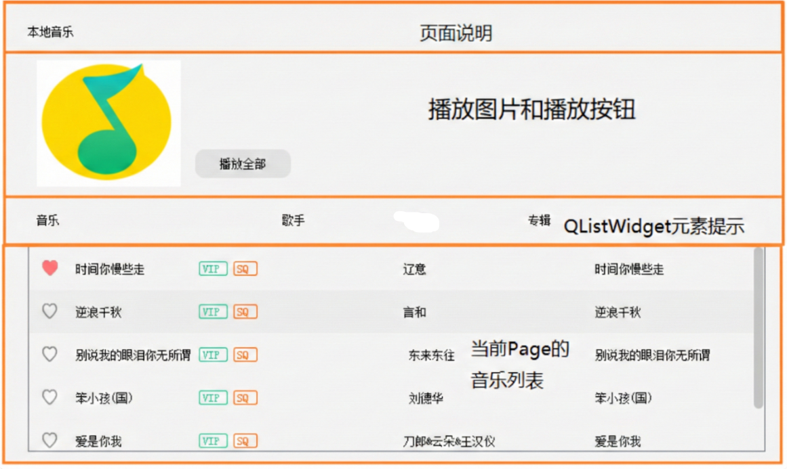
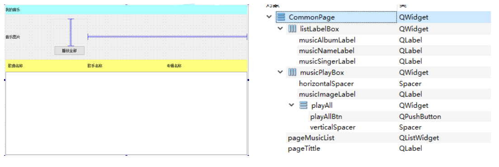
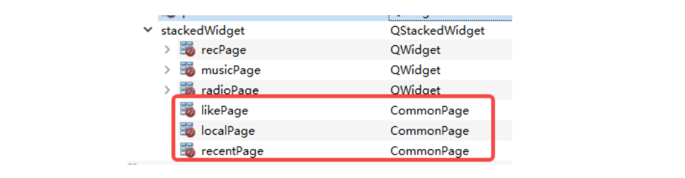
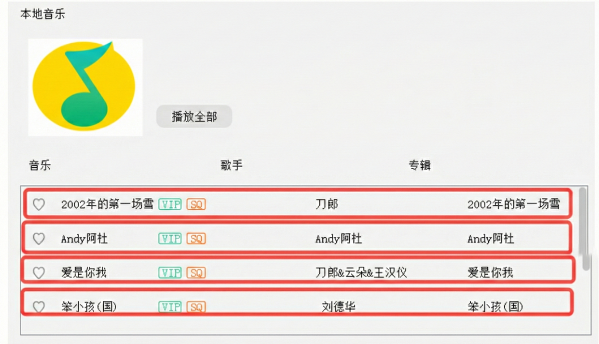
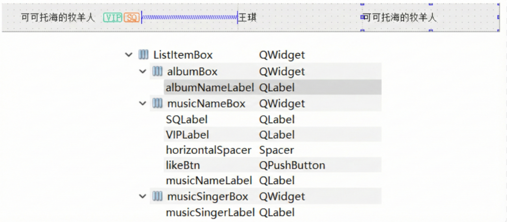
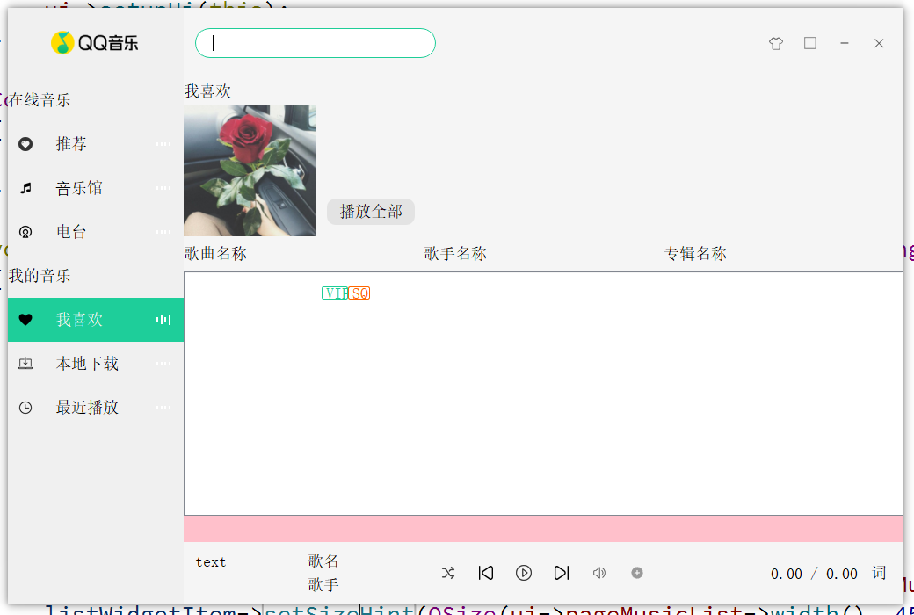

## 6.1 CommonPage 页面分析

我的音乐下的：我喜欢、本地下载、最近播放三个按钮表面上看对应三个 Page 页面，分析之后发现，这三个 Page 页面实际是雷同的，因此只需要定义一个页面 CommonPage ，将 stackedWidget 中这三个页面的类型提升为 CommonPage 即可。



上图为本地音乐的 Page 页面，对页面拆解后，发现该页面可以分四部分：
① 页面说明，比如：本地音乐，该部分实际就是 QLabel 的提示说明； 
② 正在播放音乐图片和播放全部按钮； 
③ 音乐列表中每个部分的文本提示，实际就是三个 QLabel 
④ 本页面对应的音乐列表，即 QListWidget

## 6.2 CommonPage 页面布局 

1、新建一个“Qt 设计师界面类”，界面模板选择 Widget，类名为 CommonPage，创建。geometry 的宽高修改为：`800*500`。

2、拖拽一个 QLabel、两个 Widget 和一个 List View 控件到 CommonPage 中， objectName 从上往下依次修改为 pageTittle、musicPlayBox、listLabelBox、pageMusicList，然后选中 CommonPage 点击垂直布局，将 CommonPage 的 margin 和 Spacing 修改为 0。

- pageTittle 的 minimumSize 和 maximumSize 的高度修改为 30。 
- musicPlayBox 的 minimumSize 和 maximumSize 的高度修改为 150。 
- listLabelBox 的 minimumSize 和 maximumSize 的高度修改为 40。 

3、将 pageTittle 的文本内容修改为"本地音乐" 

4、musicPlayBox 中拖拽一个 QLabel，objectName 修改为 musicImageLabel， minimumSize 和 maximumSize 的宽度修改为 150 

5、拖拽一个 Widget，objectName 修改为 playAll，minimumSize 和 maximumSize 的宽度修改为 120，在其内部拖拽一个 PushButton 和 Vertical Space（即垂直弹簧），将按钮的 objectName 修改为 playAllBtn，minimumSize 和 maximumSize 的宽和高修改为`100*30`，文本内容修改为"播放全部"，然后选中 playAll 点击垂直布局。

6、拖拽一个 Horizontal Spacer 到 musicPlayBox 中，放在 playAll 之后。 然后选中musicPlayBox，点击水平布局，将 margin 和 spacing 设置为 0 

7、listLabelBox 中拖拽三个 QLabel，内容依次修改为：歌曲名称、歌手名称、专辑名称，objectName 从左往右依次修改为：musicNameLabel、musicSingerLabel、musicAlbumLabel，然后选中 listLabelBox，点击水平布局，将 margin 和 spacing 设置为 0

8、选中 List View，右键单击弹出菜单中选择"变形为"，选择 QListWidget


选中 QQMusic 页面，将 stackedWidget 中我喜欢、本地下载、最近播放对应的页面提升为 CommonPage，页面就处理完成。



再为 playAllBtn 按钮进行一下 QSS 美化：

控件：`playAllBtn`
QSS 美化：
```css
#playAllBtn
{
	background-color:#E3E3E3;
	border-radius:10px;
}

#playAllBtn:hover
{
	background-color:#1ECD97;
}
```

## 6.3 CommonPage 界面设置和显示

CommonPage 页面是我喜欢、本地下载、最近播放三个界面的共同类型，因此该类需要提供设置：pageTittle 和 musicImageLabel 的公共方法，将来在程序启动时完成三个界面信息的设置，因此 CommonPage 类需要添加一个 public 的 setCommonPageUI 函数：
```cpp
/////////////////////////////////////////////////////////////////
// commonpage.h 中新增
public:
	void setCommonPageUI(const QString &title, const QString &image);
	
/////////////////////////////////////////////////////////////////
// commonpage.cpp 中新增
void CommonPage::setCommonPageUI(const QString &title, const QString &image)
{
    // 设置标题
    ui->pageTittle->setText(title);

    // 设置封⾯栏
    ui->musicImageLabel->setPixmap(QPixmap(image));
    ui->musicImageLabel->setScaledContents(true);
}
```

界面设置的函数需要在程序启动时就完成好配置，即需要在 QQMusic 的 initUi() 函数中调用完成设置：
```cpp
/////////////////////////////////////////////////////////////////
// qqmusic.cpp 中新增
// 在 QQMusic::initUI() 函数中添加
void QQMusic::initUI()
{
	...

    // 设置我喜欢、本地⾳乐、最近播放⻚⾯
    ui->likePage->setCommonPageUI("我喜欢", ":/images/ilikebg.png");
    ui->localPage->setCommonPageUI("本地⾳乐", ":/images/localbg.png");
    ui->recentPage->setCommonPageUI("最近播放", ":/images/recentbg.png");
}
```

## 6.4 自定义 ListItemBox

### 6.4.1 ListItemBox 页面分析

CommonPage 页面创建好之后，等音乐加载到程序之后，就可以将音乐信息往 CommonPage 的 pageMusicList 中显示了。我们希望的每一首音乐的信息显示效果如下：



上图每行都是 QListWidget 中的⼀个元素，每个元素中包含多个控件：
① 收藏图标，即 QLabel 
② 歌曲名称，即 QLabel 
③ VIP 和 SQ，VIP 即收费会员专享，SQ 为无损音乐，也是两个 QLabel 
④ 歌手名称，即 QLabel 
⑤ 音乐专辑名称，即 QLabel

这个控件 Qt 中是没有内置的，所以需要我们自定义。

### 6.4.2 ListItemBox 页面布局 

1、新建一个“Qt 设计师界面类”，界面模板选择 Widget，类名为 ListItemBox，创建。geometry 的宽高修改为：`800*45`。

2、拖三个 Widget 到 ListItemBox 中，objectName 从左往右依次修改为musicNameBox、musicSingerBox、musicAlbumBox，将 musicNameBox 的 minimumSize 和 maximumSize 的宽修改为 380，将 musicSingerBox 的 minimumSize 和 maximumSize 的宽修改为 200，然后选中 ListItemBox，点击水平布局，将 ListItemBox 的 margin 和 spacing 修改为 0。 

3、musicNameBox：

- 拖拽一个 QPushButton 到 musicNameBox 中，objectName 修改为 likeBtn，minimumSize 和 maximumSize 的宽高修改为`25*25`。
- 拖一个 QLabel 到 musicNameBox 中，objectName 修改为 musicNameLabel，minimumSize 和 maximumSize 的宽修改为 130
- 拖一个 QLabel 到 musicNameBox 中，objectName 修改为 VIPLabel，minimumSize 和 maximumSize 的宽修改为 30，maximumSize 高度修改为 15，文本内容修改为 VIP。
- 拖一个 QLabel 到 musicNameBox 中，objectName 修改为 SQLabel，minimumSize 和 maximumSize 的宽修改为 25，maximumSize 高度修改为 15，文本内容修改为 SQ。
- 拖拽一个水平弹簧控件到 musicNameBox 中，将上述控件撑到 musicNameBox 的左侧
- 选中 musicNameBox，点击水平布局，将 musicNameBox 的 margin 和 spacing 修改为 0 

3、拖拽一个 QLabel 到 musicSingerBox 中，objectName 修改为 musicSingerLabel，然后选中 musicNameBox 点击水平布局，将 musicSingerBox 的 margin 和 spacing 修改为 0。

4、拖拽一个 QLabel 到 musicAlbumBox 中，objectName 修改为 albumNameLabel，然后选中 musicAlbumBox 点击水平布局，将 musicAlbumBox 的 margin 和 spacing 修改为0。

再为一些控件进行 QSS 美化：

控件：`likeBtn`
QSS 美化：
```css
#likeBtn
{
	border:none;
}
```

控件：`VIPLabel`
QSS 美化：
```css
#VIPLabel
{
	border:1px solid #1ECD96;
	color:#1ECD96;
	border-radius:2px;
}
```

控件：`SQLabel`
QSS 美化：
```css
#SQLabel
{
	border:1px solid #FF6600;
	color:#FF6600;
	border-radius:2px;
}
```



### 6.4.3 ListItemBox 显示测试 

由于这个自定义类是在之后我们有相关歌曲信息后使用的，现在不立即使用，所以这里只进行一下简单的显示测试，确保这个自定义控件是正常的。

```cpp
/////////////////////////////////////////////////////////////////
// commonpage.cpp 中新增
// 在 CommonPage::setCommonPageUI 函数中添加
void CommonPage::setCommonPageUI(const QString &title, const QString &image)
{
	...

    // 测试
    ListItemBox* listItemBox = new ListItemBox(this);
    QListWidgetItem* listWidgetItem = new QListWidgetItem(ui->pageMusicList);
    listWidgetItem->setSizeHint(QSize(ui->pageMusicList->width(), 45));
    ui->pageMusicList->setItemWidget(listWidgetItem, listItemBox);
}
```


### 6.4.4 支持 hover 效果 

ListItemBox 添加到 CommonPage 中的 QListWidget 之后，自带 hover 效果，但是背景颜色和界面不太搭配，此处重新实现 hover 效果，此处重写 enterEvent 和 leaveEvent 来实现 hover 效果。 
```cpp
/////////////////////////////////////////////////////////////////
// listitembox.h 新增
protected:
	// 重写鼠标进入和离开事件处理函数
    void enterEvent(QEvent *event);
    void leaveEvent(QEvent *event);
    
/////////////////////////////////////////////////////////////////
// listitembox.cpp 新增
void ListItemBox::enterEvent(QEvent *event)
{
    (void)event;
    setStyleSheet("background-color:#EFEFEF");
}

void ListItemBox::leaveEvent(QEvent *event)
{
    (void)event;
    setStyleSheet("");
}
```