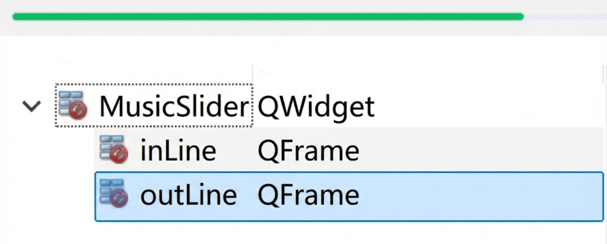
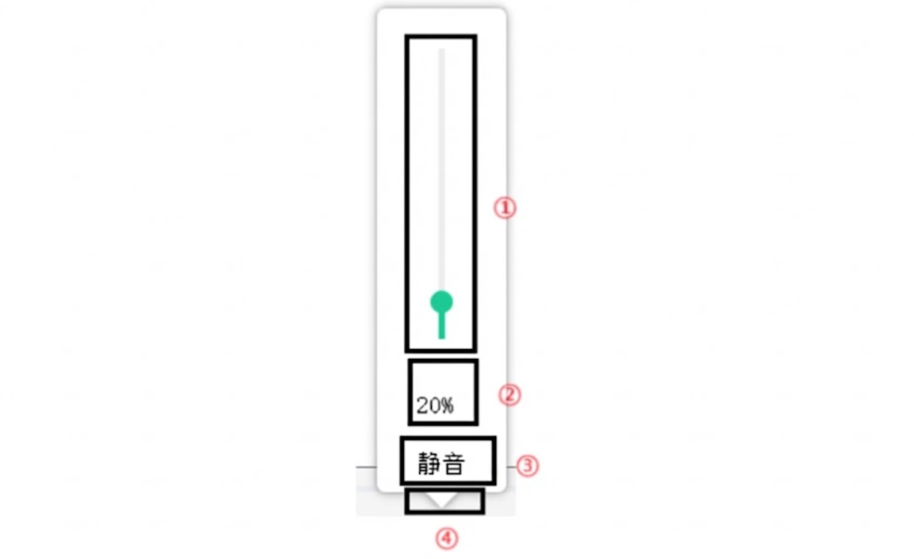

## 7.1 自定义 MusicSlider

对于播放进度条 Qt 内置有 Horizontal Slider（水平滑竿），但不是很好看，所以该控件这里也采用自定义。 

该控件比较简单，实际就是两个 QFrame 重叠起来的。

1、新建一个“Qt 设计师界面类”，界面模板选择 Widget，类名为 MusicSlider，创建。geometry 的宽高修改为：`800*20`。

2、拖拽一个 QFrame，objectName 修改为 inLine，geometry 修改为`[(0,8),800*4]`。 

3、拖拽一个 QFrame，objectName 修改为 outLine，geometry 修改为`[(0,8),400*4]`。 

4、inLine 和 outLine 的样式设置如下：

控件：`inLine`
QSS 美化：
```css
#inLine
{
	background-color:#EBEEF5;
}
```

控件：`outLine`
QSS 美化：
```css
#outLine
{
	background-color:#1ECC94;
}
```

5、打开 QQMusic.ui，选中 progressBar 清除之前样式，将 progressBar 提升为 MusicSlider，运行程序就能看到效果。



> **QFrame 是什么**？
> QFrame 是 Qt 框架中用于创建带有边框（Frame）的容器组件，继承自 `QWidget`。它与 `QWidget`的区别就是 `QWidget` 默认没有边框绘制逻辑并且有时需要重写 `paintEvent` 才能对 QSS 有很好的支持效果，而`QFrame`自带丰富的边框样式并且完美支持 QSS。所以我们这里用`QFrame`模拟进度条。

## 7.2 自定义 VolumeTool

### 7.2.1 VolumeTool 控件分析

音量调节控件本来也可以使用 Qt 内置的垂直滑杆来代替，只是垂直滑杆不好看，因此也自定义。


① 内部为类似 MusicSlider 控件 + 小圆球，圆球实际为⼀个 QPushButton
② 音量大小文本显示，实际为 QLabel 
③ QPushButton，点击之后在静音和取消静音切换
④ 一个倒三角，Qt 未提供三角控件，该控件需要手动绘制，用来提示是播放控制区那个按钮按下的 

### 7.2.2 VolumeTool 界面布局

1、新建一个“Qt 设计师界面类”，界面模板选择 Widget，类名为 VolumeTool，创建。geometry 的宽高修改为：`100*350`。

2、拖拽一个 Widget 到 VolumeTool 中，objectName 修改为 volumeWidget，geometry 修改为：`[(10,10), 80*300]`

3、拖拽一个 QPushButton 到 volumeWidget，objectName 修改为 silenceBtn， mimimumSize 和 maximumSize 的宽高修改为`80*45`，geometry 设置为`[(0, 255), 80 x 45]`

4、拖拽一个 QLabel 到 volumeWidget，objectName 修改为 volumeRatio，mimimumSize 和 maximumSize 的高修改为30，geometry 设置为 `[(0, 225), 80 x 30]`，QLabel的 alignment 属性修改为水平和垂直居中。

5、拖拽一个 QWidget 到 volumeWidget，objectName 修改为 sliderBox。geometry 修改为：`[(0,0), 80*225]` 

6、sliderBox 内部：

1. 拖拽一个 QFrame，objectName 修改为 inSlider，geometry 修改为`[(38, 25), 4*180]`。 
2. 拖拽一个 QFrame，objectName修改为 outSlider，geometry 修改为`[(38, 25), 4*180]`。 
3. 拖拽一个 QPushButton，objectName 修改为 sliderBtn，geometry 修改为`[(33, 20), 14*14]`，mimimumSize 和 maximumSize 的宽高`14*14`

7、再为一些控件进行 QSS 样式设置

控件：`volumeWidget`
QSS 美化：
```css
#volumeWidget
{
	background-color:#ffffff;
	border-radius:5px;
}
```

控件：`slienceBtn`
QSS 美化：
```css
#silenceBtn
{
	border:none;
}

#silenceBtn:hover
{
	background-color:#F0F0F0;
}
```

控件：`inSlider`
QSS 美化：
```css
#inSlider
{
	background-color:#ECECEC;
}
```

控件：`outSlider`
QSS 美化：
```css
#outSlider
{
	background-color:#1ECC94;
}
```

控件：`sliderBtn`
QSS 美化：
```css
#sliderBtn
{
	background-color:#1ECC94;
	border-radius:7px;
}
```


注意：静音底下的空缺用来绘制三角。

### 7.2.3 界面初始化

在 Qt 开发中，“弹出窗口”通常指设置了 `Qt::Popup` 属性的窗口。它具有一个显著特征：当用户点击窗口外部的任何区域时，窗口自动从屏幕上消失（Hide）。

对于我们的这个 VolumeTool 控件，它就属于弹出窗口，即点击了主界面的音量调节按钮后，才需要弹出该界面，点击其他位置该界面自动隐藏。因此在窗口创建时，需要设置窗口为无边框以及为弹出窗口。

```cpp
/////////////////////////////////////////////////////////////////
// volumetool.cpp 中新增
// 在构造函数中添加
VolumeTool::VolumeTool(QWidget *parent)
    : QWidget(parent)
    , ui(new Ui::VolumeTool)
{
    ...

    // 1. 设置窗口标志（Window Flags）
    // 通过位掩码（Bitmask）配置窗口的交互行为与外观样式
    // Qt::Popup：将窗口设置为弹出式。核心特性是“失焦自隐”，即点击窗口外部区域时自动关闭（Hide）。
    // Qt::FramelessWindowHint：移除标题栏、缩放按钮等原生装饰。这是实现自定义圆角或异形 UI 的前提。
    // (注意：在 Windows 平台，开启透明属性后必须配合此标志，否则非控件区域将渲染为黑色背景)
    // Qt::NoDropShadowWindowHint：禁用 OS 层级的原生阴影，规避系统阴影与后续自定义阴影的渲染冲突。
    setWindowFlags(Qt::Popup | Qt::FramelessWindowHint | Qt::NoDropShadowWindowHint);
    
    // 2. 开启跨平台透明支持
    // 允许窗口背景渲染为透明，配合 QSS 即可实现圆角效果
    setAttribute(Qt::WA_TranslucentBackground);
    
    // 3. 配置自定义图形阴影（QGraphicsDropShadowEffect）
    // 比起系统阴影，自定义阴影可控性更高，能有效增强界面的视觉层级感
    QGraphicsDropShadowEffect* shadowEffect = new QGraphicsDropShadowEffect(this);
    shadowEffect->setOffset(0, 0);       // 偏移量为0，形成四周均匀发散的呼吸灯感
    shadowEffect->setColor("#646464");   // 柔和的深灰色
    shadowEffect->setBlurRadius(10);     // 模糊半径，数值越大阴影越虚化
    this->setGraphicsEffect(shadowEffect);
    
    // 4. 加载资源文件
    ui->silenceBtn->setIcon(QIcon(":/images/volumn.png"));
    
    // 5. 初始化音量条布局（默认音量 20%）
    // 核心逻辑：由于 Qt 坐标系 Y 轴向下增长，而音量条需“自底向上”绘制，需进行逆向几何映射。
    // 计算公式：y_pos = y_start + (总高度 - 当前进度高度)
    // 169 = 25 + (180 - 36)
    ui->outSlider->setGeometry(ui->outSlider->x(), 25 + 180 - 36, ui->outSlider->width(), 36);
    
    // 联动计算滑块位置：将滑块中心点与进度条顶部对齐
    ui->sliderBtn->move(ui->sliderBtn->x(), ui->outSlider->y() - ui->sliderBtn->height() / 2);
    
    // 同步 UI 文本显示
    ui->volumeRatio->setText("20%");
}
```

### 7.2.4 界面使用

音量调节属于主界面上元素，因此在 QQMusic 类中需要添加 VolumeTool 的对象，我们在 `QQMusic::initUi()` 函数中 new 一个该类的对象，然后在主界面中为音量调节按钮添加 `clicked` 槽函数，在`clicked` 槽函数中实现显示音量调节窗口的逻辑。

```cpp
/////////////////////////////////////////////////////////////////
// qqmusic.h 中新增
#include "volumetool.h"

private slots:
    void on_volume_clicked();
    
private:
	VolumeTool* volumeTool;
	
/////////////////////////////////////////////////////////////////
// qqmusic.cpp 中新增
// 在构造函数中添加
void QMusic::initUI()
{
	...

    // 创建⾳量调节窗⼝对象并挂到对象树
    volumeTool = new VolumeTool(this);
}

void QMusic::on_volume_clicked()
{
	// 由于弹出窗口默认在屏幕的 (0, 0) 位置显示，为了让它精准出现在按钮上方，我们必须重新计算它的全局坐标

    // 1. 获取音量按钮在屏幕（全局）中的坐标
    // 这样弹出的音量条才能精准定位在按钮附近，而不是主窗口左上角
    QPoint point = ui->volume->mapToGlobal(QPoint(0, 0));

    // 2. 计算 volumeTool 窗口的左上角位置
    // 逻辑：将弹出窗口的底部中心点对齐到按钮的左上角
    // 弹出窗口左上角 = 按钮全局坐标 - (窗口宽度的1/2, 窗口总高度)
    QPoint volumeLeftTop = point - QPoint(volumeTool->width() / 2, volumeTool->height());

    // 3. 微调窗口位置
    // 根据实际 UI 视觉效果进行手动偏移，确保遮盖或间距美观
    volumeLeftTop.setY(volumeLeftTop.y() + 30);
    volumeLeftTop.setX(volumeLeftTop.x() + 15);

    // 4. 执行移动并显示
    volumeTool->move(volumeLeftTop);
    volumeTool->show();
}
```

### 7.2.5 绘制界面的倒三角 

由于 Qt 中并未给出三角控件，因此三角需要手动绘制，故在 VolumeTool 类中重写 paintEvent 事件处理函数。
```cpp
/////////////////////////////////////////////////////////////////
// volumetool.h 中新增
public:
    void paintEvent(QPaintEvent *event);
    
/////////////////////////////////////////////////////////////////
// volumetool.cpp 中新增
void VolumeTool::paintEvent(QPaintEvent *event)
{
    (void)event; // 明确告诉编译器该参数暂不使用，避免警告

    // 1. 创建绘图对象：指定在当前窗口 (this) 上画图
    QPainter painter(this);

    // 2. 设置抗锯齿：让画出来的图形边缘更平滑，不带“毛边”
    painter.setRenderHint(QPainter::Antialiasing, true);

    // 3. 设置画笔：设置为 NoPen 代表不需要边框线
    painter.setPen(Qt::NoPen);

    // 4. 设置画刷：填充颜色为白色
    painter.setBrush(Qt::white);

    // 5. 定义三角形的三个顶点 (QPolygon 多边形)
    QPolygon polygon;
    polygon.append(QPoint(30, 300)); // 左顶点
    polygon.append(QPoint(70, 300)); // 右顶点
    polygon.append(QPoint(50, 320)); // 下顶点（尖角向下）

    // 6. 绘制三角形
    painter.drawPolygon(polygon);
}
```

> **`paintEvent`是什么**？
> `paintEvent` 是 `QWidget` 类中的一个事件处理函数。每当窗口需要刷新其视觉表现时，Qt 事件循环就会自动调用它。
> 
> **`paintEvent` 的触发机制**：
> `paintEvent` 的执行并非随机，而是由 **Qt 的 Paint System** 响应特定信号触发的：
> - **首次显示**：窗口第一次调用 `show()` 时。
> - **状态改变**：窗口被最小化后恢复、或是被其他窗口遮挡后重新暴露。
> - **尺寸调整**：当窗口缩放导致其 `Geometry` 发生变化。
> - **手动刷新**：开发者在代码中显式调用了 `update()`或 `repaint()`（立即强制重绘）。

> **`QPainter` 是什么**？
> QPainter 是 Qt 框架中用于执行高级绘图操作的核心类。
> 
> **`QPainter` 的三个要素**：
> - **绘图设备 (QPaintDevice)**：在哪里进行绘制，如 `QWidget`、`QImage` 或 `QPrinter`。我们可以通过 `QPainter painter(this)` 指定当前窗口为绘图设备，即在当前窗口进行绘制。
> - **画笔 (QPen)**：负责绘制物体的**轮廓线**。你可以设置其颜色、宽度、线型（实线、虚线等）。我们在绘制三角形时使用了 `Qt::NoPen` 来取消轮廓。
> - **画刷 (QBrush)**：负责填充物体的**内部区域**。它支持纯色填充（如我们使用的 `Qt::white`）、渐变色填充甚至是纹理填充。
> 
> `QPainter` 遵循经典的“画家算法”，即后画出的图形会覆盖先画出的图形。