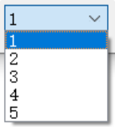

## 1. QSS 是什么？
简单来说，**QSS（Qt样式表）是 Qt 版本的 CSS（层叠样式表）**。它的语法、逻辑和网页开发中的 CSS 几乎一模一样，专门用于美化和自定义 Qt 控件的外观，不过QSS的功能会比CSS要弱很多，体现在选择器要少，可以使用的QSS属性也要少很多，并且并不是所有的属性都可以用在Qt的所有控件上。

## 2. QSS 的核心作用
通过 QSS 控制控件的样式能简化我们的操作。在没有 QSS 之前，如果你想改变按钮的颜色或圆角等，可能需要重写绘图事件处理函数 paintEvent 。有了 QSS，只需要写几行像文本一样的代码，就能实现：

- **换肤**（一键切换深色/浅色模式）。
- **精细化 UI**（圆角、渐变色、阴影、边框）。
- **交互反馈**（鼠标悬停、点击、禁用时的不同状态）。

## 3. QSS 的基本语法
QSS 的语法由 **选择器 (Selector)** 和 **声明 (Declaration)** 组成：
```css
/* 选择器 */
QPushButton 
{ 
    /* 属性 : 值; */
    background-color: #2ecc71; 
    border-radius: 5px;
    color: white;
}
```

- **选择器**：指定你想给哪个控件设置样式（如 QPushButton, QLabel, QWidget）。
- **属性**：你想改变什么（如 background-color, font-size, border）。
- **值**：你想改成什么样（如 red, 14px, 2px solid gray）。

## 4. 三大概念
### 4.1 伪状态 (Pseudo-States)
伪状态用于根据控件的特定运行时状态（如鼠标悬停、按钮被按下或禁用等）来应用不同样式。

伪状态与事件关系很密切，当特定事件（如鼠标悬停、点击）发生时，Qt 事件系统会创建一个事件类，并将这个事件类分发给对应控件，然后控件执行相应的内置事件处理函数时，会同步更新其内部的**状态标志位**。随后，Qt 的样式引擎会捕捉到这些状态变化，并根据 QSS 中定义的伪状态选择器，动态地将匹配的样式应用到控件上，从而实现视觉上的实时反馈。

> 控件的内置事件处理函数（以 `mousePressEvent` 为例）被触发时通常会做三件事：
> 
> 1. **逻辑处理**：发射 `clicked()` 信号，或者执行你自定义的业务代码。
> 2. **状态更新**：修改内部的 `RenderFlag` 或状态位（比如把 `pressed` 设为 `true`）。
> 3. **请求重绘**：调用 `update()` 告知 Qt 界面需要重新渲染。
> 
> 其中，“状态更新”发生在第二阶段， QSS 引擎根据新状态匹配样式的过程，是在第三阶段发出 `update()` 请求后的**渲染流水线**中进行。
> 
> 所以如果我们为控件设置过 QSS 伪状态处理，在重写事件处理函数时可能会失效。
>
> **失效原因：** 如果我们重写了事件处理函数却**没有调用父类实现**，会导致两个核心环节缺失：
> 1. **状态位未改变**：QSS 引擎找不到对应的伪状态（如 `:pressed`）触发条件。
> 2. **重绘请求未发出**：即便状态改了，如果没有 `update()`，QSS 引擎也不会启动“样式重算”的过程。 
> 
> 解决的办法就是只有通过调用父类实现，或者手动补齐“状态修改 + 刷新请求”，才能确保 QSS 伪状态在自定义控件中依然生效。
> 
> 调用父类实现：
> ```cpp
> void MyButton::mousePressEvent(QMouseEvent *event) {
>     // 1. 你的自定义逻辑
>     doSomething();
> 
>     // 2. 关键：调用父类实现
>     QPushButton::mousePressEvent(event); 
> }
> ```
>
>手动补齐：
> ```cpp
> void MyButton::mousePressEvent(QMouseEvent *event) {
>     // 1. 不调用父类，彻底干掉父类逻辑
>     // 2. 手动设置一个动态属性来模拟 "pressed"
>     this->setProperty("my_pressed", true);
>     // 3. 强制通知 QSS 引擎重算样式
>     this->style()->unpolish(this);
>     this->style()->polish(this);
>     this->update(); 
> }
> ```

**语法格式**：`选择器:伪状态 { 属性: 值; }`

**常见的伪状态**：

|**伪状态**|**含义**|**常用场景**|
|---|---|---|
|`:hover`|鼠标**悬停**在控件上时|按钮变色提醒用户可以点击|
|`:pressed`|鼠标**左键按下**控件时|模拟按钮被按下的下沉效果|
|`:checked`|复选框或单选框被**选中**时|勾选后的特殊样式|
|`:disabled`|控件被**禁用**（不可操作）时|变灰色表示无法点击|
|`:focus`|控件获得**焦点**时（如输入框光标闪烁）|输入框边框高亮|

### 4.2 子控件 (Sub-Controls)
很多 Qt 控件并不是一个单一的整体，而是由多个小部件组合而成的“复合体”，这些小部件就是子控件。例如 **`QComboBox`**（下拉框）就是由文本框、下拉按钮、下拉箭头组成。

在 QSS 中，我们**使用双冒号 `::` 来访问这些内部零件**。

**语法格式**：`选择器::子控件名称 { 属性: 值; }`

如果想**为子控件也加上“状态”**（比如：当鼠标悬停在下拉按钮上时），可以把伪状态连用：`选择器::子控件名称:伪状态 { 属性: 值; }`

例如：为下拉框设计样式
```css
/* 1. 下拉框本体 */
QComboBox {
    border: 1px solid gray;
    border-radius: 3px;
}

/* 2. 右侧的下拉按钮零件 */
QComboBox::drop-down {
    subcontrol-origin: padding;
    subcontrol-position: top right; /* 定位在右上角 */
    width: 20px;
    border-left: 1px solid darkgray;
}

/* 3. 下拉按钮里的箭头零件 */
QComboBox::down-arrow {
    image: url(down_arrow.png); /* 自定义图标 */
}

/* 4. 组合技：当鼠标悬停在下拉按钮上时 */
QComboBox::drop-down:hover {
    background-color: lightblue;
}
```

### 4.3 级联与继承 (Cascading & Inheritance)

级联决定了**当样式冲突时谁说了算**，而继承决定了**样式是否会传给子元素**。

**级联 (Cascading) —— 谁的优先级更高：** 当样式发生冲突时，Qt 会按以下优先级决定谁说了算：

1. **局部 > 全局**：控件自身设置的样式（`setStyleSheet`）优先于父窗口或全局 `qApp` 设置的样式。
2. **特异性 (Specificity)**：ID 选择器（`#myBtn`） > 伪状态（`:hover`） > 类型选择器（`QPushButton`）。
3. **后发制人**：如果优先级相同，**写在后面的样式**会覆盖前面的。

**继承 (Inheritance) —— 父子关系：**

- **样式传播**：如果你在父窗口上设置样式（如 `QWidget { color: white; }`），该规则会“传播”给所有子控件。
- **属性限制**：并非所有属性都会传播。例如 `font` 和 `color` 容易传播，但 `border`、`background` 等属性通常**不会**被子控件继承（否则每个按钮都会自动套上父窗口的背景图）。

> **类选择器（`.`）与 类型选择器**：
> - **类型选择器**：`QPushButton { ... }`
>     - **效果**：匹配 `QPushButton` **及其所有子类**（比如你自己定义的 MyCustomButton）。
> - **类选择器**：`.QPushButton { ... }` (前面带个点)
>     - **效果**：**只匹配** `QPushButton` 实例，**不匹配**它的子类。

## 5. 盒子模型

在 QSS 中，每一个控件都被看作是一个矩形的“盒子”。这个盒子由**Margin（外边距）**、**Border（边框）**、**Padding（内边距）** 和 **Content（内容）** 四部分组成。
```text
+---------------------------------------------------------+
|                Margin (外边距 - 控件与控件的距离)          |
|  +---------------------------------------------------+  |
|  |             Border (边框 - 盒子的外框线)            |  |
|  |  +---------------------------------------------+  |  |
|  |  |          Padding (内边距 - 内容与边框的距离)    |  |  |
|  |  |  +---------------------------------------+  |  |  |
|  |  |  |                                       |  |  |  |
|  |  |  |           Content (内容/文字/图标)      |  |  |  |
|  |  |  |                                       |  |  |  |
|  |  |  +---------------------------------------+  |  |  |
|  |  +---------------------------------------------+  |  |
|  +---------------------------------------------------+  |
+---------------------------------------------------------+
```

1. **Content (内容区域)**：
    - 包含控件实际显示的东西，比如 QLabel 的文字、QPushButton 的图标。
    - 当你设置 width 和 height 时，通常指的就是这一块区域。
2. **Padding (内边距)**：
    - 内容与边框之间的透明区域。
    - **作用**：如果你觉得文字挨边框太近了，就加大 Padding。
    - 注意：背景颜色（background-color）通常会填充 Content + Paddin 区域。
3. **Border (边框)**：
    - 围绕在内边距外面的线。
    - 你可以设置其粗细（width）、样式（solid/dashed）和颜色。
4. **Margin (外边距)**：
    - 边框以外的区域，用于控制当前控件与周围其他控件之间的距离。
    - 这个区域永远是透明的。

我们在“4.2 子控件 (Sub-Controls)”的例子中有提到 `subcontrol-origin`，这个属性就是用来决定子控件**以盒子的哪一层作为坐标原点**：

- subcontrol-origin: content; —— 子控件以内容区为基准对齐。
- subcontrol-origin: padding; —— 子控件可以摆放在内边距区域。
- subcontrol-origin: border; —— 子控件可以骑在边框线上。
- `subcontrol-origin: margin;`：子控件可以跑到最外层的边距区。